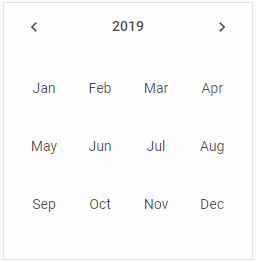
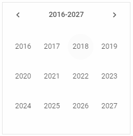
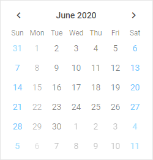
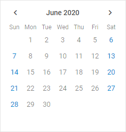
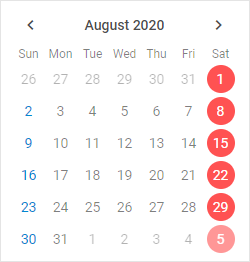
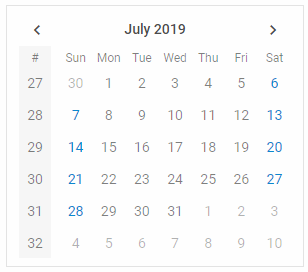
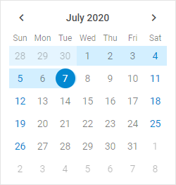
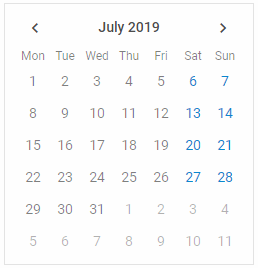
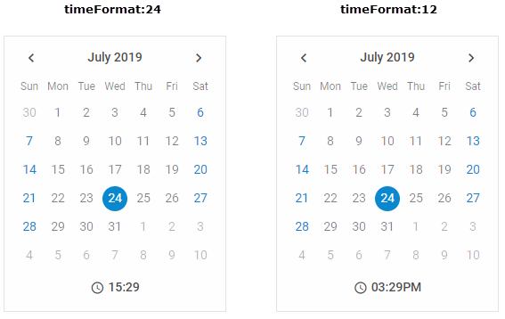
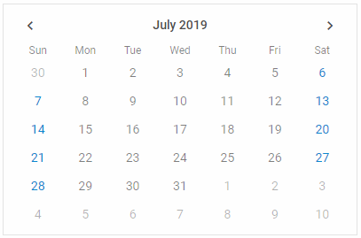

# Configuration

## Calendar modes

There are several modes of displaying Calendar, which are set via the  property:

- **"calendar"** - the default mode. The current date (year and month) is shown in the calendar

~~~js
const calendar = new dhx.Calendar("calendar_container");
~~~

- **"month"** - only months of the current year are shown in the calendar 

~~~js
const calendar = new dhx.Calendar("calendar_container", {
    mode: "month"
});
~~~

- **"year"** - only years are shown, including the current one

~~~js
const calendar = new dhx.Calendar("calendar_container", {
    mode: "year"
});
~~~

**Related sample**: [Calendar. Calendar modes](https://snippet.dhtmlx.com/n9q0tc0q)

You can also show the calendar in one of the modes using the  method.

## Date format

There is a possibility to specify the format of dates in the calendar via the  property. The default format is "%d/%m/%y". 
The full list of available characters used to make formats is provided in the [API reference](/calendar/api/calendar_dateformat_config).

~~~js
const calendar = new dhx.Calendar("calendar_container", {
   dateFormat:"%d.%m.%Y"
});
~~~

**Related sample**: [Calendar. Date format](https://snippet.dhtmlx.com/2co9z3bi)

## Disabled dates

**Related sample**: [Calendar. Marked and disabled dates](https://snippet.dhtmlx.com/ic5oeiga)

To disable certain dates, use the  setting. The value of the property must be a function that takes a *date* as a parameter and returns a *boolean* value.
The dates, for which the function returns *true*, are dimmed in the calendar.

~~~js
const calendar = new dhx.Calendar("calendar_container", {
	disabledDates: function(date) {
		const disabled = {
			0: true,
			1: true,
			2: false,
			3: false,
			4: false,
			5: false,
			6: true
		}
		return disabled[date.getDay()];
	},
	css: "dhx_widget--bordered"
});
~~~

## Displaying only current month

**Related sample**: [Calendar. The days of this month only](https://snippet.dhtmlx.com/4wi5hbtr)

A default calendar shows both the days of the current month and several days of the previous and next months. You can choose the mode of displaying just the current month by setting the value of the  configuration property to *true*:

~~~js
const calendar = new dhx.Calendar("calendar_container", {
    thisMonthOnly:true
});
~~~

## Highlighted dates

**Related sample**: [Calendar. Marked and disabled dates](https://snippet.dhtmlx.com/ic5oeiga)

You can highlight certain dates in the calendar. Set the  property for that. The value of the property must be a function that takes a *date* as a parameter and returns a *string* with the name of a CSS class for marked dates or an empty string for other dates.

~~~js
const calendar = new dhx.Calendar("calendar_container", {
	mark: function(date) {
		if (date.getDay() === 6) {
			return "highlight-date";
		}
	},
	css: "dhx_widget--bordered"
});
~~~

Where "highlight-date" is a CSS class like this:

~~~html

~~~

## Initial calendar date

By default, a calendar shows a month with the current date. If for some reason you want to open some other date, set the  property. It accepts a Date object as a value. It is either the same as  (by default), or shows the current date if **value** is not specified.

~~~js
const calendar = new dhx.Calendar("calendar_container", {
    date: new Date(2019, 0, 1)
});
~~~

**Related sample**: [Calendar. Date initialization](https://snippet.dhtmlx.com/fyg6l65t)

## Initially selected date

If you want to create a calendar with an initially selected date, set the  property in the configuration object. The property can accept a value in several formats:

- as a Date object
- as a string
- as an array of Date values for the range mode
- as an array of string values for the range mode

~~~js
// selects a date
const calendar = new dhx.Calendar("calendar_container", {
    value: new Date(2019,01,10)
});

// selects a date as an array of Date value
const calendar = new dhx.Calendar("calendar_container", {
    value: [new Date(2019,01,10)]
});

// selects a date as a string
const calendar = new dhx.Calendar("calendar_container", {
    value: ("10/02/19")
});

// selects a date as an array of string value
const calendar = new dhx.Calendar("calendar_container", {
    value: (["10/02/19"])
});

// selects dates as an array of Date values(for the range mode)
const calendar = new dhx.Calendar("calendar_container", {
    value: ([new Date(2019,05,03), new Date(2019,05,19)]),
    range: true  
});

// selects dates as an array of string values(for the range mode)
const calendar = new dhx.Calendar("calendar_container", {
    value: (["03/06/19", "15/06/19"]),
    range: true  
});
~~~

**Related sample**: [Calendar. Value initialization](https://snippet.dhtmlx.com/epjjww3l)

The specified date will be highlighted with a round blue marker in the calendar. By default, no date is selected initially.

:::note
Please note that the format of date in the Calendar is defined by the dateFormat option. So, check that you've set the format of date you want to use in the calendar both in the  and in the  property. Otherwise, the default format ("%d/%m/%y") will be used.
:::

## Numbers of weeks

**Related sample**: [Calendar. Numbers of weeks](https://snippet.dhtmlx.com/9692gk6n)

If you want to display the numbers of weeks in the calendar, enable the  property. By default, the numbers are not shown as the property is set to *false*.

~~~js
const calendar = new dhx.Calendar("calendar_container", {
    weekNumbers: true
});
~~~

## Range mode

**Related sample**: [Calendar. Range](https://snippet.dhtmlx.com/2mrj53h0)

You have a possibility to create a calendar in the range mode that allows you to select a range of dates in the calendar. To do this, you need to use the [range:true](/calendar/api/calendar_range_config) option in the calendar configuration object and define an array with the start and end dates of the range.

~~~js
const calendar = new dhx.Calendar("calendar_container", {
	css: "dhx_widget--bordered",
	range: true,
    value: ["25/06/20", "07/07/20"]
});
~~~

:::note
The **value** option should have the array type and contain a pair of values (either Date values or string values) for both dates.
:::

## Start of the week

**Related sample**: [Calendar. Week start](https://snippet.dhtmlx.com/kaxmurh9)

By default, the first day of the week is Sunday, as the **weekStart:"sunday"** configuration option is used. It is also possible to set Monday as the start of the week, by applying "monday" as a value of the  setting:

~~~js
const calendar = new dhx.Calendar("calendar_container", {
    weekStart: "monday"
});
~~~

## Timepicker

You can add a timepicker into a calendar by enabling the  property. By default, a timepicker uses the 24-hour format.
You can change it to the 12-hour format via the  property. It accepts either 12 or 24 value to select the desired time format.

~~~js
const calendar = new dhx.Calendar("calendar_container", {
	timePicker: true,
    timeFormat: 12 // the 12-hour format for the timepicker
});
~~~

**Related sample**: [Calendar. Timepicker In Calendar](https://snippet.dhtmlx.com/jkbfb202)

**Related sample**: [Calendar. Time format](https://snippet.dhtmlx.com/9xi24if2)

## Width of calendar

**Related sample**: [Calendar. Calendar width](https://snippet.dhtmlx.com/azm0u5ns)

You can set the desired width of a calendar using the  configuration property. The default width of Calendar is 250px.

~~~js
const calendar = new dhx.Calendar("calendar_container", {
    width: "400", 
    css: "dhx_widget--bordered"
});
~~~
