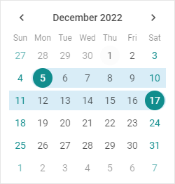

# Customization

## Styling Calendar

There is a possibility to make changes in the look and feel of a calendar. For example, change its background color:

**Related sample**: [Calendar. Styling (custom CSS)](https://snippet.dhtmlx.com/2045cbe1)

For this you need to take the following steps:

- add a new CSS class(es) with desired settings in the &lt;style&gt; section of your HTML page or in your file with styles (don't forget to include your file on the page in this case)

~~~js

~~~

- specify the name of the created CSS class (or names of classes separated by spaces) as the value of the  property in the Calendar configuration:

~~~js
var calendar = new dhx.Calendar({
    css:"my_first_class my_second_class"
});
~~~

For example:

~~~js

var calendar = new dhx.Calendar("calendar", { 
	css: "bg-grey dhx_calendar--bordered" 
});
~~~

## Styling selected dates

**Related sample**: [Calendar. Custom styles for selected date](https://snippet.dhtmlx.com/9u0ix3na)

You can apply custom styling to dates selected in a calender as well as to [date ranges](calendar/operating_calendar.md#linking-two-calendars). There are system styles you need to change for this purpose:

~~~js

var calendar1 = new dhx.Calendar("calendar1", {css: "dhx_widget--bordered"});
var calendar2 = new dhx.Calendar("calendar2", {css: "dhx_widget--bordered"});
~~~
