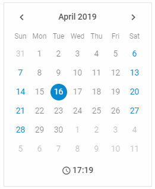

---
sidebar_label: Overview
title: Calendar overview
description: dhtmlxCalendar is a smart datepicker solution for websites or applications that allows selecting dates, ranges of dates, and time. It's easily configurable and highly customizable.
---          

dhtmlxCalendar is a component that allows users to view and select dates. You can create calendar in one of 4 modes: days, months, years, or as a timepicker.
This component is a great date picker solution for your website or application. Check [online samples for dhtmlxCalendar](https://docs.dhtmlx.com/suite/samples/calendar/).  

## API reference

[Calendar API](api/api_overview)

## Related resources

- To get just dhtmlxCalendar, download it from [our website](https://dhtmlx.com/docs/products/dhtmlxCalendar/download.shtml)
- To get the whole JavaScript library of UI components [download dhtmlxSuite](https://dhtmlx.com/docs/products/dhtmlxSuite/download.shtml)          
- There are also [online samples for dhtmlxCalendar](https://docs.dhtmlx.com/suite/samples/calendar/)  
  
## Guides

You can read the following articles to find out how to add Calendar on the page and work with it.

- [Initialization](how_to_start)
- [Configuration](configuring)
- [Localization](localizing_calendar)  
- [Work with Calendar](operating_calendar)
- [DatePicker](datepicker)
- [Customization](customization)
- [Event Handling](handling_events)  

## Other

[Migration to Newer Versions](migration) 
