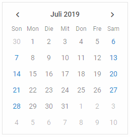

---
sidebar_label: Localization
title: Localization
---      
    
You can apply different languages to the interface of dhtmlxCalendar. You just need to translate the corresponding strings for Calendar labels and apply a ready locale to the component.

Default locale
------------

The default locale for Calendar looks like this:

~~~js
var en = {
	// short names of months
	monthsShort: ["Jan", "Feb", "Mar", "Apr", "May", "Jun", 
                 "Jul", "Aug", "Sep", "Oct", "Nov", "Dec"],
    // full names of months
	months: ["January", "February", "March", "April", "May", "June", 
            "July", "August", "September", "October", "November", "December"],
    // short names of days
	daysShort: ["Sun", "Mon", "Tue", "Wed", "Thu", "Fri", "Sat"],
    // full names of days
	days: ["Sunday", "Monday", "Tuesday", "Wednesday", "Thursday", 
    			"Friday", "Saturday"]
};
~~~

Custom locale
------------

To use a different locale, your need to:

- define necessary language settings: provide full and short names of months, as well as full and short names of days of a week:

~~~js
var de = {
	// short names of months
	monthsShort: ["Jan", "Feb", "Mär", "Apr", "Mai", "Jun", 
    			 "Jul", "Aug", "Sep", "Okt", "Nov", "Dez"],
    // full names of months             
	months: ["Januar", "Februar", "März", "April", "Mai", "Juni", 
    		"Juli", "August", "September", "Oktober", "November", "Dezember"],
    // short names of days
	daysShort: ["Son", "Mon", "Die", "Mit", "Don", "Fre", "Sam"],
    // full names of days
	days: ["Sonntag", "Montag", "Dienstag", "Mittwoch", "Donnerstag", 
    			"Freitag", "Samstag"]
};
~~~

- apply the language settings by calling the **dhx.i18n.setLocale()** method before Calendar initialization:

~~~js
dhx.i18n.setLocale("calendar", de);
var calendar = new dhx.Calendar("calendar_container");
~~~

{{editor    https://snippet.dhtmlx.com/tn40a0w8	Calendar. Localized Calendar}}