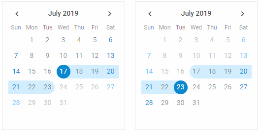
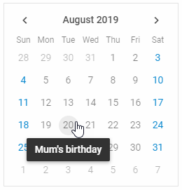

---
sidebar_label: Work with Calendar
title: Work with Calendar
description: description
---          

## Changing calendar mode

You can show a particular date in the calendar and/or open Calendar in a certain mode via the  method. It takes two parameters:

- **date** - (*Date*) the date that should be shown in the calendar
- **mode** - (*string*)	optional, the mode in which the calendar will be opened

There are the following calendar modes available:

- **"calendar"** - allows selecting among days of a month (default)

~~~js
calendar.showDate(new Date(2020,11,12),"calendar");
~~~

- **"month"** - allows selecting a month

~~~js
calendar.showDate(new Date(2020,11,12),"month");

// shows the current month
calendar.showDate(null,"month");
~~~

{{editor    https://snippet.dhtmlx.com/nyfzc8cl	Calendar. Showing Particular Calendar Date And Mode}}

- **"year"** - allows selecting a year

~~~js
calendar.showDate(new Date(2020,11,12),"year");

// shows the current year
calendar.showDate(null,"year");
~~~

For example, Calendar can be attached to an input, a click on which will show Calendar in one of the modes:

~~~html
<input type="text" onclick="showCalendar()" />
~~~

~~~js
var calendar = new dhx.Calendar("calendar_container");
function showCalendar(){
	calendar.showDate(new Date(11,11,11),"month");
};
~~~

## Getting current mode

There is a possibility to get the current mode of displaying Calendar via the [getCurrentMode()](calendar/api/calendar_getcurrentmode_method.md) method. The method returns one of the available calendar modes:

- month
- year
- calendar
- timepicker

~~~js
var mode = calendar.getCurrentMode(); // -> "calendar"
~~~

{{editor    https://snippet.dhtmlx.com/fadykqoc	Calendar. Get Current Mode}}

## Getting selected date

To get the selected date, call the  method. The method returns selected date either as a string (default) or as a Date object. 
To get a date as an object, pass the *true* parameter to the method.

~~~js
var date1 = calendar.getValue(); // -> "20/08/19"

var date2 = calendar.getValue(true); // -> Tue Aug 20 2019 00:00:00 GMT+0300 
~~~

{{editor    https://snippet.dhtmlx.com/k2vrfqj0	Calendar. Getting Selected Date}}

If you work with a calendar in the [range mode](calendar/configuring.md#rangemode) the **getValue()** method returns either an array of Date values or an array of string values with the start and end dates of the range.

~~~js
// for a range calendar as an array of Date values 
var date = calendar.getValue(true); 
// -> [Mon Jun 03 2019 00:00:00 GMT+0300, Wed Jun 19 2019 00:00:00 GMT+0300]

// for a range calendar as an array of string values 
var date = calendar.getValue(); // ->  ["03/06/19", "19/06/19"]
~~~

## Linking two calendars

You can create two calendars and link them to provide the ability of selecting a date range. The first calendar will be used for setting the start date of the range, while the end date of the range will be specified in the
second calendar. 

Use the  method and pass as a parameter the object of the second calendar to link the first calendar to.
In the example below the [Change](calendar/api/calendar_change_event.md) event is intended to output the start and end dates of the selected range:

~~~js
var calendar = new dhx.Calendar("calendar1", { css: "dhx_calendar--bordered" });
var calendar2 = new dhx.Calendar("calendar2", { css: "dhx_calendar--bordered" });

calendar.link(calendar2);

calendar.events.on("change", function (date) {
	document.querySelector("#resultFrom").innerHTML = 
    	"Date from: " + calendar.getValue() + " ";
});

calendar2.events.on("change", function (date) {
	document.querySelector("#resultTo").innerHTML = 
    	"Date to: " + calendar2.getValue() + " ";
});
~~~

{{editor    https://snippet.dhtmlx.com/dxo54017	Calendar. Date Range}}

## Selecting date 

To select a date in a calendar, call the  method. The method has one mandatory parameter - a date that should be selected, which can be passed in several formats:

- as a Date object
- as a string
- as an array of Date values for the range mode
- as an array of string values for the range mode

~~~js
// selects the current date
calendar.setValue(new Date());

// sets the current date as an array of Date value
calendar.setValue([new Date()]);
 
// sets a date as a string
calendar.setValue("30/05/19");

// sets a date as an array of string value
calendar.setValue(["30/05/19"]);

//sets dates as an array of Date values(for the range mode)
calendar.setValue([new Date(2019,05,03), new Date(2019,05,19)]);

//sets dates as an array of string values(for the range mode)
calendar.setValue(["03/06/19", "15/06/19"]);
~~~

In case a date has been successfully added into the calendar, the method will return *true*.

{{editor    https://snippet.dhtmlx.com/vmg11002	Calendar. Preset Selected Date}}

{{note Please note that the format of date in the Calendar is defined by the  option. So, check that you've set the format of date you want to use in the calendar both in the
**setValue()** method and in the **dateFormat** property. Otherwise, the default format (**"%d/%m/%y"**) will be used.}}

## Showing tooltips

You can add tooltips for dates and show them on the  event. For example, you can add tooltips to mark some special days:

~~~js
var special_days = {
	"20__8": "Mum's birthday",
	"28__8": "Trip to Canada"
}

calendar.events.on("DateMouseOver", function(date, e) {
	var key = date.getDate() + "__" + (date.getMonth() + 1);
	if (key in special_days) {
		dhx.tooltip(special_days[key], {node: e.target, position: "bottom"});
	}
});
~~~

