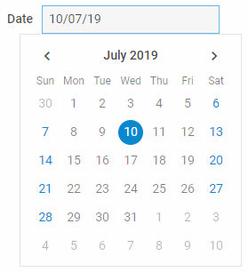

## Calendar basic initialization 

To use DHTMLX Calendar in your application, you need to take the following simple steps:

- [Download the DHTMLX Calendar package](https://dhtmlx.com/docs/products/dhtmlxCalendar/download.shtml) and unpack it into a folder of your project
- [Include source files](#Include-source-files)
- [Initialize Calendar](#initializecalendar) with the object constructor
- [Select initial date (optional)](#selectinitialdateoptional)

### Include source files

Create an HTML file and place full paths to JS and CSS files of DHTMLX Calendar into the header of the created file. The Calendar component can be used standalone or as a part of the Suite library.

**If you use DHTMLX Calendar standalone**, you need to include JS/CSS files from Calendar package:

- *calendar.js*
- *calendar.css*

**If you use DHTMLX Calendar as a part of the Suite package**, you need to include JS/CSS files from the DHTMLX Suite library:

- suite.js
- suite.css

### Initialize Calendar

Basic Calendar initialization means creating a container. In this case you initialize Calendar with the `dhx.Calendar` object constructor. The constructor takes two parameters: 

- the HTML container for Calendar

- an object with configuration properties. If this argument is not passed to the constructor, the settings will be default

~~~html
<html>

<head>
	<title>How to Start with dhtmlxCalendar</title>
	<!-- includes JS/CSS files from Calendar package -->
	
	<link rel="stylesheet" href="../../codebase/calendar.css">
</head>

<body>
	<!-- component container -->
	

	
</body>

</html>
~~~

`RELATED SAMPLE:` [Calendar. Basic Initialization](https://snippet.dhtmlx.com/xcw19e52)

### Select initial date (optional)

You can specify what date should be selected in the calendar both before and after initialization of the component.  Please follow the links to read related articles. There are several options to do it:

- via the [value configuration](configuring#initially-selected-date) option 
- with the help of the [setValue](operating_calendar) method

## Configuration properties

There is a list of properties that you can specify in the Calendar configuration object. Have a look for all of them: [Calendar API Properties](http://localhost:3000/calendar/api/api_overview#properties). 

The detailed information on configuration options can be found...

## Initialization in a popup
This variant presupposes that you create a popup first and then attach a calendar into it, thus creating a date picker. Please follow the link and read the related article: [DatePicker](calendar/datepicker.md).

## Initialization inside Form and Toolbar
