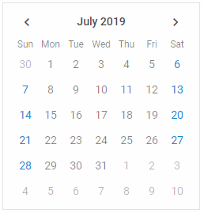

---
sidebar_label: Overview2
title: Calendar2
description: DHTMLX Calendar is a smart datepicker solution for websites or applications that allows selecting dates, ranges of dates, and time. It's easily configurable and highly customizable.
---          

DHTMLX Calendar is a component that allows users to view and select dates. You can create the Calendar in several modes and use a timepicker in it. The useful date picker feature is implemented in the Calendar and ready for usage.

This component is a great solution for your website or application. Check [online samples for DHTMLX Calendar](https://docs.dhtmlx.com/suite/samples/calendar/).  

## API reference

[Calendar API](api/api_overview)

## Related resources

- To get just DHTMLX Calendar, download it from [our website](https://dhtmlx.com/docs/products/dhtmlxCalendar/download.shtml)
- To get the whole JavaScript library of UI components [download dhtmlxSuite](https://dhtmlx.com/docs/products/dhtmlxSuite/download.shtml)          
- There are also [online samples for dhtmlxCalendar](https://docs.dhtmlx.com/suite/samples/calendar/)  
  
## Guides 1

You can read the following articles to find out how to add the Calendar to the page, configure and work with it. Covers all the possible ways you can use this widget. 

- [Initialization](how_to_start)
- [Configuration](configuring)
- [Localization](localizing_calendar)  
- [Work with Calendar](operating_calendar)
- [DatePicker](datepicker)
- [Customization](customization)
- [Event Handling](handling_events)  

## Guides 2
You can read the following articles to find out how to add the Calendar to the page, configure and work with it. 

### How to start
Covers the initialization of Calendar on a page
- [Initialization](how_to_start)

### How to localize
Covers languages interface settings. You can set the language you need in an easy way.
- [Localization](localizing_calendar) 

### How to work with
Covers the ways of specifying date format, design of the widget, customization, modes, working with two calendars. Includes the operations that can be performed with Calendar and available events.
- Initialization settings
- Configuration settings
- Applying features
- Styling features

## Guides 3

### Creating Calendar 
Read how to initialize the Calendar on a page.
- [Initialization](how_to_start)

### Localizing Calendar
Study how to set languages interface.
- [Localization](localizing_calendar) 

### Exploring Calendar settings
Read how to create Calendar settings.
- Date settings
    - 
- Styling settings
    - 
- Spesial settings
    - 

### Developing with Calendar solutions
Explore how to work with the solutions the Calendar provides to you.
- DatePicker (Initialization in a popup)
- Showing tooltips
- Getting current mode
- Showing tooltips
- Getting current mode
- Getting selected date 
- Attaching event listeners
- Detaching event listeners
- Calling events
- The list of events

## Guides 4

### Creating Calendar 

Read how to initialize the Calendar on a page.
- [Initialization](how_to_start)

### Localizing Calendar

Study how to set languages interface.
- [Localization](localizing_calendar) 

### Exploring Calendar settings
Read how to create Calendar settings.
- Calendar modes
- Changing calendar mode
- Initial calendar date
- Initially selected date
- Selecting date (переименовать в Set date)
- Date format
- Numbers of weeks
- Start of the week
- Disabled dates
- Displaying only current month
- Styling Calendar
- Styling selected dates
- Width of calendar
- Highlighted dates
- Range mode
- Linking 2 calendars
- Range mode of 2 calendars
 
### Developing with Calendar solutions

Explore how to work with the solutions the Calendar provides to you.
- DatePicker (Initialization in a popup)
- Showing tooltips
- Getting current mode
- Showing tooltips
- Getting current mode
- Getting selected date 
- Attaching event listeners
- Detaching event listeners
- Calling events
- The list of events

## Migration to Newer Versions

Please check ... article to learn about new upgrades. 