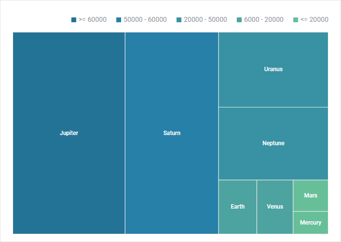

# Overview of Chart types

DHTMLX Chart provides a variety of charts types that will help you to represent you data in the most suitable way. Each type of chart is easily configurable and can be adjusted according to your preferences.
All in all there are 11 types of chart, in the list below they are combined into groups for the sake of convenience:

- [Overview of Chart types](#overview-of-chart-types)
  - [Line and Spline chart](#line-and-spline-chart)
    - [Line chart](#line-chart)
    - [Spline chart](#spline-chart)
  - [Bar and X-Bar chart](#bar-and-x-bar-chart)
    - [Bar chart](#bar-chart)
    - [X-Bar chart](#x-bar-chart)
  - [Area and SplineArea chart](#area-and-splinearea-chart)
    - [Area chart](#area-chart)
    - [SplineArea chart](#splinearea-chart)
  - [Pie, Pie 3D and Donut chart](#pie-pie-3d-and-donut-chart)
    - [Pie and Pie 3D chart](#pie-and-pie-3d-chart)
    - [Donut chart](#donut-chart)
  - [Radar chart](#radar-chart)
  - [Scatter chart](#scatter-chart)
  - [Treemap chart](#treemap-chart)
  - [Calendar heatmap chart](#heatmap-chart)

## Line and Spline chart

This is a basic chart type that shows changes of trends in progress over a period of time. Thus it will help you to display the dynamics of prices over a year or
how the number of staff has increased over several years. Choose this variant when your data has **more than 10 items**. 

### Line chart

**Related sample**: [Chart. Line chart initialization](https://snippet.dhtmlx.com/t881qcim)

### Spline chart

**Related sample**: [Chart. Spline chart initialization](https://snippet.dhtmlx.com/2wvmdm0y)

## Bar and X-Bar chart

The same as Line chart it displays data for certain periods. It greatly suits you if there are **less than 10 items** in your data set.

### Bar chart

**Related sample**: [Chart. Bar chart initialization](https://snippet.dhtmlx.com/id9nbujd)

### X-Bar chart

**Related sample**: [Chart. X-Bar chart initialization](https://snippet.dhtmlx.com/qz80yw84)

## Area and SplineArea chart

Area chart is based on the Line chart. The difference is that areas below lines are filled with color. This type of chart allows you to provide visual comparison of two or more values over time.

### Area chart

**Related sample**: [Chart. Area chart initialization](https://snippet.dhtmlx.com/nv6t6lvm)

### SplineArea chart

**Related sample**: [Chart. Spline Area chart initialization](https://snippet.dhtmlx.com/bo82km4n)

## Pie, Pie 3D and Donut chart

Pie chart and its variations are the best choice when you deal with proportions and percentages. It is a circular chart divided into proportional parts that illustrate relations between items in a data set.

### Pie and Pie 3D chart

**Related sample**: [Chart. Pie chart initialization](https://snippet.dhtmlx.com/jfbet749)

**Related sample**: [Chart. Pie 3D chart initialization](https://snippet.dhtmlx.com/xfce9pys)

### Donut chart

**Related sample**: [Chart. Donut chart initialization](https://snippet.dhtmlx.com/lobb80ig)

## Radar chart

This one is a two-dimensional chart that allows placing one or several series of values over multiple numerical variables. For example, Radar chart will help you to study how a number of parameters 
relate to one item (the center point of a chart) and compare their values.

**Related sample**: [Chart. Radar chart initialization](https://snippet.dhtmlx.com/6otf4h0t)

## Scatter chart

The peculiarity of Scatter Chart is that it allows exploring relations between two sets of data in order to find out possible dependencies or patterns.

**Related sample**: [Chart. Scatter chart initialization](https://snippet.dhtmlx.com/pkczfmpu)

## Treemap chart

A treemap chart presents a hierarchical visualization of data as a set of rectangular tiles and makes it easy to spot patterns. Several tiles can be collected into a group. The sizes of tiles are proportional to the values of the data items they represent.

**Related sample**: [Chart. Treemap chart initialization](https://snippet.dhtmlx.com/p31wzm0b)

**Related sample**: [Chart. Treemap chart with groups initialization](https://snippet.dhtmlx.com/fmgnlue4)

## Calendar heatmap chart 

The calendar heatmap chart is a two dimensional calendar view that uses graduated colors to visualize certain number of events for specific days during a year. The whole time period in the chart is divided into years and years into months. Each cell in a column corresponds to a day of the week.

The chart helps to display and identify daily patterns or anomalies over a long period.

~~~todo
add image
~~~

