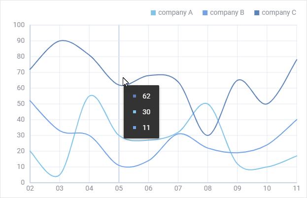
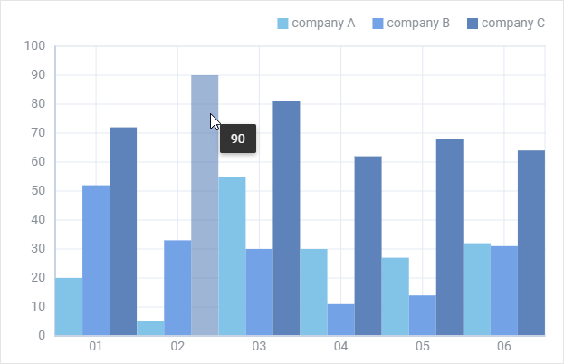
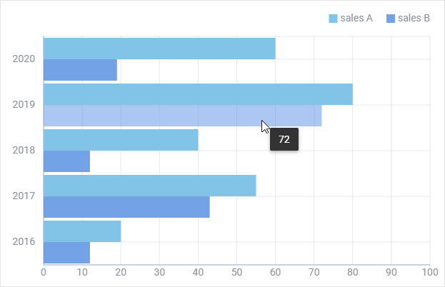
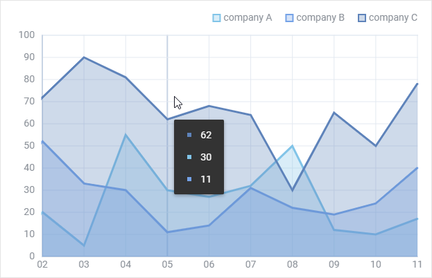
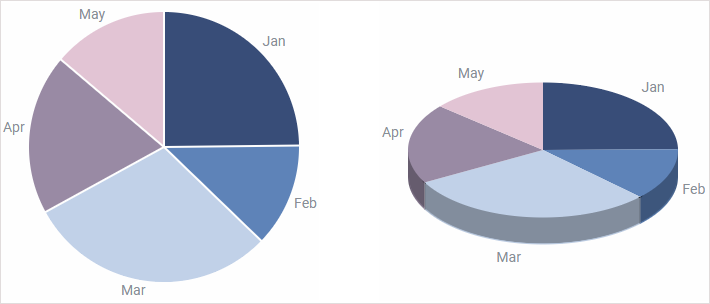
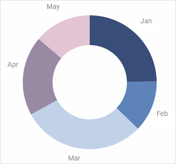
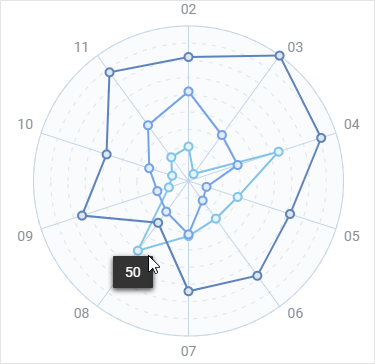
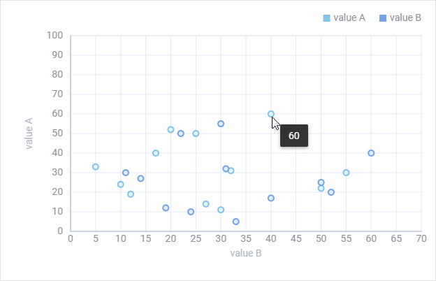

---
sidebar_label: Overview of Chart Types 
title: Overview of Chart Types 
---          

dhtmlxChart provides a variety of charts types that will help you to represent you data in the most suitable way. Each type of chart is easily configurable and can be adjusted according to your preferences.
All in all there are 11 types of chart, in the list below they are combined into groups for the sake of convenience:

- [Line and Spline chart](#line-and-spline-chart)
  - [Line chart](#line-chart)
  - [Spline chart](#spline-chart)
- [Bar and X-Bar chart](#bar-and-x-bar-chart)
  - [Bar chart](#bar-chart)
  - [X-Bar chart](#x-bar-chart)
- [Area and SplineArea chart](#area-and-splinearea-chart)
  - [Area chart](#area-chart)
  - [SplineArea chart](#splinearea-chart)
- [Pie, Pie 3D and Donut chart](#pie-pie-3d-and-donut-chart)
  - [Pie and Pie 3D Chart](#pie-and-pie-3d-chart)
  - [Donut Chart](#donut-chart)
- [Radar Chart](#radar-chart)
- [Scatter Chart](#scatter-chart)

Line and Spline chart
------------------

This is a basic chart type that shows changes of trends in progress over a period of time. Thus it will help you to display the dynamics of prices over a year or
how the number of staff has increased over several years. Choose this variant when your data has **more than 10 items**. 

### Line chart

{{editor    https://snippet.dhtmlx.com/t881qcim	Chart. Basic Initialization Line Chart}}

### Spline chart

{{editor    https://snippet.dhtmlx.com/2wvmdm0y	Chart. Basic Initialization Spline Chart}}

Bar and X-Bar chart
---------------------

The same as Line chart it displays data for certain periods. It greatly suits you if there are **less then 10 items** in your data set.

### Bar chart

{{editor    https://snippet.dhtmlx.com/id9nbujd	Chart. Basic Initialization Bar Chart}}

### X-Bar chart

{{editor    https://snippet.dhtmlx.com/qz80yw84	Chart. Basic Initialization X-Bar Chart}}

Area and SplineArea chart
--------------

Area chart is based on the Line chart. The difference is that areas below lines are filled with color. This type of chart allows you to provide visual comparison of two or more values over time.

### Area chart

{{editor    https://snippet.dhtmlx.com/nv6t6lvm	Chart. Basic Initialization Area Chart}}

### SplineArea chart

{{editor    https://snippet.dhtmlx.com/bo82km4n	Chart. Basic Initialization Spline Area Chart}}

Pie, Pie 3D and Donut chart
----------------------

Pie chart and its variations are the best choice when you deal with proportions and percentages. It is a circular chart divided into proportional parts that illustrate relations between items in a data set.

### Pie and Pie 3D Chart

{{editor    https://snippet.dhtmlx.com/jfbet749	Chart. Basic Initialization Pie Chart}}

{{editor    https://snippet.dhtmlx.com/xfce9pys	Chart. Basic Initialization Pie 3D Chart}}

### Donut Chart

{{editor    https://snippet.dhtmlx.com/lobb80ig	Chart. Basic Initialization Donut Chart}}

Radar Chart
-----------------

This one is a two-dimensional chart that allows placing one or several series of values over multiple numerical variables. For example, Radar chart will help you to study how a number of parameters 
relate to one item (the center point of a chart) and compare their values.

{{editor    https://snippet.dhtmlx.com/6otf4h0t	Chart. Basic Initialization Radar Chart}}

Scatter Chart
---------------

The peculiarity of Scatter Chart is that it allows exploring relations between two sets of data in order to find out possible dependencies or patterns.

{{editor    https://snippet.dhtmlx.com/pkczfmpu	Chart. Basic Initialization Scatter Chart}}
