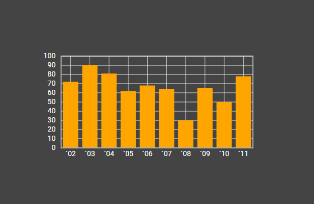
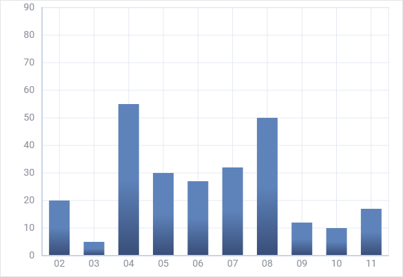
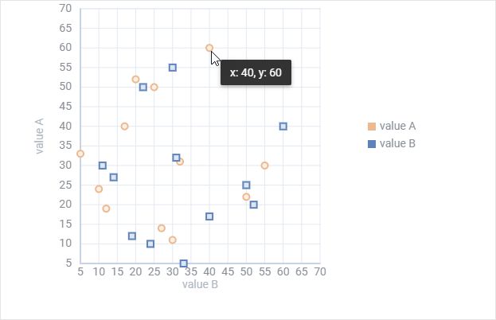
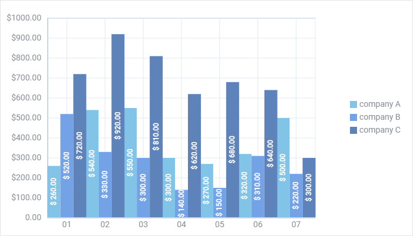

# Customization

## Styling chart

There is a possibility to make changes in the look and feel of a chart.

**Related sample**: [Chart. Styling (custom CSS)](https://snippet.dhtmlx.com/p82iew5s)

For this you need to take the following steps:

- add a new CSS class(es) with desired settings in the &lt;style&gt; section of your HTML page or in your file with styles (don't forget to include your file on the page in this case)

~~~html

~~~

- specify the name of the created CSS class (or names of classes separated by spaces) as the value of the  property in the Chart configuration:

~~~js
const chart = new dhx.Chart("chart_container", {
    css:"my_first_class my_second_class"
});
~~~

For example:

~~~html

~~~

## Adding template to scale labels

**Related sample**: [Chart. Text template for scale labels](https://snippet.dhtmlx.com/nhm3438n)

While configuring chart scales you can add a template for the labels of the scales by using the **textTemplate** configuration option of [scales](chart/configuration_properties.md#scales):

~~~js {7-9}
const chart = new dhx.Chart("chart_container", {
    type:"line",
    css: "dhx_widget--bg_white dhx_widget--bordered",
    scales: {
        "bottom" : {
            text: "month",
            textTemplate: function(month) {
                return "m:" + month;
            }
        },
        "left" : {
            maxTicks: 10, max: 100, min: 0
        }
    },
    series: [
        {
            id: "A", value: "company C", color: "#5E83BA", strokeWidth: 2
        }
    ]
});
~~~

## Adding color gradient for bars

**Related sample**: [Chart. Bar chart. Gradient](https://snippet.dhtmlx.com/j3duyn2q)

It is possible to define a color gradient for bars with the help of the **gradient** option of [series](chart/configuration_properties.md#series). You need to set its value as a function that takes the color of the series filling in Hex format as a parameter:

~~~js {16-31}
const chart = new dhx.Chart("chart_container", {
    type:"bar",
    css: "dhx_widget--bg_white dhx_widget--bordered",
    scales: {
        "bottom" : {
            text: "month",
        },
        "left" : {
            max: 90
        }
    },
    series: [
        {
            id: "A", value: "company A", color: "none", size: 35,
            fill: "#5E83BA",
            gradient: function(color) {
                return {
                    stops: [
                        {
                            offset: 0.5, 
                            color: color, 
                            opacity: 1 
                        }, 
                        { 
                            offset: 1, 
                            color: "#394E79", 
                            opacity: 1 
                        } 
                    ] 
                } 
            } 
        }
    ]
});
~~~

## Adding template to tooltips

**Related sample**: [Chart. Tooltip template](https://snippet.dhtmlx.com/mbz7dkku)

You can easily define a template for showing values of data items in tooltip via the **tooltipTemplate** option of [series](chart/configuration_properties.md#series):

~~~js {1-3,18,23}
function tooltipTemplate(p) {
  return "x: " + p[1] + ", y: " + p[0];
};

const chart = new dhx.Chart("chart_container", {
    css: "dhx_widget--bg_white dhx_widget--bordered",
    scales: {
        bottom:{
            locator: "value B", title: "value B", max: 70
        },
        left:{
            title: "value A", max: 70
        }
    },
    series: [{
        id: "A", type: "scatter", value: "value A", valueY:"value B",
        pointType: "circle", color: "#EEB98E",
        tooltipTemplate: tooltipTemplate
    },
    {
        id: "B", type: "scatter", value: "value B", valueY: "value A",
        pointType: "rect", color: "#5E83BA",
        tooltipTemplate: tooltipTemplate
    }],
    legend: {
        series: ["A", "B"],
        usePointType: true,
    }
});
~~~

## Adding template to text values of data items in bars

**Related sample**: [Chart. Show text](https://snippet.dhtmlx.com/o7ke2f1s)

The **showTextTemplate** option of [series](chart/configuration_properties.md#series) lets you an opportunity to add a template to values that are shown for data items in bars:

~~~js {20-22,29-31}
const chart = new dhx.Chart("chart_container", {
    type: "bar",
    css: "dhx_widget--bg_white dhx_widget--bordered",
    scales: {
        bottom : {
            text: "month"
        },
        left : {
            max: 1000, maxTicks: 10, min: 0,
            textTemplate: function (cost) {
                return cost !== 0 ? "$" + cost + ".00" : cost + ".00"
            }
        }
    },
    series: [
        {
            id: "A", value: "company A", color: "#81C4E8", fill: "#81C4E8",
            showText: true,
            showTextRotate: -90,
            showTextTemplate: function (sum) {
                return "$ " + sum + ".00";
            },
            barWidth: 22, tooltip: false
        },
        {
            id: "B", value: "company B", color: "#74A2E7", fill: "#74A2E7",
            showText: true,
            showTextRotate: "-90",
            showTextTemplate: function (sum) {
                return "$ " + sum + ".00";
            },
            barWidth: 22, tooltip: false
        }
    ],
    legend: {
        series: ["A", "B"],
        halign: "right",
        valign: "middle"
    }
});
~~~
