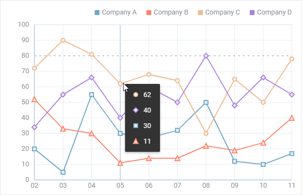

---
sidebar_label: Overview
title: Chart overview
description: dhtmlxChart is a powerful data visualization tool for web applications. It provides a wide variety of charts to represent different data sets in the clearest way. 
---          

dhtmlxChart is a great tool for creating powerful charts for web applications. It provides a wide variety of chart types, the possibility to render several data properties on the same chart and adding tooltips, 
both 2D and 3D presentation, different variants of data loading, and a whole kit of configuration settings for all elements of a chart interface. 
Check [online samples for dhtmlxChart](https://docs.dhtmlx.com/suite/samples/chart/). 

## API reference

## Related resources

- To get just dhtmlxChart, download it from [our website](https://dhtmlx.com/docs/products/dhtmlxChart/download.shtml)
- To get the whole JavaScript library of UI components [download dhtmlxSuite](https://dhtmlx.com/docs/products/dhtmlxSuite/download.shtml)          
- There are also [online samples for dhtmlxChart](https://docs.dhtmlx.com/suite/samples/chart/)  

## Guides

You can read the following articles to find out how to add Chart on the page and work with it.

-       
- 
- 
- 
- 
-                
- 
