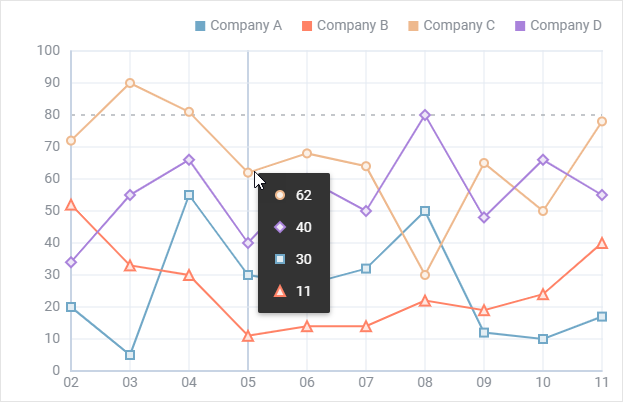

# Chart overview

DHTMLX Chart is a great tool for creating powerful charts for web applications. It provides a wide variety of chart types, the possibility to render several data properties on the same chart and adding tooltips, 
both 2D and 3D presentation, different variants of data loading, and a whole kit of configuration settings for all elements of a chart interface. 
Check [online samples for DHTMLX Chart](https://snippet.dhtmlx.com/bo82km4n?tag=chart). 

## Features

You can check the following page to learn how to build a full-featured DHTMLX Chart:

- [Features](/chart/features/)

## API reference

- [Chart API overview](/chart/api/api_overview/)

## Related resources

- To get just DHTMLX Chart, download it from [our website](https://dhtmlx.com/docs/products/dhtmlxChart/download.shtml)
- To get the whole JavaScript library of UI components [download DHTMLX Suite](https://dhtmlx.com/docs/products/dhtmlxSuite/download.shtml)
- There are also [online samples for DHTMLX Chart](https://snippet.dhtmlx.com/bo82km4n?tag=chart)
- To work with data of Chart check [DataCollection API](/data_collection/)

## Guides

You can read the following articles to find out how to add Chart on the page and work with it.

- [Overview of Chart types](/chart/charts_overview/)
- [Initialization](/chart/initialization/)
- [Configuration](/chart/configuration_properties/)
- [Data loading](/chart/data_loading/)
- [Work with Chart](/chart/usage/)
- [Customization](/chart/customization/)
- [Event handling](/chart/events/)
