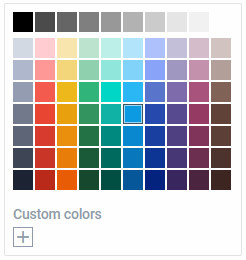
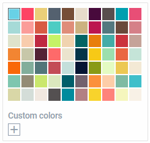
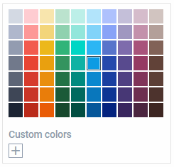
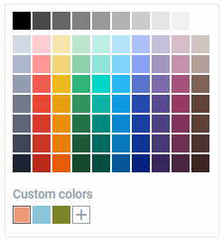
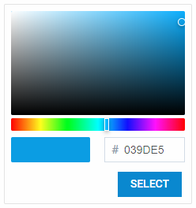
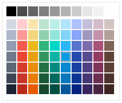

---
sidebar_label: Configuration
title: Configuration
---          

Custom colors in palette
---------------------

The palette of ColorPicker contains a set of default colors. They are enumerated below:

~~~js
var palette = [
    ["#D4DAE4","#B0B8CD","#949DB1","#727A8C","#5E6677","#3F4757","#1D2534"],
    ["#FFCDD2","#FE9998","#F35C4E","#E94633","#D73C2D","#CA3626","#BB2B1A"],
    ["#F9E6AD","#F4D679","#EDB90F","#EAA100","#EA8F00","#EA7E00","#EA5D00"],
    ["#BCE4CE","#90D2AF","#33B579","#36955F","#247346","#1D5B38","#17492D"],
    ["#BDF0E9","#92E7DC","#02D7C5","#11B3A5","#018B80","#026B60","#024F43"],
    ["#B3E5FC","#81D4FA","#29B6F6","#039BE5","#0288D1","#0277BD","#01579B"],
    ["#AEC1FF","#88A3F9","#5874CD","#2349AE","#163FA2","#083596","#002381"],
    ["#C5C0DA","#9F97C1","#7E6BAD","#584A8F","#4F4083","#473776","#3A265F"],
    ["#D6BDCC","#C492AC","#A9537C","#963A64","#81355A","#6E3051","#4C2640"],
    ["#D2C5C1","#B4A09A","#826358","#624339","#5D4037","#4E342E","#3E2723"]
];
~~~

{{editor    https://snippet.dhtmlx.com/ezk8rk4m	Colorpicker. Basic Initialization}}

It is possible to redefine the structure of a palette via the  config option, and set an array of custom colors that will be shown on initialization of the component. 
For example:

~~~js
var colorpicker = new dhx.Colorpicker("colorpicker_container", {
    // removes the section with gray shades shown at the top of palette by default
    grayShades: false,
    palette: [
        ["#ffffc0", "#ffff9c", "#ecd078", "#a59154", "#5e5330"],
        ["#ff916b", "#ff7657", "#d95b43", "#973f2e", "#56241a"],
        ["#ff4169", "#f93555", "#c02942", "#861c2e", "#4c101a"],
        ["#863958", "#6d2e47", "#542437", "#3a1926", "#210e16"],
        ["#84bec3", "#6b9a9e", "#53777a", "#3a5355", "#212f30"]
    ]
});
~~~

{{editor    https://snippet.dhtmlx.com/j5gisdew	Colorpicker. Custom Palette Colors}}

Gray shades
-----------------------

The default configuration of the ColorPicker palette includes a section with gray shades, which is shown at the top of palette. There is a possibility to hide this section showing just main colors: default or custom.

{{editor    https://snippet.dhtmlx.com/b44fp8q2	Colorpicker. Palette Without Gray Shades}}

Use the  configuration option for this purpose:

~~~js
var colorpicker = new dhx.Colorpicker("colorpicker_container",{
	grayShades: false
});
~~~

List of custom colors
---------------------

{{editor    https://snippet.dhtmlx.com/zf88vxd1	Colorpicker. Custom Colors}}

When ColorPicker is rendered on a page, its list of custom (user-defined) colors is empty. You can change this configuration and specify custom colors that should be shown in the related section on initialization of 
the component via the  configuration option. Colors should be specified as an array of strings in the Hex format:

~~~js
var colorpicker = new dhx.Colorpicker("colorpicker_container", {
	customColors: ["#1d2de7", "#ab31ff", "#a3fa76"]
});
~~~

"palette" or "picker" mode only
--------------------

dhtmlxColorPicker has two main modes: "palette" (default) and "picker". To initialize the component in the "picker" mode, set the  property in the ColorPicker 
configuration to *true*.

~~~js
var colorpicker = new dhx.Colorpicker("colorpicker_container",{
	pickerOnly: true
});
~~~

In this mode the palette is not available and only the picker is displayed.

{{editor    https://snippet.dhtmlx.com/5zlvvwpl	Colorpicker. Picker Only}}

It is also possible to create the component in the palette mode only using the  mode:

~~~js
var colorpicker = new dhx.Colorpicker("colorpicker_container",{
	paletteOnly: true
});
~~~

{{note Note that in the **paletteOnly** mode the palette is displayed without the panel with custom (user-defined) colors.}}

{{editor    https://snippet.dhtmlx.com/3d75mz19	Colorpicker. Disabled Custom Colors}}

Width of ColorPicker
-------------------

By default, the width of the component is 238 px. In case you change the number of colors in the palette, it may be necessary to adjust the width of ColorPicker accordingly. You can do this with the help of the  property:

~~~js
var colorpicker = new dhx.Colorpicker("colorpicker_container", {  
    width: "300px"              
});
~~~

