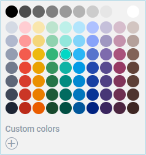

---
sidebar_label: Customization
title: Customization
---          

Styling 
-----------

There is a possibility to make changes in the look and feel of a colorpicker. 

{{editor    https://snippet.dhtmlx.com/mnwi3sp0	Colorpicker. Custom CSS}}

For this you need to take the following steps:

- add a new CSS class(es) with desired settings in the &lt;style&gt; section of your HTML page or in your file with styles (don't forget to include your file on the page in this case)

~~~html

~~~

- specify the name of the created CSS class (or names of classes separated by spaces) as the value of the [css](colorpicker/api/colorpicker_css_config.md) property in the ColorPicker configuration:

~~~js
var colorpicker = new dhx.Colorpicker({
    css:"my-first-class my-second-class"
});
~~~

For instance:

~~~js

var colorpicker = new dhx.Colorpicker("colorpicker", {
	css: "myClass dhx_widget--bordered",
});
~~~

