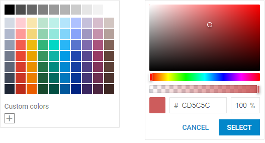

---
sidebar_label: Overview
title: ColorPicker overview
description: dhtmlxColorPicker is a graphical tool that allows either selecting colors from a palette of colors or picking a color using a color spectrum. It is possible to change the default colors and specify your own palette.  
---          

dhtmlxColorPicker is a smart component for selecting colors that can be used both as an inline control and as a popup dialog box. 
It possesses easy-to-configure interface that can be simply localized and customized depending on the need of the project and complete API for handy control over the behavior of the component. 

Check [online samples for dhtmlxColorPicker](https://docs.dhtmlx.com/suite/samples/colorpicker/). 

## API reference

## Related resources

- You can get dhtmlxColorPicker as a part of the Suite library by [downloading dhtmlxSuite](https://dhtmlx.com/docs/products/dhtmlxSuite/download.shtml)          
- There are also [online samples for dhtmlxColorPicker](https://docs.dhtmlx.com/suite/samples/colorpicker/)  

## Guides

Covers the processes of creating, configuring, localizing, customizing Colorpicker, and working with it.

- 
- 
- 
- 
- 
- 

## Other

- 
