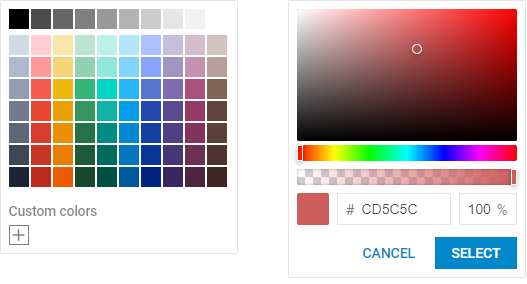

# Colorpicker overview

DHTMLX Colorpicker is a smart component for selecting colors that can be used both as an inline control and as a popup dialog box. 
It possesses easy-to-configure interface that can be simply localized and customized depending on the need of the project and complete API for handy control over the behavior of the component. 

Check [online samples for DHTMLX Colorpicker](https://snippet.dhtmlx.com/097jjhb8?tag=colorpicker).

## Features

You can check the following page to learn how to build a full-featured DHTMLX Colorpicker:

- [Features](/colorpicker/features/)

## API reference

- [Colorpicker API overview](/colorpicker/api/api_overview/)

## Related resources

- You can get DHTMLX Colorpicker as a part of the Suite library by [downloading DHTMLX Suite](https://dhtmlx.com/docs/products/dhtmlxSuite/download.shtml)
- There are also [online samples for DHTMLX Colorpicker](https://snippet.dhtmlx.com/097jjhb8?tag=colorpicker)  

## Guides

Covers the processes of creating, configuring, localizing, customizing ColorPicker, and working with it.

- [Initialization](/colorpicker/how_to_start/)
- [Configuration](/colorpicker/configuration/)
- [Localization](/colorpicker/localizing_colorpicker/)
- [Work with ColorPicker](/colorpicker/manipulating_colorpicker/)
- [Customization](/colorpicker/customization/)
- [Event handling](/colorpicker/handling_events/)

## Other

- [Migration to newer versions](/migration/)
