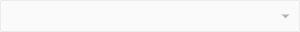
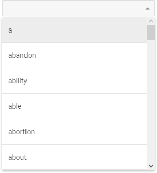
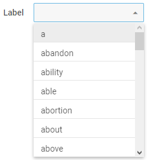
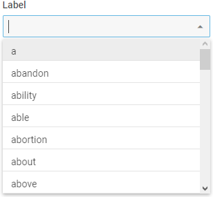
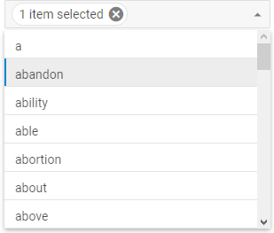
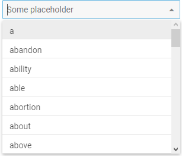
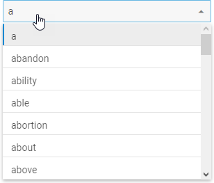
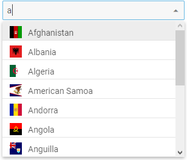

---
sidebar_label: Configuration
title: Configuration
---          

Disabled mode
---------------

There is an option that allows making ComboBox disabled and blocks any operations with it. Use the  configuration property to enter the described mode.

~~~js
var combo = new dhx.Combobox("combo_container",{
	disabled: true
});
~~~

{{editor    https://snippet.dhtmlx.com/ductsm0f	Combobox. Disabled}}

Dynamic rendering of options
---------------------

When you load a list of options into ComboBox, all items are loaded at once. In case you have a large data collection, it is suitable to render data by portions. dhtmlxComboBox provides you with such an ability.
Use the  property to render options in the ComboBox list dynamically on scrolling the list.

~~~js
var combo = new dhx.Combobox("combo_container",{
	virtual:true
});
~~~

{{editor    https://snippet.dhtmlx.com/5srwualw	Combobox. Virtual List}}

Height of list of options and its items
----------------

{{editor    https://snippet.dhtmlx.com/vilg4l7w	Combobox. List Height}}

There are two useful options to adjust the height of the list of options and the height of a separate item of this list:  and :

~~~js
var combo = new dhx.Combobox("combo_container",{
	listHeight:300,
	itemHeight:50
});
~~~

Help icon 
-----------

While using Combo in a form, it is useful to add some info about options that can be selected in it. Use the  configuration option for this purpose.
Set the necessary tip for users as a value of the property.

~~~js
var combobox = new dhx.Combobox("combobox",{
    helpMessage:"Some text"
});
~~~

Hidden label
-------------------

While sending a form to the server you can add a label for a ComboBox input that won't be visible, but will be used to identify the input on the server side. Use the combo/ configuration property for this property.

~~~js
var combo = new dhx.Combobox("combo_container",{
	label:"My Combo",
	hiddenLabel:true
});
~~~

Initial value
-----------------

Starting from v7.0, it is possible to define the values that will appear in the input on initialization of the component via the  property:

~~~js
var combobox = new dhx.Combobox("combobox", {
    multiselection: true,
    value: ["austria", "estonia"] /*!*/
});

// or
var combobox = new dhx.Combobox("combobox", {
    value: "austria" /*!*/
});
~~~

[Combobox. Initial Value](https://snippet.dhtmlx.com/spnausim)

- If *multiselection:true* is set for a combo, the property takes an array of string values as: *value: ["1","2","3"]*,
- If *multiselection:false* is set or the *multiselection* config is not defined, the property gets either of the two values: *value:"1"* or *value: ["1"]*

Label
--------------

You can set a label for ComboBox, adjust its width and position using the following properties: ,  and . This is how it can be done:

~~~js
var combo = new dhx.Combobox("combo_container",{
	label:"Label",
	labelPosition: "left",
	labelWidth: 100
});
~~~

or

~~~js
var combo = new dhx.Combobox("combo_container",{
	label:"Label",
	labelPosition: "top",
	labelWidth: 100
});
~~~

{{editor    https://snippet.dhtmlx.com/2936fray	Combobox. Label Position}}

Number of selected options
--------------------

{{editor    https://snippet.dhtmlx.com/fw2u2bww	Combobox. Items Count}}

Instead of showing all selected options separately in the ComboBox input, you can group them and display just the number of selected options. For this, you should use the  property. 

There are two possible types of values for this config. You can either simply enable the default behavior of the option, 
or specify a custom template function to display grouped options in the desired way. The function takes one parameter:

- **count** - (*number*) the number of selected options

and should return a template for displaying a result.

~~~js
var combo = new dhx.Combobox("combo_container", {
	multiselection: true,
    // simply enables the option
	itemsCount: true
});

// or

var combo = new dhx.Combobox("combo_container", {
	multiselection: true,
    // set a custom template function for showing total number of selected options
	itemsCount: function (num) {
		return num + (num === 1 ? " item" : " items") + " selected";
	}
});
~~~

{{note Don't forget to enable the **multiselection** option to select several options at once.}}

Placeholder 
-------------

{{editor    https://snippet.dhtmlx.com/759z23gh	Combobox. Placeholder}}

To add some placeholder into the ComboBox input, apply the  property:

~~~js
var combobox = new dhx.Combobox("combo_container",{
	placeholder: "Some placeholder"
});
~~~

Readonly mode
----------------

{{editor    https://snippet.dhtmlx.com/igjsuf7y	Combobox. Readonly}}

If needed, you can make ComboBox readonly via the  property, so that it will be impossible to enter text in the input. In this case a user will only be able to select options from the popup list.

~~~js
var combo = new dhx.Combobox("combo_container",{
	readOnly:true
});
~~~

Selection of multiple options
----------------------

In order to add the possibility to select several options in ComboBox at once, make use of the  configuration option.

~~~js
var combo = new dhx.Combobox("combo_container", {
	multiselection:true
});
~~~

Selection of all options in the list
-----------------------

There is the Select All button that allows selecting all options in the ComboBox list. To add this button into the component, use the  property. Note that you also need to enable selection of
multiple options by setting the  configuration option to *true*:

~~~js
var combo = new dhx.Combobox("combo_container", {
	// enables multiple selection of options
	multiselection:true,
    // shows the Select All button
	selectAllButton: true
});
~~~

{{editor    https://snippet.dhtmlx.com/ui7pi7ty	Combobox. Select All Button}}

Template for ComboBox options
--------------------------

{{editor    https://snippet.dhtmlx.com/z7cpj76i	Combobox. Template}}

You can specify the appearance of ComboBox options in the list with the help of the  property. It is a function that takes as a parameter an item of data collection and should return a string 
with a template for rendering options in the list.

~~~js
var combo = new dhx.Combobox("combo_container", {
	template: function (item) {
	  return "
"
	  +"
" 
	  + item.value + "
";
	}
});			
~~~

