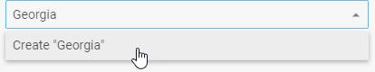

# Configuration

## Disabled mode

There is an option that allows making ComboBox disabled and blocks any operations with it. Use the  configuration property to enter the described mode.

~~~js
var combo = new dhx.Combobox("combo_container",{
	disabled: true
});
~~~

**Related sample**: [Combobox. Disabled](https://snippet.dhtmlx.com/ductsm0f)

## Dynamic rendering of options

When you load a list of options into ComboBox, all items are loaded at once. In case you have a large data collection, it is suitable to render data by portions. dhtmlxComboBox provides you with such an ability.
Use the  property to render options in the ComboBox list dynamically on scrolling the list.

~~~js
var combo = new dhx.Combobox("combo_container",{
	virtual:true
});
~~~

**Related sample**: [Combobox. Virtual list](https://snippet.dhtmlx.com/5srwualw)

## Height of list of options and its items

**Related sample**: [Combobox. List height](https://snippet.dhtmlx.com/vilg4l7w)

There are two useful options to adjust the height of the list of options and the height of a separate item of this list:  and :

~~~js
var combo = new dhx.Combobox("combo_container",{
	listHeight:300,
	itemHeight:50
});
~~~

## Help icon

While using Combo in a form, it is useful to add some info about options that can be selected in it. Use the  configuration option for this purpose.
Set the necessary tip for users as a value of the property.

~~~js
var combobox = new dhx.Combobox("combobox",{
    helpMessage:"Some text"
});
~~~

## Hidden label

While sending a form to the server you can add a label for a ComboBox input that won't be visible, but will be used to identify the input on the server side. Use the  configuration property for this property.

~~~js
var combo = new dhx.Combobox("combo_container",{
	label:"My Combo",
	hiddenLabel:true
});
~~~

## Initial value

Starting from v7.0, it is possible to define the values that will appear in the input on initialization of the component via the  property:

~~~js {3,8}
var combobox = new dhx.Combobox("combobox", {
    multiselection: true,
    value: ["austria", "estonia"]
});

// or
var combobox = new dhx.Combobox("combobox", {
    value: "austria"
});
~~~

**Related sample**: [Combobox. Initial value](https://snippet.dhtmlx.com/spnausim)

- If *multiselection:true* is set for a combo, the property takes an array of string values as: *value: ["1","2","3"]*,
- If *multiselection:false* is set or the *multiselection* config is not defined, the property gets either of the two values: *value:"1"* or *value: ["1"]*.

## Label

You can set a label for ComboBox, adjust its width and position using the following properties: ,  and . This is how it can be done:

~~~js
var combo = new dhx.Combobox("combo_container",{
	label:"Label",
	labelPosition: "left",
	labelWidth: 100
});
~~~

or

~~~js
var combo = new dhx.Combobox("combo_container",{
	label:"Label",
	labelPosition: "top",
	labelWidth: 100
});
~~~

**Related sample**: [Combobox. Label position](https://snippet.dhtmlx.com/2936fray)

## Number of selected options

**Related sample**: [Combobox. Items count](https://snippet.dhtmlx.com/fw2u2bww)

Instead of showing all selected options separately in the ComboBox input, you can group them and display just the number of selected options. For this, you should use the  property. 

There are two possible types of values for this config. You can either simply enable the default behavior of the option, 
or specify a custom template function to display grouped options in the desired way. The function takes one parameter:

- **count** - (*number*) the number of selected options

and should return a template for displaying a result.

~~~js
var combo = new dhx.Combobox("combo_container", {
	multiselection: true,
    // simply enables the option
	itemsCount: true
});

// or

var combo = new dhx.Combobox("combo_container", {
	multiselection: true,
    // set a custom template function for showing total number of selected options
	itemsCount: function (num) {
		return num + (num === 1 ? " item" : " items") + " selected";
	}
});
~~~

{{note Don't forget to enable the **multiselection** option to select several options at once.}}

## Placeholder

**Related sample**: [Combobox. Placeholder](https://snippet.dhtmlx.com/759z23gh)

To add some placeholder into the ComboBox input, apply the  property:

~~~js
var combobox = new dhx.Combobox("combo_container",{
	placeholder: "Some placeholder"
});
~~~

## Editable combobox

You may allow end users to add new items into the data collection from UI. 
You just need to enable the functionality via setting the [newOptions](combobox/api/combobox_newoptions_config.md) property to *true*:

~~~js
const combobox = new dhx.Combobox("combobox", {
    multiselection: true,
  	newOptions: true  
});
~~~

To add a new item into the list of options, the user needs to type a new value into the input field and either press "Enter" or click on the appeared *Create "newValue"* option in the drop-down list.

The combobox invokes the [beforeAdd](data_collection/api/datacollection_beforeadd_event.md) and [afterAdd](data_collection/api/datacollection_afteradd_event.md) events of DataCollection each time when the user enters a new value into the input field. You can use the [beforeAdd](data_collection/api/datacollection_beforeadd_event.md) event to prevent adding incorrect values into the list of options:

~~~js
// blocks the ability to add an item with value: "new" into the collection of combobox items
combobox.data.events.on("beforeAdd", item => item.value !== "new");
~~~

## Readonly mode

**Related sample**: [Combobox. Readonly](https://snippet.dhtmlx.com/igjsuf7y)

If needed, you can make ComboBox readonly via the  property, so that it will be impossible to enter text in the input. In this case a user will only be able to select options from the popup list.

~~~js
var combo = new dhx.Combobox("combo_container",{
	readOnly:true
});
~~~

## Selection of multiple options

In order to add the possibility to select several options in ComboBox at once, make use of the  configuration option.

~~~js
var combo = new dhx.Combobox("combo_container", {
	multiselection:true
});
~~~

## Selection of all options in the list

There is the Select All button that allows selecting all options in the ComboBox list. To add this button into the component, use the  property. Note that you also need to enable selection of
multiple options by setting the  configuration option to *true*:

~~~js
var combo = new dhx.Combobox("combo_container", {
	// enables multiple selection of options
	multiselection:true,
    // shows the Select All button
	selectAllButton: true
});
~~~

**Related sample**: [Combobox. Multiselection, add new options (free text), select all button](https://snippet.dhtmlx.com/ui7pi7ty)

## Template for ComboBox options

**Related sample**: [Combobox. HTML template](https://snippet.dhtmlx.com/z7cpj76i)

You can specify the appearance of ComboBox options in the list with the help of the  property. It is a function that takes as a parameter an item of data collection and should return a string with a template for rendering options in the list.

~~~js
var combo = new dhx.Combobox("combo_container", {
	template: function (item) {
	  return "
"
	  +"
" 
	  + item.value + "
";
	}
});			
~~~

## HTML content of Combobox options

By default, Combobox displays HTML content if it is specified for its options.

In case you need to disable rendering of HTML content and show it as plain text to keep your application safe, set the [htmlEnable](../../combobox/api/combobox_htmlenable_config/) property to *false*. 

~~~js
const combo = new dhx.Combobox("combo_container", { 
    htmlEnable: false, // disables rendering of HTML content
    template: function (item) {
        return "
" +
            "" + item.value + "" +
            "</img>" +
            "
";
    }
});
~~~

**Related sample**: [Combobox. Disable HTML rendering](https://snippet.dhtmlx.com/e4dolhfs)

