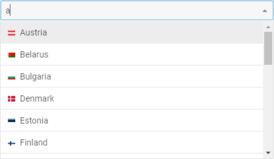
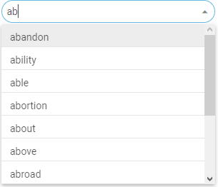

# Customization

## Custom filter for options

It is possible to set a custom filtering function for the options of ComboBox via the  option. A custom function takes two parameters:

<table>
	<tbody>
        <tr>
			<td><b>item</b></td>
			<td>(<i>object</i>) an item of data collection</td>
		</tr>
		<tr>
			<td><b>target</b></td>
			<td>(<i>string</i>) the string to compare to</td>
		</tr>
    </tbody>
</table>

and should return *true/false* to specify whether an item should be displayed in the filtered list of options.

~~~js
function fuzzySearch(item, target) {
	const source = item.value.toLowerCase();
    target = target.toLowerCase();
    const sourceLen = source.length;
    const targetLen = target.length;
    if (targetLen > sourceLen) {
    	return false;
    }
    let sourceIndex = 0;
    let targetIndex = 0;
    while (sourceIndex < sourceLen && targetIndex < targetLen) {
    	if (source[sourceIndex] === target[targetIndex]) {
    		targetIndex++;
    	}
    	sourceIndex++;
    }
    return targetIndex === targetLen;
}

const combo = new dhx.Combobox("combo_container", {
	filter: fuzzySearch
});
~~~

**Related sample**: [Combobox. Custom filter](https://snippet.dhtmlx.com/791incm9)

In the above example a custom filtering function compares an entered value with items of data collection letter by letter, and shows in the popup list all the words that contain entered letters independent of their 
order in a word.

## Styling

There is a possibility to make changes in the look and feel of a combo box. For this you need to take the following steps:

- add a new CSS class(es) with desired settings in the &lt;style&gt; section of your HTML page or in your file with styles (don't forget to include your file on the page in this case)

~~~html

~~~

- specify the name of the created CSS class (or names of classes separated by spaces) as the value of the [css](combobox/api/combobox_css_config.md) property in the ComboBox configuration:

~~~js
const combo = new dhx.Combobox("combo_container", {
    css:"my_first_class my_second_class"
});
~~~

For example:

~~~html

~~~

**Related sample**: [Combobox. Styling (custom CSS)](https://snippet.dhtmlx.com/lldd739i)
