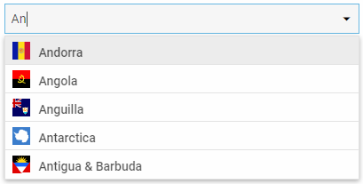

# ComboBox overview

dhtmlxComboBox is an advanced select box that provides the ability to show suggestions while a user is entering text in the input. The component allows you to set custom filtering rules and specify templates of 
displaying options in the list. Among other nice features there are tuning of the list of options and Combo Box input, selection of multiple options and data loading on request.
Check [online samples for dhtmlxComboBox](https://docs.dhtmlx.com/suite/samples/combobox/).

## API reference

- 

## Related resources

- You can get dhtmlxComboBox as a part of the Suite library by [downloading dhtmlxSuite](https://dhtmlx.com/docs/products/dhtmlxSuite/download.shtml)
- There are also [online samples for dhtmlxComboBox](https://docs.dhtmlx.com/suite/samples/combobox/)
- To work with data of ComboBox check [DataCollection API](data_collection/index.md)

## Guides

- 
- 
- 
- 
- 
- 
- 

## Other

- 
