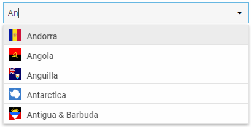

# ComboBox overview

DHTMLX ComboBox is an advanced select box that provides the ability to show suggestions while a user is entering text in the input. The component allows you to set custom filtering rules and specify templates of 
displaying options in the list. Among other nice features there are tuning of the list of options and Combo Box input, selection of multiple options and data loading on request.
Check [online samples for DHTMLX ComboBox](https://snippet.dhtmlx.com/ui7pi7ty?tag=combobox).

## Features

You can check the following page to learn how to build a full-featured DHTMLX Combobox:

- [Features](/combobox/features/)

## API reference

- [Combobox API overview](/combobox/api/api_overview/)

## Related resources

- You can get DHTMLX ComboBox as a part of the Suite library by [downloading DHTMLX Suite](https://dhtmlx.com/docs/products/dhtmlxSuite/download.shtml)
- There are also [online samples for DHTMLX ComboBox](https://snippet.dhtmlx.com/ui7pi7ty?tag=combobox)
- To work with data of ComboBox check [DataCollection API](/data_collection/)

## Guides

- [Initialization](/combobox/how_to_start/)
- [Configuration](/combobox/configuration/)
- [Localization](/combobox/localization/)
- [Data loading](/combobox/adding_options/)
- [Work with ComboBox](/combobox/work_with_combo/)
- [Customization](/combobox/customization/)
- [Event handling](/combobox/handling_events/)

## Other

- [Migration to newer versions](/migration/)
