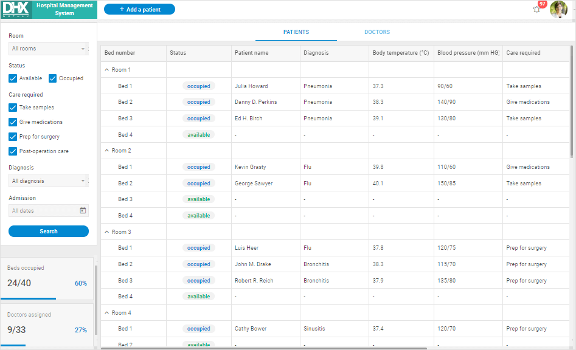

# Custom scroll

{{pronote This functionality requires PRO version of the DHTMLX Suite package.}}

From v7.2, DHTMLX includes neat custom scrollbars with a thin grey semi-transparent design to replace the standard browser scrollbars. The custom bars come with the auto-hide behavior, i.e., they are initially hidden and shown only when the user hovers the mouse over the page. 

<iframe src="https://snippet.dhtmlx.com/gjsbvzdk?mode=result" frameborder="0" class="snippet_iframe" width="100%" height="700"></iframe>

The custom scroll is available for the following DHTMLX components: List, DataView, Grid, Grid in the TreeGrid mode, Layout cell, Toolbar, Ribbon, Sidebar, Window.

To add the feature into your application, you need to set the **enable** property of the **dhx.scrollViewConfig** global variable to *true* before initialization of the widgets:

~~~js
// enable the custom scroll for all available widgets
dhx.scrollViewConfig.enable = true;

// initialize a widget
const list = new dhx.List("list_container", {
    itemHeight: 30
});
~~~

or apply the **enable()** method of the **scrollView** object after initialization of the widget:

~~~js
// initialize the widget
const list = new dhx.List("list_container", {
    template: listTemplate,
    itemHeight: 52,
    height: "100%",
    dragMode: "both",
});
list.data.load(data);

// enable custom scroll
list.scrollView.enable();
~~~

For more details on the custom scroll configuration, read [this article](../../helpers/custom_scroll/). 

## Custom scroll in Optimus demos

You may notice, that all DHTMLX demos built with Optimus have the custom scroll enabled. 

**View the live demos to check the feature:**

| Demo                                                                                    | Related article                                                             |
|-----------------------------------------------------------------------------------------|-----------------------------------------------------------------------------|
| [File Explorer](https://dhtmlx.com/docs/products/demoApps/dhtmlxFileExplorerDemo/)      | learn more in [the related article](../../optimus_guides/filemanager_demo/) |
| [UI Dashboard](https://dhtmlx.com/docs/products/demoApps/dhtmlxFileExplorerDemo/)       | learn more in [the related article](../../optimus_guides/dashboard_demo/)   |
| [Hotel Management Template](https://dhtmlx.com/docs/products/demoApps/dhtmlxDashboard/) | learn more in [the related article](../../optimus_guides/hotel_demo/)       |
| [Geo Tracking](https://dhtmlx.com/docs/products/demoApps/dhtmlxGeoTracking/)            | learn more in [the related article](../../optimus_guides/geotracking_demo/) |
| [Hospital Management](https://dhtmlx.com/docs/products/demoApps/dhtmlxHospital/)        | learn more in [the related article](../../optimus_guides/hospital_demo/)    |
| [Sales KPI Tracking](https://dhtmlx.com/docs/products/demoApps/dhtmlxKPI/)              | learn more in [the related article](../../optimus_guides/kpi_demo/)         |
| [Online Exam System](https://dhtmlx.com/docs/products/demoApps/dhtmlxExam/)             | learn more in [the related article](../../optimus_guides/exam_demo/)        |
