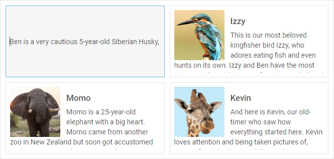
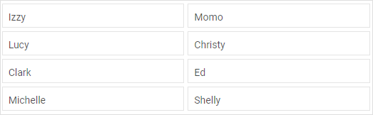
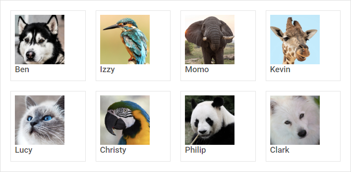
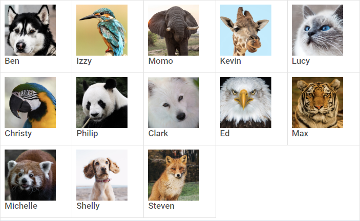

---
sidebar_label: Configuration
title: Configuration
description: description
---          

## Arrow keys navigation


[Dataview. Arrow Navigation](https://snippet.dhtmlx.com/u7mgoly9)

The DataView component provides the possibility to navigate its items with arrow keys. You can enable this functionality using the [](dataview/api/dataview_keynavigation_config.md) property:

~~~js
var dataview = new dhx.DataView("dataview", {
    itemsInRow: 4, keyNavigation: true
});
~~~

As a value of this option you can use either *true/false* to switch it on/off, or you can specify a *function* that will define some custom navigation logic.

### Default shortcut keys

<table class="webixdoc_links">
	<tbody>
        <tr>
			<td class="webixdoc_links0"><b>ArrowUp</b></td>
			<td>to move focus to the previous vertical item</td>
		</tr>
        <tr>
			<td class="webixdoc_links0"><b>ArrowDown</b></td>
			<td>to move focus to the next vertical item</td>
		</tr>
		<tr>
			<td class="webixdoc_links0"><b>ArrowLeft</b></td>
			<td>to move focus to the previous horizontal item</td>
		</tr>
        <tr>
			<td class="webixdoc_links0"><b>ArrowRight</b></td>
			<td>to move focus to the next horizontal item</td>
		</tr>
        <tr>
			<td class="webixdoc_links0"><b>Enter/Shift+Enter/Ctrl+Enter</b></td>
			<td>to add selection to a DataView item in focus</td>
		</tr>
        <tr>
			<td class="webixdoc_links0"><b>Ctrl+A</b></td>
			<td>to select all items at once (when the "multiselection" property is enabled)</td>
		</tr>
    </tbody>
</table>


Drag-n-drop of items
------------------

dhtmlxDataView supports drag-n-drop of items between dataviews in several modes. To begin with, you should specify the [](dataview/api/dataview_dragmode_config.md) property in the configuration object of DataView.
Then define which mode you need:

- "target" - a dataview takes items from other dataviews, while its items can't be dragged out of it
- "source" - a dataview allows dragging its items out and can't take items from other dataviews
- "both" - a dataview both takes items from other dataviews and allows dragging its items out as well

~~~js
var dataview = new dhx.DataView("dataview_container", { 
    dragMode:"source"
});
~~~

In order to provide the possiblity of dragging several items between dataviews, you should enable the [](dataview/api/dataview_multiselection_config.md) property
in addition to **dragMode**:

~~~js
var dataview = new dhx.DataView("dataview_container", { 
    dragMode:"source",
    multiselection:true
});
~~~

Read more about multiselection in DataView [below](#multipleselectionofitems).

[Dataview. Drag'n'drop](https://snippet.dhtmlx.com/nia2e5a9)

### Copying dragged item

Instead of moving a dragged item to a new position in the same or a different dataview, you can copy it. 
Use the [](dataview/api/dataview_dragcopy_config.md) option in the configuration object of a dataview.

~~~js
var source = new dhx.DataView("dataview-source", {dragMode: "source", dragCopy: true});
var target = new dhx.DataView("dataview-target", {dragMode: "target", dragCopy: true});
~~~

{{editor    https://snippet.dhtmlx.com/h89c3gl3	Dataview. Drag'n'drop Сopy}}


Editing items
----------------



{{editor    https://snippet.dhtmlx.com/m8fbqcza	Dataview. Editable Dataview}}

You can enable the possibility to edit DataView items with the help of the [](dataview/api/dataview_editable_config.md) configuration option:

~~~js
var dataview = new dhx.DataView("dataview_container", {editable:true});
~~~

Height of an item
----------------



{{editor    https://snippet.dhtmlx.com/cth9mwrf	Dataview. Setup Dataview Item Height}}

You can specify the necessary height of a Dataview item and set it before initialization of Dataview via the [itemHeight](dataview/api/dataview_itemheight_config.md) property either as a number:

~~~js
// sets the height of an item as a number
var dataview = new dhx.DataView("dataview", { 
    itemHeight:34 /*!*/
});
~~~

or as a string value

~~~js
// sets the height of an item as a string value
var dataview = new dhx.DataView("dataview", { 
    itemHeight:"34px" /*!*/
});
~~~

{{note The usage of the *CSS calc() function* within the [](dataview/api/dataview_itemheight_config.md) property is not possible.}}

Height of the Dataview
---------------


{{editor    https://snippet.dhtmlx.com/g1k2l4q0	Dataview. Setup Dataview Height}}

You can define the desired height of a dataview via the [height](dataview/api/dataview_height_config.md) configuration option as easy as that:

~~~js
var dataview = new dhx.DataView("dataview", {height: 150});
~~~

You can also use a string value for setting the height of Dataview:

~~~js
var dataview = new dhx.DataView("dataview", {height: "400px"});
~~~

{{note The usage of the *CSS calc() function* within the [](dataview/api/dataview_height_config.md) property is not possible.}}

Margins around DataView items
-----------------------



{{editor    https://snippet.dhtmlx.com/ozsuww1q	Dataview. Configure Gap Size}}

It is possible to add margins around DataView items to increase distance between two items as well as between an item and DataView borders. Use the [](dataview/api/dataview_gap_config.md) configuration property 
to define the desired margin:

~~~js
var dataview = new dhx.DataView("dataview", {itemsInRow: 4, gap: 20});
~~~

Multiple selection of items
---------------------------


By default, you can select only one item in a dataview, since selection of another item resets selection of the previous one. To enable the possbility to select several DataView items, make use of the [](dataview/api/dataview_multiselection_config.md) configuration option:

~~~js
var dataview = new dhx.DataView("dataview", {multiselection:true});
~~~

Setting the **multiselection** property to *true* presupposes selection of multiple items by using Ctrl key.
It is also possible to use the "Ctrl+click" combination to select several items. For this, you need to set the [](dataview/api/dataview_multiselection_config.md) configuration option to *"ctrlClick"*:

~~~js
var dataview = new dhx.DataView("dataview", {
    multiselection:"ctrlClick"
});
~~~

{{editor    https://snippet.dhtmlx.com/g0xwdx10	Dataview. Multiselection Dataview}}


Number of items in a row
-----------------------



{{editor    https://snippet.dhtmlx.com/de4r8km3	Dataview. Amount Items In A Row}}

You can define the number of items that should be displayed in a row of DataView with the help of the [](dataview/api/dataview_itemsinrow_config.md) configuration property:

~~~js
var dataview = new dhx.DataView("dataview", {itemsInRow: 5});
~~~

Selection of items
---------------------


[Dataview. Disable selection](https://snippet.dhtmlx.com/xh66mnu3)

The default configuration of DataView provides you with the selection feature that allows highlighting a DataView item. To disable selection in a DataView you need to set the [](dataview/api/dataview_selection_config.md) configuration property to *false*:

~~~js
var dataview = new dhx.DataView("dataview", {
    selection: false
});
~~~

Template for DataView items
-------------------


{{editor    https://snippet.dhtmlx.com/d6l6grr7	Dataview. Render Template}}

You can define a template for rendering items in a dataview with the help of the [](dataview/api/dataview_template_config.md) configuration property. You need to set a function as its value and pass one parameter to it:

- **item** - (*object*) an object of a data item

~~~js
var dataview = new dhx.DataView("dataview", {
    itemsInRow: 4, 
    template: function(item) {
        var template = "<div class='item_wrap'>";
        template += "";
        template += "<h2 class='title'>" + item.value + "</h2>";
        template += "<p class='description'>" + item.shortDescription + "</p>";
        template += "</div>";
        return template;
    }
});
~~~

Event handlers for the template
-------------------------------

Starting from v7.0, it is possible to assign event handlers to the HTML elements of a custom template of DataView items by using the [](dataview/api/dataview_eventhandlers_config.md) configuration option:

~~~js
function template(item) {
	let template = "<div class='item_wrap'>";
	template += "";
	template += "<h2 class='title'>" + item.value + "</h2>";
	template += "<p class='description'>" + item.shortDescription + "</p>";
	template += "</div>";
	return template;
}

var dataview = new dhx.DataView("dataview", {
	template: template,
	eventHandlers: { /*!*/
		onclick: { /*!*/
			item_wrap: function(event, id) { /*!*/
				display("You clicked on " + event.target.tagName); /*!*/
			}, /*!*/
		}, /*!*/
		onmouseover: { /*!*/
			item_wrap: function(event, id) { /*!*/
				display(dataview.data.getItem(id).short); /*!*/
			}, /*!*/
		} /*!*/
	} /*!*/
});
~~~

[Dataview. Handling events in template](https://snippet.dhtmlx.com/26873eql)

The **eventHandlers** object includes a set of *key:value* pairs, where:
``` todo нужна ли таблица
<table class="webixdoc_links">
	<tbody>
        <tr>
			<td class="webixdoc_links0"><i>key</i></td>
			<td> the name of the event. Note, that at the beginning of the event name the <b>'on'</b> prefix is used (onclick, onmouseover).</td>
		</tr>
        <tr>
			<td class="webixdoc_links0"><i>value</i></td>
			<td>an object that contains a <i>key:value</i> pair, where <i>key</i> is the css class name that the handler will be applied to and <i>value</i> is a function that takes two parameters:
            <ul>
                <li><b>event</b> - an event object</li>
                <li><b>id</b> - the id of a DataView item
            </ul></td>
		</tr>
    </tbody>
</table>

```