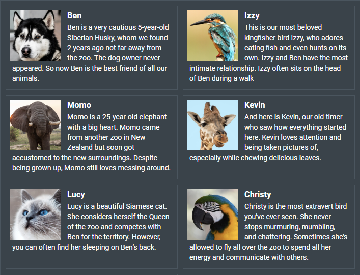
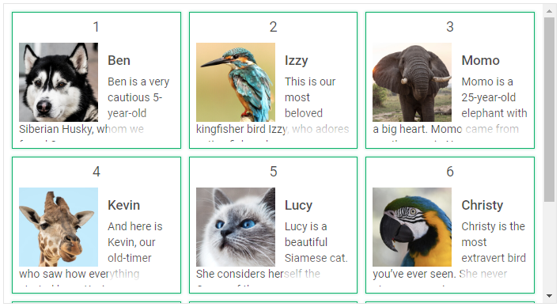
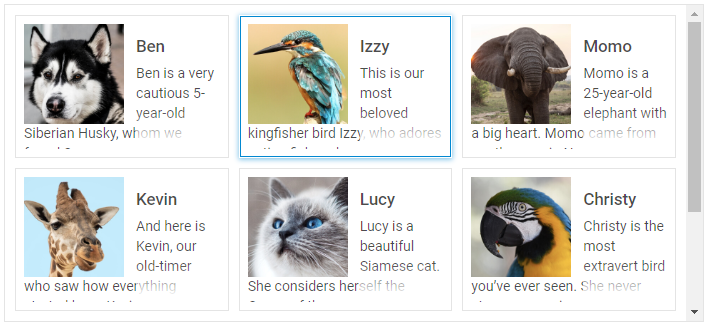

# Customization

## Custom styling of widget

There is a possibility to make changes in the look and feel of a dataview. 

**Related sample**: [Dataview. Styling (custom CSS)](https://snippet.dhtmlx.com/j1yv94o8)

For this you need to take the following steps:

- add a new CSS class(es) with desired settings in the &lt;style&gt; section of your HTML page or in your file with styles (don't forget to include your file on the page in this case):

~~~html

~~~

- specify the name of the created CSS class (or names of classes separated by spaces) as the value of the  property in the DataView configuration:

~~~js
const dataview = new dhx.DataView("dataview_container", { 
    css:"my_first_class my_second_class"
});
~~~

For example:

~~~html

~~~

## Custom styling of items

You can style particular cells in the dataview. For example, apply some color to each even item, as in:

~~~html

~~~

The image below and the related sample demonstrate another example of customization of Dataview items:

**Related sample**: [Dataview. Styling (custom CSS for item)](https://snippet.dhtmlx.com/kpnzizbf)

## Custom styling of selection and focus

You can apply your own styles for selection of items and focus with the help of the corresponding CSS classes: **.dhx_dataview-item--selected** and **.dhx_dataview-item--focus**. There is no need to use any
additional custom classes.

~~~html

~~~

**Related sample**: [Dataview. Custom selection styles](https://snippet.dhtmlx.com/n98tzmzp)
