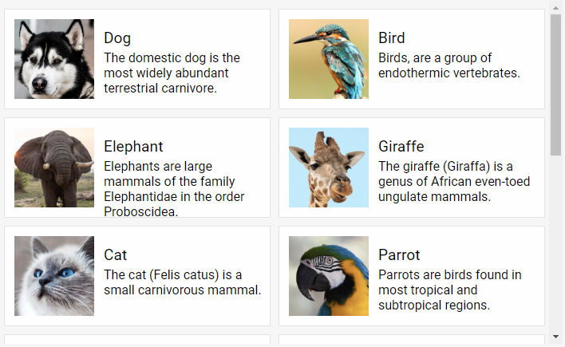

---
sidebar_label: Overview
title: DataView overview
description: DHTMLX DataView is a helpful JavaScript widget for arranging similar objects in a grid view and displaying them according to a user-defined template. 

---          

dhtmlxDataView allows rendering a collection of objects according to a specified template. It will help you to organize data by arranging various objects with similar properties within a common container.
This component is especially useful, if you're creating an online store or an image gallery, or just want to display a number of similar objects on a page.
Check [online samples for dhtmlxDataView](https://docs.dhtmlx.com/suite/samples/dataview/). 

## API reference

- 

## Related resources

- You can get dhtmlxDataView as a part of the Suite library by [downloading dhtmlxSuite](https://dhtmlx.com/docs/products/dhtmlxSuite/download.shtml)          
- There are also [online samples for dhtmlxDataView](https://docs.dhtmlx.com/suite/samples/dataview/)  

## Guides

You can read the following articles to find out how to add DataView on the page and work with it.

- 
- 
-               
-  
-          	
- 	
-    

## Other

- 
