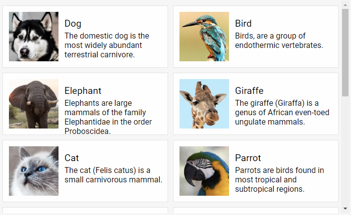

# DataView overview

DHTMLX DataView allows rendering a collection of objects according to a specified template. It will help you to organize data by arranging various objects with similar properties within a common container.
This component is especially useful, if you're creating an online store or an image gallery, or just want to display a number of similar objects on a page.
Check [online samples for DHTMLX DataView](https://snippet.dhtmlx.com/j1yv94o8?tag=dataview). 

## Features

You can check the following page to learn how to build a full-featured DHTMLX DataView:

- [Features](dataview/features.md)

## API reference

- [DataView API overview](api/api_overview.md)

## Related resources

- You can get DHTMLX DataView as a part of the Suite library by [downloading DHTMLX Suite](https://dhtmlx.com/docs/products/dhtmlxSuite/download.shtml)
- There are also [online samples for DHTMLX DataView](https://snippet.dhtmlx.com/j1yv94o8?tag=dataview)
- To work with data of DataView check [DataCollection API](data_collection.md)

## Guides

You can read the following articles to find out how to add DataView on the page and work with it.

- [Initialization](initialization.md)
- [Configuration](configuration.md)
- [Data loading](data_loading.md)
- [Work with DataView](manipulating_data.md)
- [Work with Selection object](usage_selection.md)
- [Customization](customization.md)
- [Event handling](events.md)

## Other

- 
