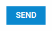

---
sidebar_label: Button
title: Button
---          

A simple button that can have an icon. Button can be *twoState* and can have a badge with a number, which can be useful for displaying the number of new messages, etc.

{{editor    https://snippet.dhtmlx.com/ikyyekxq	Form. All DhxForm Inputs}}

## Adding Button 

You can easily add a Button control during initialization of a form:

~~~js
var form = new dhx.Form("form_container", {
	rows: [
    	{
			type: "button",
            name: "button",
            text: "Send",
            size: "medium",
            view: "flat",
            color: "primary"
		}   
  	]
});
~~~

### Properties

View [the full list of configuration properties of the Button control](form/api/button/api_button_properties.md).

## Working with Button

You can manipulate a Button control by using methods (or [events](#eventhandling)) of the object returned by the [getItem()](form/api/form_getitem_method.md) method.

For example, you can disable a control on a page:

~~~js
form.getItem("button").disable();
~~~

### Methods

Check [the full list of methods of the Button control](form/api/api_overview.md#methods-1).

### Events

Check [the full list of events of the Button control](form/api/api_overview.md#events-1)

