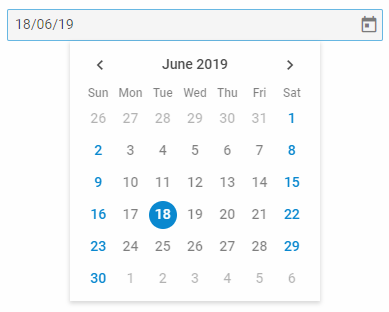

---
sidebar_label: DatePicker
title: DatePicker
---          

An input with a calendar attached to it for selecting a date.

{{editor    https://snippet.dhtmlx.com/ikyyekxq	Form. All DhxForm Inputs}}

{{editor	https://snippet.dhtmlx.com/q3yk7e6s	Form. DatePicker}}

## Adding DatePicker

You can easily add a DatePicker control during initialization of a form:

~~~js
var form = new dhx.Form("form_container", {
    rows: [
		{
			type: "datepicker",
            name: "datepicker",
            label: "date",
            labelWidth: "50px"
		}
    ]
});
~~~

## Properties

View [the full list of configuration properties of the Datepicker control](form/api/calendar/api_calendar_properties.md).

## Working with DatePicker

You can manipulate a DatePicker control by using methods (or [events](#eventhandling)) of the object returned by the [getItem()](form/api/form_getitem_method.md) method.

For example, you can get the value of the control:

~~~js
var value = form.getItem("datepicker").getValue();
// -> "03/06/19"

var value = form.getItem("datepicker").getValue(true);
// -> Mon Jun 03 2019 00:00:00 GMT+0300
~~~

### Methods

Check [the full list of methods of the Datepicker control](form/api/api_overview.md#methods-2).

### Events

Check [the full list of events of the Datepicker control](form/api/api_overview.md#events-2).

## Working with the dhtmlxCalendar widget

There is a possibility to use methods of dhtmlxCalendar via the **getWidget()** method of a DatePicker control.

For example, you can show the current month in the control. To do this, you need to get the widget attached to the DatePicker control and then use the [showDate()](calendar/api/calendar_showdate_method.md) method of this widget.

~~~js
var datepicker = form.getItem("datepicker").getWidget();  // -> dhtmlxCalendar
datepicker.showDate(null,"month"); // shows the current month
~~~

{{editor    https://snippet.dhtmlx.com/0aqkdsi7	Form. Get Widget Of Control}}
