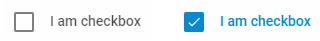

---
sidebar_label: Checkbox
title: Checkbox
---          

A control that allows a user to make a choice between one or several opposite options by toggling them.

{{editor    https://snippet.dhtmlx.com/ikyyekxq	Form. All DhxForm Inputs}}

{{editor    https://snippet.dhtmlx.com/scs712zl	Form. Checkboxes}}

## Adding Checkbox

You can easily add a Checkbox control during initialization of a form:

~~~js
var form = new dhx.Form("form_container", {
    rows: [
		{	
			type: "checkbox",
            label: "I agree",
            name: "agree",
            id: "agree",
            value: "checkboxvalue"
		}
    ]
});
~~~

### Properties

View [the full list of configuration properties of the Checkbox control](form/api/checkbox/api_checkbox_properties.md).

## Working with Checkbox

You can manipulate a Checkbox control by using methods (or [events](#eventhandling)) of the object returned by the [getItem()](form/api/form_getitem_method.md) method.

For example, you can get the value of the control:

~~~js
var value = form.getItem("checkbox").getValue();
~~~

### Methods

Check [the full list of methods of the Checkbox control](form/api/api_overview.md#methods-3).

### Events

Check [the full list of events of the Checkbox control](form/api/api_overview.md#events-3).