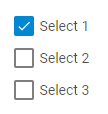

---
sidebar_label: CheckboxGroup
title: CheckboxGroup
---          

A control intended for creating groups of checkboxes.

[Form. Checkbox groups](https://snippet.dhtmlx.com/p89u4ovb)

## Adding CheckboxGroup

You can easily add a Checkbox control during initialization of a form:

~~~js
var form = new dhx.Form("form_container", { 
    rows: [
        {
			id: "checkboxGroup",
			type: "checkboxGroup",
			name: "checkboxGroup",
			required: true,
			label: "Checkbox Group",
			labelWidth: 140,
			labelPosition: "left",
			helpMessage: "Help information",
			padding: "50px",
			value: {
				first: true,
			},
			options: {
				padding: "50px",
				rows: [
					{
						id: "first",
						type: "checkbox",
						text: "Select 1",
					},
					{
						id: "second",
						type: "checkbox",
						text: "Select 2",
						checked: true
					}
				]
			}
		}
     ]
});
~~~

### Properties of CheckboxGroup 

View [the full list of configuration properties of the CheckboxGroup control](form/api/checkbox_group/api_checkboxgroup_properties.md).

### Properties of Checkbox of CheckboxGroup control

Check [the full list of configuration properties of a Checkbox of the CheckboxGroup control](form/api/checkbox_group/api_checkboxgroup_properties.md#properties-of-a-checkbox-of-checkboxgroup).

## Working with CheckboxGroup

You can manipulate a CheckboxGroup control by using methods (or [events](#eventhandling)) of the object returned by the [getItem()](form/api/form_getitem_method.md) method.

For example, you can hide a control on a page:

~~~js
var value = form.getItem("CheckboxGroup").hide();
~~~

### Methods 

Check [the full list of methods of the CheckboxGroup control](form/api/api_overview.md#methods-4).

### Events 

Check [the full list of events of the CheckboxGroup control](form/api/api_overview.md#events-4).