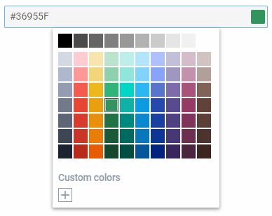

---
sidebar_label: ColorPicker
title: ColorPicker
---          

An input with a color picker attached to it for selecting a color.

{{editor    https://snippet.dhtmlx.com/ikyyekxq	Form. All DhxForm Inputs}}

{{editor	https://snippet.dhtmlx.com/n52dl19s	Form. ColorPicker}}

## Adding ColorPicker

You can easily add a ColorPicker control during initialization of a form:

~~~js
var form = new dhx.Form("form_container", {
    rows: [
		{
			type: "colorpicker",
            name: "colorpicker",
            labelWidth: "200px",
			label: "Choose your color"
		}
    ]
});
~~~

### Properties

View [the full list of configuration properties of the Colorpicker control](form/api/colorpicker/api_colorpicker_properties.md).

## Working with ColorPicker

You can manipulate a ColorPicker control by using methods (or [events](#eventhandling)) of the object returned by the [getItem()](form/api/form_getitem_method.md) method.

For example, you can get the value of the control:

~~~js
var value = form.getItem("colorpicker").getValue();
~~~

{{editor	https://snippet.dhtmlx.com/ocfas6go	Form. Get Item}}

### Methods

Check [the full list of methods of the ColorPicker control](form/api/api_overview.md#methods-5).

### Events

Check [the full list of events of the ColorPicker control](form/api/api_overview.md#events-5).

## Working with the dhtmlxColorPicker widget

There is a possibility to use methods of dhtmlxColorPicker via the **getWidget()** method of a ColorPicker control.

For example, you can set focus on the specified value in the control. To do this, you need to get the widget attached to the ColorPicker control and then use the [setFocus()](colorpicker/api/colorpicker_setfocus_method.md) method of this widget.

~~~js
var colorpicker = form.getItem("colorpicker").getWidget();  // -> ColorPicker
colorpicker.setFocus("#BDF0E9"); // sets focus on the "#BDF0E9" color
~~~

{{editor    https://snippet.dhtmlx.com/0aqkdsi7	Form. Get Widget Of Control}}
