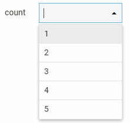

# Combo

An input that represents an advanced select box with a set of options. It is able to provide suggestions while a user is typing text.

**Related sample**: [Form. All controls](https://snippet.dhtmlx.com/ikyyekxq)

**Related sample**: [Form. Combo](https://snippet.dhtmlx.com/wla7u1xq)

## Adding Combo

You can easily add a Combo control during initialization of a form:

~~~js
const form = new dhx.Form("form_container", {
	rows: [
    	{
        	type: "combo",
            name: "combo",
        	label: "count",
        	labelPosition: "left",
        	multiselection: true,
        	selectAllButton: true,
        	value: [
        		"id_1",
        		"id_2"
        	],
        	data: [
        		{ value: "1", id: "id_1" },
        		{ value: "2", id: "id_2" },
        		{ value: "3", id: "id_3" },
        		{ value: "4", id: "id_4" },
        		{ value: "5", id: "id_5" }
        	]
        }
    ]
});
~~~

### Properties

View [the full list of configuration properties of the Combo control](form/api/combo/api_combo_properties.md).

## Working with Combo

You can manipulate a Combo control by using methods or events of the object returned by the [getItem()](form/api/form_getitem_method.md) method.

For example, you can get the value of the control:

~~~js
const value = form.getItem("Combo").getValue();
~~~

### Methods

Check [the full list of methods of the Combo control](form/api/api_overview.md#combo-methods).

### Events

Check [the full list of events of the Combo control](form/api/api_overview.md#combo-events).

### Working with the dhtmlxComboBox widget

There is a possibility to use methods of DHTMLX Combobox via the [getWidget()](form/api/combo/combo_getwidget_method.md) method of a Combo control.

For example, you can set focus in the Combo input without opening a popup with options. To do this, you need to get the widget attached to the Combo control and then use the [focus()](combobox/api/combobox_focus_method.md) method of this widget.

~~~js
const combo = form.getItem("combo").getWidget();  // -> ComboBox
combo.focus(); // sets focus in the input
~~~

Check [the full list of methods of the DHTMLX Combobox component](../../combobox/api/api_overview/#methods) which you can apply via the [getWidget()](../../form/api/combo/combo_getwidget_method/) method.