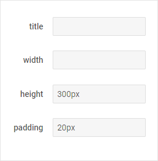
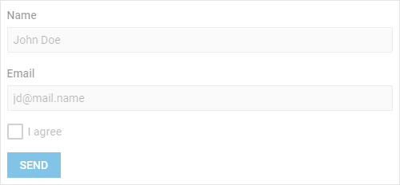

---
sidebar_label: Configuration
title: Configuration
description: description
---          

Alignment
------------

The [](form/api/form_align_property.md) property allows you to set aligning direction for all controls in Form. 

You can apply various options of alignment for different [control groups](form/configuration.md#groupingcontrolsinform) by specifying the [](form/api/form_align_property.md) property for the [](form/api/form_rows_property.md) and form/api/form_cols_property.md:

~~~js
var form = new dhx.Form("form_container", {
    css: "dhx_widget--bordered",
    align: "center", // set alignment for rows /*!*/
    rows: [
        {
            align: "start", // set alignment for cols /*!*/
            css: "dhx_layout-cell--bordered",
            cols: [{
                type: "checkbox",
                label: "start",
                name: "align",
                labelInline: true,
                value: "start",
                checked: true
            },
            {
                type: "checkbox",
                label: "center",
                name: "align",
                labelInline: true,
                value: "center"
            }]
        }
    ]
});
~~~

{{editor	https://snippet.dhtmlx.com/1pzybtja	Form. Blocks}}

The tables below demonstrate using the possible values for the **align** property in Form:

``` todo скорее всего можно просто прикрепить подходящий семпл
<style>
	table.my_table {
		width: 100%;  
	}
    table.my_table caption{
        vertical-align: center;
        width: 100%;
	}
    table.my_table caption.title{
        font-size: 15px;
        padding: 10px;
        text-align: center;
	}
    .img_center {
        padding-top: 10px;
        height: 100%;
    }
</style>
<table class="my_table">
	<tbody>
    <caption class="title">Basic positional alignment</caption>
    <tr>
    <th>"start"</th>
    <th>"center"</th>
    <th>"end"</th></tr>
    <tr>
        <td id="start" class="img_center">
        </td>
        <td id="center" class="img_center"></td>
        <td id="end" class="img_center"></td>
    </tr>           
   	</tbody>
</table>

<table class="my_table">
	<tbody>
    <caption class="title">Distributed alignment</caption>
    <tr>
    <th>"between"</th>
    <th>"around"</th>
    <th>"evenly"</th></tr>
    <tr>
        <td id="between" class="img_center">
        </td>
        <td id="around" class="img_center"></td>
        <td id="evenly" class="img_center"></td>
    </tr>           
   	</tbody>
</table>
```

Grouping Controls in Form
-------------------------



{{editor	https://snippet.dhtmlx.com/1pzybtja	Form. Blocks}}

You can combine controls into groups by placing controls into rows and columns with any level of complexity. To do this, use the [](form/api/form_rows_property.md) and [](form/api/form_cols_property.md) options in the configuration object of the component:

~~~js
var form = new dhx.Form("form_container", {
    css: "dhx_widget--bordered",
    cols: [{ /*!*/
		padding: "20px",
		rows: [ /*!*/
			{
            	type: "input",
            	label: "title",
            	name: "title",
            	value: blockConfig.title,
            	labelWidth: "100px",
            	labelPosition: "right"
			},
			{
				type: "input",
				label: "width",
				name: "width",
				value: blockConfig.width,
				labelWidth: "100px",
				labelPosition: "right"
			},
            {
                // more controls
          	}
        ]
    }]
});
~~~

Making Form disabled
---------------



{{editor	https://snippet.dhtmlx.com/7qjwg2sw	Form. Disabled}}


By default, Form is enabled. To make Form disabled, set the [](form/api/form_disabled_property.md) configuration property to *true*:

~~~js
var form = new dhx.Form("form_container", {
    css: "dhx_widget--bordered",
    disabled: true
});
~~~

Making Form hidden
---------------

By default, Form is visible. To make Form hidden, set the [](form/api/form_hidden_property.md) configuration property to *true*:

~~~js
var form = new dhx.Form("form_container", {
    css: "dhx_widget--bordered",
    hidden: true
});
~~~

Padding
---------------

To generate space around a [control group](form/configuration.md#groupingcontrolsinform), make use of the [](form/api/form_padding_property.md) parameter:

~~~js
var form = new dhx.Form("form_container", {
	css: "dhx_widget--bordered",
	padding: "10px", /*!*/ // padding for rows
    rows: [
        {
            padding: "10px", /*!*/ // padding for cols
            css: "dhx_layout-cell--bordered",
            cols: [{
                type: "checkbox",
                label: "start",
                name: "align",
                labelInline: true,
                value: "start",
                checked: true
            },
            {
                type: "checkbox",
                label: "center",
                name: "align",
                labelInline: true,
                value: "center"
            }]
        }
    ]
});
~~~

{{editor	https://snippet.dhtmlx.com/1pzybtja	Form. Blocks}}

Title
----------

You can define a title for a [control group](form/configuration.md#groupingcontrolsinform) with the help of the [](form/api/form_title_property.md) property:

~~~js
var form = new dhx.Form("form_container", {
	css: "dhx_widget--bordered",
	title: "Form", /*!*/ // title for rows
    rows: [
        {
            title: "Controls", /*!*/ // title for cols
            css: "dhx_layout-cell--bordered",
            cols: [{
                type: "checkbox",
                label: "start",
                name: "align",
                labelInline: true,
                value: "start",
                checked: true
            },
            {
                type: "checkbox",
                label: "center",
                name: "align",
                labelInline: true,
                value: "center"
            }]
        }
    ]
});
~~~

{{editor	https://snippet.dhtmlx.com/1pzybtja	Form. Blocks}}

Width/Height
---------------

You can adjust sizes of a [control group](form/configuration.md#groupingcontrolsinform) with the corresponding properties [](form/api/form_height_property.md) and [](form/api/form_width_property.md):

~~~js
var form = new dhx.Form("form_container", {
    css: "dhx_widget--bordered",
    height: "300px", // height for rows /*!*/
    width: "", // width for rows /*!*/
    cols: [{ /*!*/
		padding: "20px",
		rows: [ /*!*/
			{
            	type: "input",
            	label: "title",
            	name: "title",
            	value: blockConfig.title,
            	labelWidth: "100px",
            	labelPosition: "right"
			},
			{
				type: "input",
				label: "width",
				name: "width",
				value: blockConfig.width,
				labelWidth: "100px",
				labelPosition: "right"
			},
            {
                // more controls
          	}
        ]
    }]
});
~~~

{{editor	https://snippet.dhtmlx.com/1pzybtja	Form. Blocks}}


