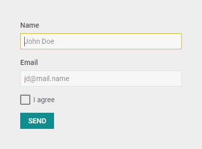

---
sidebar_label: Customization
title: Customization
description: description
---          

## Styling Form

There is a possibility to make changes in the look and feel of a form. For this you need to take the following steps:

- add a new CSS class(es) with desired settings in the &lt;style&gt; section of your HTML page or in your file with styles (don't forget to include your file on the page in this case)

~~~html

~~~

- specify the name of the created CSS class (or names of classes separated by spaces) as the value of the  property in the Form configuration:

~~~js
var form = new dhx.Form({
    css:"my_first_class my_second_class"
});
~~~

{{editor	https://snippet.dhtmlx.com/wnscgb50	Form. Form Custom Styles}}

## Styling Form controls

You can modify styling of Form controls as well using the **css** option inside the object of a [related control](form/controls_list.md).

~~~html

var form = new dhx.Form("form-sample", {
	css:"bg-gray",
	rows: [
		{	
			css:"bg-white",
			type: "input",
			label: "Name",
			placeholder: "John Doe"
		},
		{
			css:"bg-white",
			type: "input",
			label: "Email",
			placeholder: "jd@mail.name"
		}
	]
});
~~~

{{editor	https://snippet.dhtmlx.com/wnscgb50	Form. Form Custom Styles}}
