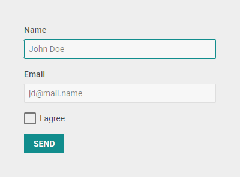

# Customization

## Styling Form

There is a possibility to make changes in the look and feel of a form. 

**Related sample**: [Form. Styling (custom CSS)](https://snippet.dhtmlx.com/wnscgb50)

For this you need to take the following steps:

- add a new CSS class(es) with desired settings in the &lt;style&gt; section of your HTML page or in your file with styles (don't forget to include your file on the page in this case)

~~~html

~~~

- specify the name of the created CSS class (or names of classes separated by spaces) as the value of the  property in the Form configuration:

~~~js
const form = new dhx.Form("form_container", {
    css:"my_first_class my_second_class"
});
~~~

For example:

~~~html

~~~

## Styling Form controls

**Related sample**: [Form. Styling (custom CSS)](https://snippet.dhtmlx.com/wnscgb50)

You can modify styling of Form controls as well using the **css** option inside the object of a related control.

~~~html

~~~
