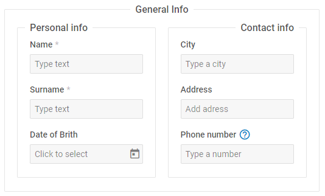

# Fieldset

A control that allows arranging the elements of the form controls into groups.

**Related sample**: [Form. All controls](https://snippet.dhtmlx.com/ikyyekxq)

**Related sample**: [Form. Fieldset](https://snippet.dhtmlx.com/axlwcdrz)

**Related sample**: [Form. Fieldset with rows/cols](https://snippet.dhtmlx.com/lo6g167p)

## Adding Fieldset

You can easily add a Fieldset control during initialization of a form:

~~~js
const form = new dhx.Form("form_container", {
	rows: [
	    {
	        type: "fieldset",
	        label: "Section name",
	        name: "f1",
	        disabled: false, 
	        hidden: false, 
	        css: "mycss",
	        rows: [
                {
                    type: "input",
                    name: "name",
                    required: true,
                    label: "Name",
                    placeholder: "Type text",
                },
                {
                    type: "input",
                    name: "surname",
                    required: true,
                    label: "Surname",
                    placeholder: "Type text",
                },
                // more controls
            ]
	    }
	]
});
~~~

### Properties

View [the full list of configuration properties of the Fieldset control](form/api/fieldset/api_fieldset_properties.md).

## Working with Fieldset

You can manipulate a Fieldset control by using methods or events of the object returned by the [getItem()](form/api/form_getitem_method.md) method.

For example, you can disable a control on a page:

~~~js
form.getItem("fieldset").disable();
~~~

### Methods

Check [the full list of methods of the Fieldset control](form/api/api_overview.md#fieldset-methods).

### Events

Check [the full list of events of the Fieldset control](form/api/api_overview.md#fieldset-events).

