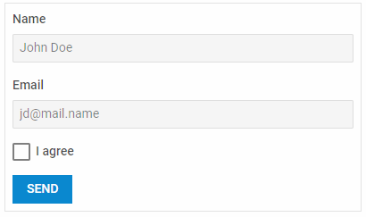

---
sidebar_label: Initialization
title: Initialization
---          

To add dhtmlxForm into an application, you need to take the following simple steps:

- [Download the Form package](https://dhtmlx.com/docs/products/dhtmlxSuite/download.shtml) and unpack it into a folder of your project
- [Include source files](#includesourcefiles)
- [Create a container](#createacontainer)
- [Define Form structure](#defineformstructure)
- [Initialize Form](#initializeform) with the object constructor

~~~html
<!DOCTYPE html>
<html>
    <head>
        <title>How to Start with dhtmlxForm</title>         
        
        <link rel="stylesheet" href="../../codebase/suite.css">
    </head>
    <body>
        

        
    </body>
</html>
~~~

{{editor    https://snippet.dhtmlx.com/yut2mnsz	Form. Initialization}}

Include source files
--------------------

Create an HTML file and place full paths to JS and CSS files of the dhtmlxSuite library into the header of the file. The files are:

- *suite.js*
- *suite.css*

~~~html

<link rel="stylesheet" href="../../codebase/suite.css">
~~~

Create a container
-------------------

Add a container for the Form and give it an id, e.g. "form_container":

~~~html

~~~

Define Form structure
-----------------

Now you need to specify the list of Form controls. For example, you can create a form with two text fields for entering a name and an email, a checkbox for the user to give consent to data processing and a button to 
send a form to a server.

Thus, the structure of your form will look like this:

- a Name input
- an Email input
- an Agree checkbox
- a Send button

To add controls inside a form, you should put them into a layout, either a vertical one (the **rows** attribute), or a horizontal one (the **cols** attribute). In the example below controls are arranged vertically, one under
another:

~~~js
var form_data = {
	rows:[
    	{
        	id: "name",
            name: "name",
        	type: "input",
        	label: "Name",
        	icon: "dxi-magnify",
        	placeholder: "John Doe"
    	},
    	{
        	id:"email",
            name:"email", 
        	type: "input",
        	label: "Email",
        	placeholder: "jd@mail.name"
    	},
    	{
        	type: "checkbox",
        	label: "I agree",
        	name: "agree",
        	labelInline: true,
        	id: "agree",
        	value: "checkboxvalue",
    	},
    	{
        	type: "button",
        	value: "Send",
       	 	size: "medium",
        	view: "flat",
        	color: "primary"
    	}
	]
};
~~~

Initialize Form
---------------------

Initialize Form with the `dhx.Form` object constructor. The constructor takes two parameters:

- the HTML object on the page that serves as the form container. 
- a configuration object which (besides config options) contains an array of form controls defined as objects with a set of attributes 

~~~js
var form = new dhx.Form("form_container", {
	css: "dhx_widget--bordered",
	rows: [
		{
			type: "input",
			label: "Name",
			icon: "dxi dxi-magnify",
			placeholder: "John Doe",
			name: "name"
		},
		// more form controls
	]
});
~~~

{{editor    https://snippet.dhtmlx.com/yut2mnsz	Form. Initialization}}

### Configuration properties:

todotw скорее всего можно просто сослаться на API
{{api
- form/api/form_align_property.md - sets the alignment of controls inside the control group
- form/api/form_cols_property.md - arranges controls inside the control group horizontally
- form/api/form_css_property.md - the name of a CSS class(es) applied to the control group
- form/api/form_disabled_property.md - makes a form disabled
- form/api/form_height_property.md - sets the height of the control group
- form/api/form_hidden_property.md - defines whether a form is hidden
- form/api/form_padding_property.md - sets padding for content inside the control group
- form/api/form_rows_property.md - arranges controls inside the control group vertically
- form/api/form_title_property.md - specifies the title of the control group
- form/api/form_width_property.md - sets the width of the control group
}}

