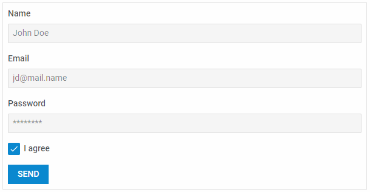

---
sidebar_label: Overview
title: Form overview
description: dhtmlxForm is a useful widget integrated with other DHTMLX components and intended to view and edit data, validate them and send to a server side.  
---          

dhtmlxForm is a typical form widget that can contain a number of adjustable and easy-to-use controls, supports data validation and localization of labels.
Check [online samples for dhtmlxForm](https://docs.dhtmlx.com/suite/samples/form/). 

## API reference

- form/api/refs/form.md

## Related resources

- You can get dhtmlxForm as a part of the Suite library by [downloading dhtmlxSuite](https://dhtmlx.com/docs/products/dhtmlxSuite/download.shtml)          
- There are also [online samples for dhtmlxForm](https://docs.dhtmlx.com/suite/samples/form/)  

## Guides

### Working with Form
Guides you through common information you may need while working with Form.

-  		    
- 
- 
- 
- 
- 
- 

### Form Controls

Discusses the creation of Form controls and the possibilities of manipulating them.

- 
- 
- 
- 
- 
- 
- 
- 
- 
- 
- 
- 
- 
-    

## Other

- 
