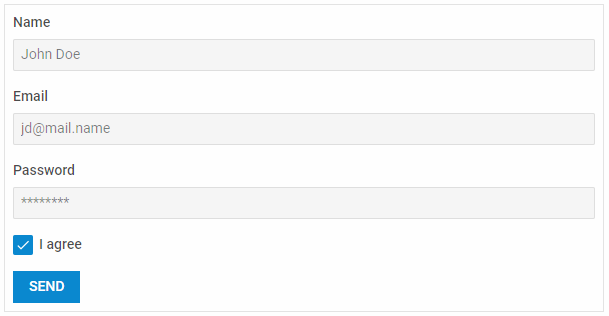

# Form overview

DHTMLX Form is a typical form widget that can contain a number of adjustable and easy-to-use controls, supports data validation and localization of labels.
Check [online samples for DHTMLX Form](https://snippet.dhtmlx.com/ikyyekxq?tag=form). 

## Features

You can check the following page to learn how to build a full-featured DHTMLX Form:

- [Features](/form/features/)

## API reference

- [Form API overview](/form/api/api_overview/)

## Related resources

- You can get DHTMLX Form as a part of the Suite library by [downloading DHTMLX Suite](https://dhtmlx.com/docs/products/dhtmlxSuite/download.shtml)
- There are also [online samples for DHTMLX Form](https://snippet.dhtmlx.com/ikyyekxq?tag=form)  

## Guides

### Working with Form

Guides you through common information you may need while working with Form.

- [Initialization](/form/how_to_start/)
- [Localization](/form/localization/)
- [Configuration](/form/configuration/)
- [Work with Form](/form/work_with_form/)
- [Customization](/form/customization/)
- [Event handling](/form/handling_events/)

### Form Controls

Discusses the creation of Form controls and the possibilities of manipulating them.

- [Avatar](/form/avatar/)
- [Button](/form/button/)
- [Calendar](/form/calendar/)
- [Checkbox](/form/checkbox/)
- [CheckboxGroup](/form/checkboxgroup/)
- [ColorPicker](/form/colorpicker/)
- [Combo](/form/combo/)
- [Container](/form/container/)
- [Fieldset](/form/fieldset/)
- [Input](/form/input/)
- [RadioGroup](/form/radiogroup/)
- [Select](/form/select/)
- [SimpleVault](/form/simplevault/)
- [Slider](/form/slider/)
- [Spacer](/form/spacer/)
- [Text](/form/text/)
- [Textarea](/form/textarea/)
- [TimePicker](/form/timepicker/)
- [Toggle](/form/toggle/)
- [ToggleGroup](/form/togglegroup/)

## Other

- [Migration to newer versions](../migration/)
