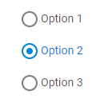

---
sidebar_label: RadioGroup
title: RadioGroup
---          

A control intended for creating groups of Radio buttons.

{{editor    https://snippet.dhtmlx.com/ikyyekxq	Form. All DhxForm Inputs}}

{{editor	https://snippet.dhtmlx.com/ycp1cbct	Form. Radio Buttons}}

{{editor	https://snippet.dhtmlx.com/1pzybtja	Form. Blocks}}

## Adding RadioGroup

You can easily add a RadioGroup control during initialization of a form:

~~~js
var form = new dhx.Form("form_container", {	
	rows: [
    	{
			id: "radiogroup",
            name: "radiogroup",
			type: "radioGroup",
			required: true,
			label: "Radio Group",
			labelWidth: 140,
			labelPosition: "left",
			helpMessage: " Help information",
			value: "1",
			options: {
				rows: [
					{
						type: "radioButton",
						text: "Select 1",
						value: "1",
					},
					{
						type: "radioButton",
						text: "Select 2",
						value: "2"
					},
				]
			}
		}
     ]
});
~~~

### Properties of RadioGroup

View [the full list of configuration properties of the RadioGroup control](form/api/radiogroup/api_radiogroup_properties.md).

### Properties of RadioButton

View [the full list of properties](form/api/radiogroup/api_radiogroup_properties.md#radiobutton-properties) that you can provide in the configuration object of a RadioButton of the RadioGroup control.

## Working with RadioGroup

You can manipulate a RadioGroup control by using methods (or [events](#eventhandling)) of the object returned by the [getItem()](form/api/form_getitem_method.md) method.

For example, you can get the value of the control:

~~~js
var value = form.getItem("radiogroup").getValue();
~~~

### Methods

Check [the full list of methods of the RadioGroup control](form/api/api_overview.md#methods-8).

### Events

Check [the full list of events of the RadioGroup control](form/api/api_overview.md#events-8).