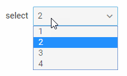

---
sidebar_label: Select
title: Select
---          

An advanced select box that provides a set of options to choose from.

{{editor    https://snippet.dhtmlx.com/ikyyekxq	Form. All DhxForm Inputs}}

{{editor	https://snippet.dhtmlx.com/yo9w9o2t	Form. Select}}

## Adding Select

You can easily add a Select control during initialization of a form:

~~~js
var form = new dhx.Form("form_container", {
	rows: [
    	{
        	type: "select",
            name: "select",
        	label: "select",
        	labelWidth: "50px",
        	width:"200px",
        	options: [
        		{
        			value: "1",
        			content: "1",
					disabled: true
        		},
        		{
        			value: "2",
        			content: "2"
        		},
        		{
        			value: "3",
        			content: "3"
        		},
        		{
        			value: "4",
        			content: "4"
        		}
        	]        
        }  
    ]
});
~~~

### Properties

View [the full list of configuration properties of the Select control](form/api/select/api_select_properties.md).

## Working with Select

You can manipulate a Select control by using methods (or [events](#eventhandling)) of the object returned by the [getItem()](form/api/form_getitem_method.md) method.

For example, you can get the value of the control:

~~~js
var value = form.getItem("select").getValue();
~~~

### Methods

Check [the full list of methods of the Select control](form/api/api_overview.md#methods-9).

### Events

Check [the full list of events of the Select control](form/api/api_overview.md#events-9).