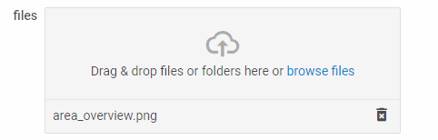

---
sidebar_label: SimpleVault
title: SimpleVault
---          

A handy control for quick and easy uploading of a file or a set of files.

{{editor    https://snippet.dhtmlx.com/ikyyekxq	Form. All DhxForm Inputs}}

{{editor	https://snippet.dhtmlx.com/ofy4k51o	Form. Simple Vault}}

## Adding SimpleVault 

You can easily add a SimpleVault control during initialization of a form:

~~~js
var form = new dhx.Form("form_container", {
	rows: [
    	{
			type: "simpleVault",
			name:"simplevault",
			label: "i am simpleVault",
			labelWidth: "120px",
			labelPosition: "left",
			disabled: false,
			required: false
		}
    ]
});
~~~

### Properties

View [the full list of configuration properties of the SimpleVault control](form/api/simplevault/api_simplevault_properties.md).

## Working with SimpleVault

You can manipulate a SimpleVault control by using methods ([events](#eventhandling)) of the object returned by the [getItem()](form/api/form_getitem_method.md) method.

For example, you can get the value of the control:

~~~js
var value = form.getItem("simpleVault").getValue();
~~~

### Methods

Check [the full list of methods of the SimpleVault control](form/api/api_overview.md#methods-10).

### Events

Check [the full list of events of the SimpleVault control](form/api/api_overview.md#events-10).

## Using DataCollection API

You can manipulate a SimpleVault control with the help of the [DataCollection API](https://docs.dhtmlx.com/vault/api__refs__data_methods.html).

For example, you can remove one or all files from the list. To do that, you need to apply the [remove](https://docs.dhtmlx.com/vault/api__data__remove.html), or [removeAll](https://docs.dhtmlx.com/vault/api__data__removeall.html) method of DataCollection to the object returned by the [getItem()](form/api/form_getitem_method.md) method as follows:

~~~js
form.getItem("simpleVault").data.remove("file_id");

form.getItem("simpleVault").data.removeAll();
~~~

{{note Check the full list of [Data Collection API](https://docs.dhtmlx.com/vault/api__refs__data_methods.html).}}

## Uploading files

You can read about uploading files into a SimpleVault control in the [related article](https://docs.dhtmlx.com/vault/uploading_files.html). 