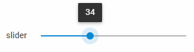

---
sidebar_label: Slider
title: Slider
---          

A control that allows selecting a numeric value by moving a thumb along a line with a fixed set of options.

{{editor    https://snippet.dhtmlx.com/ikyyekxq	Form. All DhxForm Inputs}}

##  Adding Slider
You can easily add a Slider control during initialization of a form:

~~~js
var form = new dhx.Form("form_container", {
    rows: [
		{
			type: "slider",
            name:"slider",
            label: "slider",
            labelWidth: "50px",
            min: 0,
            max: 100
		}
    ]
});
~~~

### Properties

View [the full list of configuration properties of the Slider control](form/api/slider/api_slider_properties.md).

## Working with Slider

You can manipulate a Slider control by using methods (or [events](#eventhandling)) of the object returned by the [getItem()](form/api/form_getitem_method.md) method.

For example, you can get the value of the control:

~~~js
var value = form.getItem("slider_id").getValue();
~~~

### Methods

Check [the full list of methods of the Slider control](form/api/api_overview.md#methods-11).

### Events

Check [the full list of events of the Slider control](form/api/api_overview.md#events-11).

### Working with the dhtmlxSlider widget

There is a possibility to use methods of dhtmlxSlider via the **getWidget()** method of a Slider control.

For example, you can disable a Slider control. To do this, you need to get the widget attached to the Slider control and then use the [disable()](slider/api/slider_disable_method.md) method of this widget.

~~~js
var slider = form.getItem("slider_id").getWidget();  // -> dhtmlxSlider
slider.disable(); // disables slider
~~~

