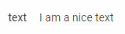

# Text

A control for adding some text.

**Related sample**: [Form. All DhxForm Inputs](https://snippet.dhtmlx.com/ikyyekxq)

## Adding Text

You can easily add a Text control during initialization of a form:

~~~js
var form = new dhx.Form("form_container", {
    rows: [
		{
			type: "text",
            name: "text",
            label: "text",						
			value: "I am a nice text"
		}
    ]
});
~~~

### Properties

View [the full list of configuration properties of the Text control](form/api/text/api_text_properties.md).

## Working with Text

You can manipulate a Text control by using methods or events of the object returned by the [getItem()](form/api/form_getitem_method.md) method.

For example, you can get the value of the control:

~~~js
var value = form.getItem("text").getValue();
~~~

### Methods

Check [the full list of methods of the Text control](form/api/api_overview.md#text-methods).

### Events

Check [the full list of events of the Text control](form/api/api_overview.md#text-events).
