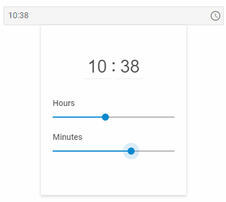

---
sidebar_label: TimePicker
title: TimePicker
description: description
---          

A control that allows a user to select time value either by moving handles along track bars or by entering hour and minutes values directly into related inputs.

{{editor    https://snippet.dhtmlx.com/ikyyekxq	Form. All DhxForm Inputs}}

{{editor	https://snippet.dhtmlx.com/4k3o8p7b	Form. TimePicker}}

## Adding TimePicker 

You can easily add a TimePicker control during initialization of a form:

~~~js
var form = new dhx.Form("form_container", {
	rows: [
    	{
			type: "timepicker",
            name: "timepicker",
            label: "time",
            labelWidth: "50px",
			timeFormat: 12,
    		valueFormat: "timeObject",
            value: [6,20,"AM"]
		}
    ]
});
~~~

### Properties

View [the full list of configuration properties of the TimePicker control](form/api/timepicker/api_timepicker_properties.md).

## Working with TimePicker

You can manipulate a TimePicker control by using methods (or [events](#eventhandling)) of the object returned by the [getItem()](form/api/form_getitem_method.md) method.

For example, you can get the value of the control:

~~~js
var value = form.getItem("timepicker").getValue();
~~~

### Methods:

Check [the full list of methods of the Timepicker control](form/api/api_overview.md#methods-15).

### Events:

Check [the full list of events of the Timepicker control](form/api/api_overview.md#events-15).

### Working with the dhtmlxTimePicker widget

There is a possibility to use methods of dhtmlxTimePicker via the **getWidget()** method of a TimePicker control.

For example, you can set value for a TimePicker control. To do this, you need to get the widget attached to the TimePicker control and then use the [setValue()](timepicker/api/timepicker_setvalue_method.md) method of this widget.

~~~js
var timepicker = form.getItem("timepicker").getWidget();  // -> TimePicker
timepicker.setValue("00:39"); //set the value as a string
~~~

{{editor	https://snippet.dhtmlx.com/0aqkdsi7	Form. Get Widget Of Control}}
