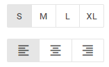

# ToggleGroup

A control intended for creating groups of toggle buttons.

**Related sample**: [Form. ToggleGroup](https://snippet.dhtmlx.com/yqi21ykr)

## Adding ToggleGroup

You can easily add a ToggleGroup control during initialization of a form:

~~~js
const form = new dhx.Form("form_container", { 
    rows: [
       	{
	        type: "toggleGroup",
	        full: true,
	        gap: 4,
	        options: [
	            {
	                id: "left",
	                icon: "dxi dxi-format-align-left",
	            },
	            {
	                id: "center",
	                icon: "dxi dxi-format-align-center",
	            },
	            {
	                id: "right",
	                icon: "dxi dxi-format-align-right",
	            },
	        ]
	    }
	]
});
~~~

### Properties

View [the full list of configuration properties of the ToggleGroup control](form/api/togglegroup/api_togglegroup_properties.md).

## Working with ToggleGroup

You can manipulate a ToggleGroup control by using methods or events of the object returned by the [getItem()](form/api/form_getitem_method.md) method.

For example, you can hide a control on a page:

~~~js
const value = form.getItem("ToggleGroup").hide();
~~~

### Methods

Check [the full list of methods of the ToggleGroup control](form/api/api_overview.md#togglegroup-methods).

### Events

Check [the full list of events of the ToggleGroup control](form/api/api_overview.md#togglegroup-events).