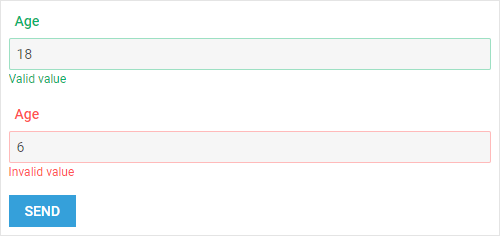
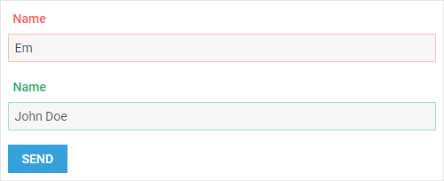
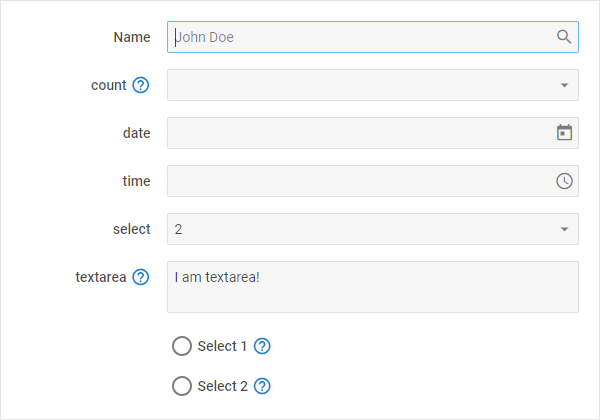

---
sidebar_label: Work with Form
title: Work with Form
description: description
---          

## Getting values of controls

You can get current values/states of Form controls with the help of the  method. By default, this method returns an object  with names or IDs of controls (if the name attribute is not defined in the config of the control) and their values/states.

~~~js
// default functionality
var state = form.getValue();
//->{"name":"John Doe","email":"jd@mail.com", "agree":true}
~~~

It is also possible to get this information in the form of FormData. For this, you need to pass the following parameter:

- **asFormData** - (*boolean*) defines whether values of Form controls should be returned as Form Data

~~~js
// returning form details as FormData
var state = form.getValue(true);
~~~

{{editor	https://snippet.dhtmlx.com/odod5v12	Form. Get Value}}

## Setting new values for controls

If you want to set new values or states for Form controls on the fly, there is the  at your disposal. The method takes as a parameter an object with new values/states of controls. This
object should contain a set of *key:value* pairs where *key* is either the name of the control or the control's id (if the name attribute is not defined in the config of the control) and *value* is a new value/state of the control:

~~~js
form.setValue({
	"input_name":"Jack London", 
    "slider_id":10
    // more name:value pairs
});
~~~

{{editor	https://snippet.dhtmlx.com/7nxbtlzs	Form. Set Value}}

Enabling/Disabling a form
--------------------------
To enable a form, use the [enable()](form/api/form_enable_method.md) method:

~~~js
form.enable();
~~~

To disable a form, use the [disable()](form/api/form_disable_method.md) method:

~~~js
form.disable();
// -> true|false
~~~

{{editor	https://snippet.dhtmlx.com/few71nk2	Form. Disable}}

## Checking if a form is disabled

To check if a form is disabled, call the [isDisabled()](form/api/form_isdisabled_method.md) method:

~~~js
form.isDisabled(); // -> true/false
~~~
 
To check whether a form control is disabled, pass either the name of the control or its id (if the name attribute is not defined in the config of the control) as a parameter to the  [isDisabled()](form/api/form_isdisabled_method.md) method:

~~~js
form.isDisabled("input"); // -> returns true/false
~~~

{{editor	https://snippet.dhtmlx.com/lthu8p6p	Form. Is Disabled}}

## Hiding/Showing a form

To hide a form, use the [hide()](form/api/form_hide_method.md) method:

~~~js
form.hide();
~~~

To show a form, use the [show()](form/api/form_show_method.md) method:

~~~js
form.show();
~~~

## Checking if a form is visible

To check if a form is visible, call the [isVisible()](form/api/form_isvisible_method.md) method:

~~~js
form.isVisible(); // -> true/false
~~~
 
To check whether a form control is visible, pass either the name of the control or its id (if the name attribute is not defined in the config of the control) as a parameter to the  [isVisible()](form/api/form_isvisible_method.md) method:

~~~js
form.isVisible("input"); // -> returns true/false
~~~

## Validating form 

In order to validate a form, you should deal with several aspects: required fields, minimal and maximal values, number of allowed characters, and validation rules.

### Required fields 

You can easily specify that an input is obligatory to be treated by a user with the help of the **required** attribute. 

~~~js
{	
	type: "checkbox",
	label: "I agree",
	labelInline: true,
	name: "agree",
	required: true,
	id: "agree",
	value: "checkboxvalue"
}
~~~

While you've set **required:true** for a field, it gets an asterisk next to its label:

{{editor	https://snippet.dhtmlx.com/0pr3var0	Form. Required}}

The attribute is applicable to the input fields with the input types: "number", "text", "password".

### Minimal and maximal values

Starting with v7.0, it is possible to add validation for number values entered in the input field. 

You just need to specify the minimum and/or maximum values allowed in the input via the **min** and/or **max** attributes.

~~~js
{
	type: "input",
	inputType: "number",
	label: "Age",
	value: 18,
	placeholder: "Enter your age",
	min: 12,
	max: 18
}
~~~

The attributes are applicable to the input fields with the input type: "number".

### Number of allowed characters

Starting from v7.0, you can easily limit the number of characters entered in an input or textarea field. 

For that, you need to use the **minlength** and (or) **maxlength** attributes that check the length of the given value. Validation is successful if the length is greater than or equal to the minlength value and (or) less than or equal to the maxlength value.

~~~js
{
	type: "input",
	inputType: "text",
	label: "Name",
	placeholder: "John Doe",
	minlength: 3,
	maxlength: 10
}
~~~

The attributes are applicable to the input/textarea fields with the input types: "text", "password".

### Validation rules

To specify the way of validating a particular input/textarea, you can make use of predefined validation rules, they are:
 
- "email" - validEmail 
- "integer" - validInteger
- "numeric" - validNumeric
- "alphanumeric" - validAplhaNumeric 
- "IPv4" - validIPv4 

Set a string with the name of the necessary rule as a value of the **validation** attribute:

~~~js
{
	type: "input",
	inputType: "text",
	label: "Email",
	placeholder: "jd@mail.name",
	validation: "email"
}
~~~

There is also a possibility to specify *a custom validation rule* by setting it as a value of the **validation** attribute:

~~~js
{
	type: "input",
	inputType: "text",
	label: "Name",
	placeholder: "John Doe",
	validation: function(value) {
		return value && value.length > 4;
	}	
}
~~~

{{editor	https://snippet.dhtmlx.com/3cz9v7rm	Form. Validation}}

{{note If the <b>inputType</b> attribute is set to "number", the **validation** attribute can be set only as a function.}}

### Messages

While specifying validation rules for form fields, you can also provide a set of messages that will notify the end user, whether he/she is filling the form in correctly. There are three types of messages available:

<table class="webixdoc_links">
	<tbody>
        <tr>
			<td class="webixdoc_links0"><b>preMessage</b></td>
			<td>(<i>string</i>) a message that contains instructions for interacting with the control</td>
		</tr>
		<tr>
			<td class="webixdoc_links0"><b>successMessage</b></td>
			<td>(<i>string</i>) a message that appears in case of successful validation of the control value</td>
		</tr>
		<tr>
			<td class="webixdoc_links0"><b>errorMessage</b></td>
			<td>(<i>string</i>) a message that appears in case of error during validation of the control value</td>
		</tr>
    </tbody>
</table>

For example, a configuration object for an input with email may look as in:

~~~js
{
	type: "input",
	label: "Email",
	placeholder: "jd@mail.name",
	errorMessage: "Invalid email",
	successMessage: "Valid email",
	validation: "email"
}
~~~

{{editor	https://snippet.dhtmlx.com/yhiuq2mi	Form. Messages}}

### Validation API

After a user has finished filling out the form according to the specified rules, it's high time to check, whether it is done correctly.
To validate a form, make use of the  method:

~~~js
var result = form.validate();
~~~

The method should return *true*, if all the fields are filled as required, or *false* if there are fields that require attention.

{{editor	https://snippet.dhtmlx.com/pmz0zk16	Form. Validate}}

## Sending form to server

To send a form to the server, make use of the  method. It takes three parameters:

<table class="webixdoc_links">
	<tbody>
        <tr>
			<td class="webixdoc_links0"><b>url</b></td>
			<td>(<i>string</i>) the URL of the server</td>
		</tr>
		<tr>
			<td class="webixdoc_links0"><b>method</b></td>
			<td>(<i>string</i>) the request type, "POST" by default</td>
		</tr>
		<tr>
			<td class="webixdoc_links0"><b>asFormData</b></td>
			<td>(<i>boolean</i>) optional, defines whether values of Form controls should be sent as Form Data</td>
		</tr>
    </tbody>
</table>

and returns a promise object.

~~~js
var send = form.send("myserver.com", "POST");
~~~

To control the process of a from sending, you can make use of the related events:  and :

~~~js
// fires before sending a form to the server
form.events.on("BeforeSend", function(){
   // your logic here
});

// fires after sending a form to the server
form.events.on("AfterSend", function(){
   // your logic here
});
~~~

## Clearing form

The API of dhtmlxForm provides you with flexible ways of clearing a form. There is the  method that clears a form either fully or partially, depending on the passed parameter.

- "value" - clears only form values
- "validation" - clears form validation
- without parameters - clears both form values and validation

~~~js
// clears only form validation
form.clear("validation");

// clears only form values
form.clear("value");

// clears both form values and validation
form.clear();
~~~

{{editor	https://snippet.dhtmlx.com/a64ih4ih	Form. Clear}}

## Setting focus to a control

Starting from v7.0, you can set focus to a Form control via the [setFocus()](form/api/form_setfocus_method.md) method. It takes either the name of the control or its id (if the name attribute is not defined in the config of the control) as a parameter:

~~~js
form.setFocus("input");
~~~

[Form. Set Focus On Control](https://snippet.dhtmlx.com/tye82oqs)

It is possible to set focus to DatePicker, Checkbox, ColorPicker, Combo, Input, RadioGroup, Select, Textarea, TimePicker controls of Form.
