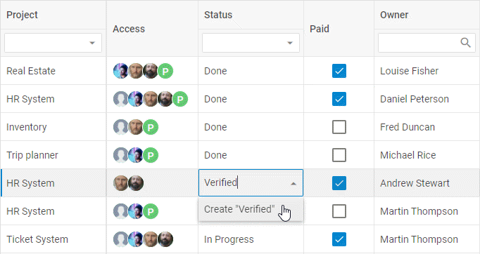
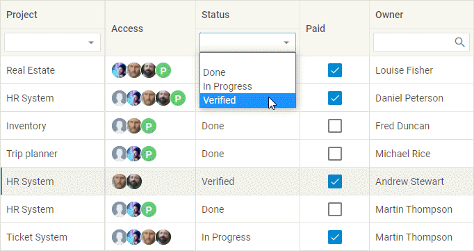

# Configuration

DHTMLX Grid possesses flexible configuration that let you get desired look and feel via a collection of versatile properties.

## Width/height

You can specify necessary size of your Grid via the configuration properties [width](grid/api/grid_width_config.md) and [height](grid/api/grid_height_config.md):

~~~js
const grid = new dhx.Grid("grid_container", {
    columns: [
		// columns config
	],
    width: 400,
    height: 400,
    data: dataset
});
~~~

**Related sample**: [Grid. Custom sizes](https://snippet.dhtmlx.com/ffxj6se0)

:::info
If the **width** and **height** options aren't set in the Grid configuration, the Grid will take the size of its container. If you don't specify the height for the container, it will be equal to "0px" and Grid won't be visible on the page.
:::

### Autoheight for Grid

**If you use PRO version of DHTMLX Grid**, you may enable the auto height mode of Grid. For this, set the value of the [height](grid/api/grid_height_config.md) property to "auto". In this mode, Grid will expand on adding new rows, and will shrink on removing rows not to occupy external place.

~~~js
const grid = new dhx.Grid("grid_container", {
    columns: [
		// columns config
	],
    height: "auto",
    data: dataset
});
~~~

This functionality is available from v8.1.

**Related sample**: [Grid. Set automatic height (PRO)](https://snippet.dhtmlx.com/srbu56ob)

If needed, you may set the minimal and maximal height for the container via the **min-height** and **max-height** CSS properties:

~~~html

~~~

## Columns

It is possible to adjust the configuration of grid columns via the corresponding option [columns](grid/api/grid_columns_config.md). As a value it takes an array with objects each of which contains config of a column.
The full list of properties you can set for a column is given in the API reference.

~~~js
const grid = new dhx.Grid("grid_container", {
    columns: [
        { width: 100, id: "a", header: [{ text: "#" }] },
        { width: 100, id: "b", header: [{ text: "Title" }] },
        { width: 200, id: "c", header: [{ text: "Name" }] },
        { width: 200, id: "d", header: [{ text: "Address" }] }
    ],
    data: dataset
});
~~~

Each column object may contain a set of properties.

{{note You will find the full list of the configuration properties of a Grid column [here](grid/api/api_gridcolumn_properties.md).}}

### Alignment

Starting from v6.5, there is the ability to align data in a column as well as to align data in the column's header via the **align** option:

~~~js
const grid = new dhx.Grid("grid_container", {
    columns: [
        { id: "name", header:  [{ text: "Name", align: "center" }], align: "right"}
        // more options
    ],
    data: dataset
});
~~~

**Related sample**: [Grid. Content align](https://snippet.dhtmlx.com/eyreddku)

The available values of the option are "left", "center" and "right".

### Autosize for columns

You can configure columns' settings so that their width would automatically adjust to their content. Use the  property for this purpose. The property can take one of four values:

<table>
	<tbody>
        <tr>
			<td><b>"header"</b></td>
			<td>adjusts the columns to the width of their header</td>
		</tr>
        <tr>
			<td><b>"footer"</b></td>
			<td>adjusts the columns to the width of their footer</td>
		</tr>
        <tr>
			<td><b>"data"</b></td>
			<td>adjusts the columns to the width of their content</td>
		</tr>
        <tr>
			<td><b>true</b></td>
			<td>combines the above mentioned modes and adjusts the column to the bigger value</td>
		</tr>
    </tbody>
</table>
 

~~~js
const grid = new dhx.Grid("grid_container", {
    columns: [
		// columns config
	],
    adjust: "header",
    data: dataset
});
~~~

**Related sample**: [Grid. Adjust columns by header, data, all](https://snippet.dhtmlx.com/zfrpe22d)

It is also possible to use the  property in the configuration of a separate column:

~~~js {3,6}
const grid = new dhx.Grid("grid_container", { 
    columns: [
        { id: "country", header: [{ text: "Country" }], adjust: "header" },
        { id: "population", header: [{ text: "Population" }] }
    ],
    adjust: false,
    data: dataset
});
~~~

{{note  In case complex HTML content is added into a column, the column width may be calculated incorrectly.}}

### Autowidth for columns

It is possible to automatically adjust the size of Grid columns to the size of Grid with the help of the  configuration option, like this:

~~~js
const grid = new dhx.Grid("grid_container", {
    columns: [
		// columns config
	],
    autoWidth: true,
    data: dataset
});
~~~

**Related sample**: [Grid. Columns auto width](https://snippet.dhtmlx.com/4as4y3l4)

You can disable this functionality for a specified column via setting the  property to *false* in the configuration of the column:

~~~js {3,6}
const grid = new dhx.Grid("grid_container", {
	columns: [
		{ width: 200, id: "country", header: [{ text: "Country" }], autoWidth: false },
		{ width: 150, id: "population", header: [{ text: "Population" }] },
	],
	autoWidth: true,
	data: dataset
});
~~~

### Formatting columns

Starting from v7.1, you can display the values of the cells of a Grid column in the desired format:

1\. To define the format for numeric values, apply the **format** configuration option of the column:

~~~js
{ 
	width: 150, id: "population", header: [{ text: "Population" }],  
	format: "# #.0"
}
// -> 1415045928 will be displayed as 1 415 045 928.0
~~~

The following characters can be used:

- **#** - the integer part of the number
- **0** - the fractional part of the number. The **0** placeholder displays insignificant zeros if a number has fewer digits than there are zeros in the format string, for instance, the **.00** format will display 0.298 as 0.30.  If a number has more digits to the right of the decimal point than there are placeholders in the format string, the number rounds to as many decimal places as there are placeholders, for instance, the **.000** format will display 0.2 as 0.200.
- **# #** - sets the thousands separator in a number (123 456)
- **#.0** - sets the separator for the decimal point in a number (123 456.357)

2\. You can display the percentage value in the necessary format by setting the **type: "percent"** configuration option of a column together with the **format** option:

~~~js {3}
{ 
	width: 150, id: "yearlyChange", header: [{ text: "Yearly Change" }], 
	type: "percent", format: "#.00"
}
// -> 0.0039 will be displayed as 0.39%
~~~

When using just the **type: "percent"** configuration option of a column, the result will be the following:

~~~js
{ 
	width: 150, id: "yearlyChange", header: [{ text: "Yearly Change" }], 
	type: "percent"
}
// -> 0.0039 will be displayed as 0%
~~~

3\. To define the format for dates, set the **type: "date"** property for a column and define the [format of dates](calendar/api/calendar_dateformat_config.md) with the help of the **format** option:

~~~js {3}
{ 
	width: 150, id: "date", header: [{ text: "Date" }], 
	type: "date", format: "%M %d %Y"
}
~~~

:::info
The date format must include delimiters (space or symbol), otherwise an error will be thrown
:::

**Related sample**: [Grid. Data formats](https://snippet.dhtmlx.com/ox37nvdm)

### Frozen columns

You can fix (or "freeze") a column or several columns, so that they will become static when you scroll the grid, while the rest of columns remain movable. 

- To fix columns to the left side of the grid, use the [leftSplit](grid/api/grid_leftsplit_config.md) property. 
- To fix columns to the right side of the grid, use the [rightSplit](grid/api/grid_rightsplit_config.md) property. 

Just set the number of columns you want to freeze as a value of the related property in the Grid configuration.

~~~js
const grid = new dhx.Grid("grid_container", {
    columns: [
		// columns config
	],
    leftSplit: 1,
	rightSplit: 2,
    data: dataset
});
~~~

**Related sample**: [Grid. Frozen columns and rows](https://snippet.dhtmlx.com/hcgl9nth)

### Hidden columns

You can set the **hidden:true** property in the [config of a column](grid/configuration.md#columns) so that it doesn't appear on a page.

~~~js {5}
{ 
	width: 150, id: "population", header: [{ text: "Population" }] 
},
{ 
	hidden: true, width: 150, id: "yearlyChange", header: [{ text: "Yearly Change" }]
}
~~~

**Related sample**: [Grid. Hidden columns](https://snippet.dhtmlx.com/lh7ma639)

### Sortable columns

By default, DHTMLX Grid allows sorting content of any Grid column by clicking on its header. 

To disable this option, set the  property in the Grid configuration to *false*:

~~~js
const grid = new dhx.Grid("grid_container", {
    columns: [
		// columns config
	],
    sortable: false,  
    data: dataset
});
~~~

**Related sample**: [Grid. Sortable columns](https://snippet.dhtmlx.com/r3prvlmo)

#### Making separate columns sortable

You can make separate columns sortable by specifying the [sortable:true](grid/api/grid_sortable_config.md) property in the configuration of a column:

In the example below all columns will be sortable, except for the second one:

~~~js {3,5,8}
const grid = new dhx.Grid("grid_container", {
    columns: [
        { width: 200, id: "country", header: [{ text: "Country" }], sortable: true },
        { width: 150, id: "land", header: [{ text: "Land" }] },
        { width: 150, id: "density", header: [{ text: "Density" }], sortable: true }
    ],
    data: dataset,
    sortable: false,  
});
~~~

The following sample demonstrates the same result:

~~~js {4}
const grid = new dhx.Grid("grid_container", {
    columns: [
        { width: 200, id: "country", header: [{ text: "Country" }] },
        { width: 150, id: "land", header: [{ text: "Land" }], sortable: false },
        { width: 150, id: "density", header: [{ text: "Density" }] }
    ],
    data: dataset
});
~~~

### Resizable columns

Columns of Grid have fixed width with no possibility to change them from UI. You can switch on the corresponding configuration option to make all columns of Grid resizable.

~~~js {6}
const grid = new dhx.Grid("grid_container", {
    columns: [
		// columns config
	],
    data: dataset,
    resizable: true
});
~~~

Then you will be able to change the width of columns using the mouse. With the cursor grab the right border and drag to the desired width.

{{note If you also set the **autoWidth** configuration option, you will be able to change the width of columns only inside the container of Grid. }}

You can disable the resizing of any column by setting the [resizable:false](grid/api/grid_resizable_config.md) property in the config of a column.

~~~js {4,7}
const grid = new dhx.Grid("grid_container", {
    columns: [
        { width: 150, id: "test1", header: [{ text: "Test1" }] },
        { width: 150, id: "test2", header: [{ text: "Test2" }], resizable: false }
    ],
    data: dataset,
    resizable: true 
})
~~~

**Related sample**: [Grid. Resizable columns](https://snippet.dhtmlx.com/aeqzuks0)

{{note To define the resizing limits, set necessary values to the **minWidth**/**maxWidth** properties in the config of a column.
}}

### HTML content of Grid columns

DHTMLX Grid allows adding an image or an icon into Grid cells in two ways:

- by specifying the HTML content of all Grid columns

This way presupposes making each cell of Grid capable of displaying the HTML content via using the [htmlEnable](grid/api/grid_htmlenable_config.md) property in the configuration object of Grid.

~~~js {14}
const dataset = [
	{
		"country": "China",
        "flag": "",
	    "id": "1"
	}
];

const grid = new dhx.Grid("grid_container", {
	columns: [
		// columns config
	],
	data: dataset,
    htmlEnable: true
});
~~~

- by specifying the HTML content of a separate column

If you want to add custom elements into cells of the specified column, you need to set the **htmlEnable:true** property in the configuration of a column:

~~~js {12}
const dataset = [
	{
		"country": "China",
	    "id": "1"
	}
];

const grid = new dhx.Grid("grid_container", {
	columns: [
		{
            width: 200, id: "country", header: [{ text: "Country" }],
            htmlEnable: true
        }, 
		{ 
            width: 150, id: "urban", header: [{ text: "Urban Pop" }] 
        }, 
		// more columns
	],
	data: dataset
});
~~~

**Related sample**: [Grid. Html in data](https://snippet.dhtmlx.com/chitkvkc)

### Event handlers for HTML content

Starting from v7.0, you can add event handlers to the HTML elements defined in a data set of Grid with the help of the  configuration property, for instance:

~~~js {3,18-29}
const data = [
	{
		"country": "
China
",
		"population": "1415045928", "yearlyChange": "0.0039",
		"netChange": "5528531", "density": "151",
		"urban": "0.5800", "id": "1"
	},
    // more options
];

const grid = new dhx.Grid("grid_container", {
	columns: [
        { width: 200, id: "country", header: [{ text: "Country" }], htmlEnable: true },
        // more options
    ],
	data: data,
    eventHandlers: {
		onclick: {
			cell__html: function(event, data) {
				display(JSON.stringify(data.col, null, 2));
			},
		},
		onmouseover: {
			cell__html: function(event) {
				display("You are over " + event.target.tagName);
			},
		}
	}
});
~~~

**Related sample**: [Grid. Handling events in template](https://snippet.dhtmlx.com/zcv5drxc)

## Editing Grid and separate columns

DHTMLX Grid provides the editing feature that includes two options:

- editing of the whole Grid, i.e. of all its columns

To make all columns of the Grid editable, specify the  option in the configuration of Grid:

~~~js
const grid = new dhx.Grid("grid_container", {
	columns: [
		// columns config
	],
	data: data,
	editable: true
});
~~~

**Related sample**: [Grid. Editing with different editors (combobox, select, multiselect, boolean, date)](https://snippet.dhtmlx.com/w2cdossn)

- editing of the specified columns only

This option implies that you can enable/disable editing of particular columns by setting the [editable: true](grid/api/grid_editable_config.md) property in the configuration of a column:

In the example below all columns will be editable, except for the first one:

~~~js {5,15}
const grid = new dhx.Grid("grid_container", {
	columns: [
		{ 
        	width: 150, id:"project",
            editable: false,
            header: [
        	  {text: "Project"}, {content: "selectFilter"}
            ]
        },
		{ width:150, id: "owner", header: [{text: "Owner"},{content: "inputFilter"}]},
		{ width:150, id: "hours", header: [{text: "Hours"}, {content: "inputFilter"}]},
		// more columns
	],
	data: data,
	editable: true
});
~~~

And the following example demonstrates an opposite situation when only the first column is editable:

~~~js {5}
const grid = new dhx.Grid("grid_container", {
	columns: [
		{ 
           width: 150, id: "project",
           editable: true,
           header: [
        	{text:"Project"}, {content:"selectFilter"}
           ]
        },
		{ width: 150, id: "owner", header: [{text: "Owner"},{content: "inputFilter"}]},
		{ width: 150, id: "hours", header: [{text: "Hours"}, {content: "inputFilter"}]},
		// more columns
	],
	data: data
});
~~~

### Types of column editor

You can specify the way of editing the cells of a Grid column depending on its content as simple input, date picker, textarea control, checkbox, select, multiselect or combobox. The type of the used editor can be defined either by the **editorType** property of a [column](grid/api/grid_columns_config.md) or via the **type** one.

There are several types of column editors:

- #### input

An editor for cells with a simple text (the default one, unless a column has **type:"date"**).

~~~js
// cells of the "project" column will be edited as inputs
const grid = new dhx.Grid("grid_container", {
	columns: [
		{
			width: 150,
			id: "project",
			header: [{ text: "Project" }, { content: "selectFilter" }]
		}
    // more columns
	],
	data: data,
	editable: true
});
~~~

**Related sample**: [Grid. Editing with different editors (combobox, select, multiselect, boolean, date)](https://snippet.dhtmlx.com/w2cdossn)

- #### datePicker

An editor for cells with dates (default for a column with **type:"date"**).

To use this editor, you should specify the **type:"date"** property for a column. It is also possible to set the necessary [format of date](calendar/api/calendar_dateformat_config.md) while editing a cell content with the help of the **format** option.

~~~js
{ 
	// if the type:"date" config is set in the column config, 
    // there's no need to specify the type of the editor
	width: 150, id: "start_date", 
    header: [{ text: "Calendar", colspan: 2 }, { text: "Start date" }], 
    type: "date", format: "%d/%m/%Y" 
}
~~~

**Related sample**: [Grid. Editing with different editors (combobox, select, multiselect, boolean, date)](https://snippet.dhtmlx.com/w2cdossn)

:::info
You can configure the date picker by passing [properties of Calendar](category/calendar-properties.md) (**except for** the *value*, *range*, and *dateFormat* ones) to the <b>editorConfig</b> object, as in:

~~~js
{ 
	id: "start_date", 
	header: [{ text: "Start date" }], 
	type: "date", 
	format: "%d/%m/%Y %H:%i",
	editorConfig: { 
		timePicker: true, 
		weekStart: "sunday",  
		thisMonthOnly: true, 
		weekNumbers: true
	} 
}
~~~
:::

- #### textarea

An editor for cells that contain text.

To use this editor, you should specify the **editorType:"textarea"** property for a column.

{{note The **textarea** editor allows editing multiple lines of text when the [autoHeight:true](grid/api/grid_autoheight_config.md) configuration option of Grid is enabled. The functionality is available only in PRO version of the DHTMLX Grid (or DHTMLX Suite) package.}}

~~~js
const grid = new dhx.Grid("grid_container", {
	columns: [
		{
			width: 150, id: "project", 
			header: [{ text: "Project" }, { content: "selectFilter" }], 
			editorType: "textarea"
		}
    // more columns
	],
	data: data,
	editable: true,
	autoHeight: true
});
~~~

**Related sample**: [Grid. Editing with different editors (combobox, select, multiselect, boolean, date)](https://snippet.dhtmlx.com/w2cdossn)

- #### checkbox

An editor for cells with a two-state check box.

To use this editor, you need to specify the **type: "boolean"** property for a column.

~~~js
{ 
	// if the type:"boolean" config is set in the column config, 
    // there's no need to specify the type of the editor
	width: 160, id: "test", 
    header: [{ text: "Test" }], 
    type: "boolean"
}
~~~

**Related sample**: [Grid. Editing with different editors (combobox, select, multiselect, boolean, date)](https://snippet.dhtmlx.com/w2cdossn)

{{note If you specify the editing option in the configuration of Grid, then editing of a column with checkbox will always be enabled.}}

- #### select

An editor for cells that should contain several options to choose from.

To set this editor type you need to specify the **editorType:"select"** property for a column and define a list of options via the **options** property.

You may either specify the same list of editor options for all cells of the column. For that, use either an array of string values or an array of options' objects as a value of the property as in:

~~~js
{
	width: 150, id: "status", header: [{text: "Status"}, {content: "selectFilter"}],
	editorType: "select", options: ["Done", "In Progress", "Not Started"]
} 

// or
{
	width: 150, id: "status", header: [{text: "Status"}, {content: "selectFilter"}],
	editorType: "select", 
	options: [
		{ id: "done", value: "Done" }, 
		{ id: "in progress", value: "In Progress" }, 
		{ id: "not started", value: "Not Started" },
	],
} 
~~~

**Related sample**: [Grid. Editing with different editors (combobox, select, multiselect, boolean, date)](https://snippet.dhtmlx.com/w2cdossn)

Or define unique lists of options for different column cells. For that, use a function as a value of the property:

~~~js
{
    id: "select_example",
    header: [{ text: "Select example" }],
    editorType: "select",
    options: (col, row) => getCurrentOptions(row),
},
~~~

**Related sample**: [Grid. Individual option lists for select, multiselect and combobox editors](https://snippet.dhtmlx.com/i22fg83z)

- #### multiselect

An editor for cells that enables selection of multiple options. You can select one option, several options, all options, or no options.

To set this editor type you need to specify the **editorType:"multiselect"** property for a column and define a list of options via the **options** property.

You may either specify the same list of editor options for all cells of the column. For that, use either an array of string values or an array of options' objects as a value of the property as in:

~~~js
{
    id: "renewals", type: "string",
    header: [{ text: "Number of renewals" }],
    editorType: "multiselect",
    options: ["1 time", "1-2 times", "more than 5 times"],
}, 

// or
{
    id: "renewals", type: "string",
    header: [{ text: "Number of renewals" }],
    editorType: "multiselect",
	options: [
		{ id: "1", value: "1 time" }, 
		{ id: "1-2", value: "1-2 times" }, 
		{ id: "5+", value: "more than 5 times" },
	],
}
~~~

**Related sample**: [Grid. Editing with different editors (combobox, select, multiselect, boolean, date)](https://snippet.dhtmlx.com/w2cdossn)

Or define unique lists of options for different column cells. For that, use a function as a value of the property:

~~~js
{
    id: "multiselect_example",
    header: [{ text: "Multiselect example" }],
    type: "string",
    editorType: "multiselect",
    options: (col, row) => getCurrentOptions(row), 
    minWidth: 360
},
~~~

**Related sample**: [Grid. Individual option lists for select, multiselect and combobox editors](https://snippet.dhtmlx.com/i22fg83z)

If you use the **multiselect** editor, you can predefine several options to be shown in a cell. You should separate the options in the dataset using the `,` separator.

~~~js
const data = [
	{
    	renewals: "1 time", //one option is shown in a cell
		...
	},
	{
    	renewals: "more than 5 times, 1 time" //two options are shown in a cell
		...
	}
];
~~~

- #### combobox

An editor for cells that should contain several options to choose from. There is a possibility to find an option by entering text in the edit control.

To use this editor you need to specify the **editorType: "combobox"** property for a column and define a list of options via the **options** property.

You may either specify the same list of editor options for all cells of the column. For that, use either an array of string values or an array of options' objects as a value of the property as in:

~~~js
{
    width: 160, id: "test", header: [{ text: "Test" }], type: "string", 
    editorType: "combobox", options: ["1 time", "1-2 times", "more than 5 times"]
}

//or
{
    width: 160, id: "test", header: [{ text: "Test" }], type: "string", 
    editorType: "combobox",
	options: [
		{ id: "1", value: "1 time" }, 
		{ id: "1-2", value: "1-2 times" }, 
		{ id: "5+", value: "more than 5 times" },
	],
}
~~~

**Related sample**: [Grid. Editing with different editors (combobox, select, multiselect, boolean, date)](https://snippet.dhtmlx.com/w2cdossn)

Or define unique lists of options for different column cells. For that, use a function as a value of the property:

~~~js
{
    id: "combobox_example",
    header: [{ text: "Combobox example" }],
    editorType: "combobox",
    options: (col, row) => getCurrentOptions(row),
    minWidth: 160
},
~~~

**Related sample**: [Grid. Individual option lists for select, multiselect and combobox editors](https://snippet.dhtmlx.com/i22fg83z)

### Editable combobox

From v7.3, you may allow end users to add new options into the combobox editor ([editorType: "combobox"](#types-of-column-editor)) from UI. To activate the functionality, specify the **newOptions: true** attribute of the **editorConfig** property in the configuration of the [column](grid/api/api_gridcolumn_properties.md):

~~~js {7}
{
    width: 150,
    id: "status",
    header: [{text: "Status"}, {content: "selectFilter"}],
    editorType: "combobox",
	// enables the ability to add new values into the combobox editor of the "Status" column
    editorConfig: { newOptions: true },
    options: ["Done", "In Progress", "Not Started"]
},
~~~

**Related sample:** [Grid. Rich example with templates and different editors](https://snippet.dhtmlx.com/1mxmshax)

The new option will be added into the combobox after the user types a new value into the input field and either presses "Enter" or clicks on the appeared *Create "newValue"* option in the drop-down list. 

At the same time, the created option will also appear in the drop-down list of the header/footer filters ([content: "selectFilter" | "comboFilter"](#headerfooter-filters)) of the column:

> To localize the *Create* option, translate the corresponding string and apply a ready locale to the Combobox component:

~~~js
const locale = {
  	en: {
    	createItem: "Create"
  	},
  	de: {
    	createItem: "Schaffen"
  	}
};

dhx.i18n.setLocale("combobox", locale["de"]);
~~~

### Opening editor with one click

By default, you can open the editor by double-clicking on a cell. 
But if you need the editor to open after a single click, apply the  event of the grid.

<iframe src="https://snippet.dhtmlx.com/r5crm57v?mode=result" frameborder="0" class="snippet_iframe" width="100%" height="450"></iframe>

{{note Note, that it does not work for the select editor (*editorType: "select"*) and you need to use the combobox editor (*editorType:"combobox"*) if you want a drop-down list to open on the mouse click.}}

## Header/footer filters

There are three types of filters that you can specify in the header/footer content of a [Grid column](grid/api/grid_columns_config.md):

- **inputFilter** - provides a way of filtering data of a Grid column by using a text field

~~~js
{ 
    width: 160, id: "budget", 
    header: [{ text: "Budget" }, { content: "inputFilter" }]
}
~~~

**Related sample**: [Grid. Header filters (comboFilter, inputFilter, selectFilter)](https://snippet.dhtmlx.com/4qz8ng3c)

- **selectFilter** - allows end users to filter data of a column by choosing an option from a presented dropdown list

~~~js
{ 
    width: 160, id: "status", 
    header: [{ text: "Status" }, { content: "selectFilter" }],
    editorType: "select", 
    options: ["Done", "In Progress", "Not Started"] 
}
~~~

**Related sample**: [Grid. Header filters (comboFilter, inputFilter, selectFilter)](https://snippet.dhtmlx.com/4qz8ng3c)

- **comboFilter** - provides a way to filter data of a column by choosing an option from a presented dropdown list. To find an option quickly you can enter text into the edit control

~~~js
{
    width: 160, id: "renewals", 
    header: [{ text: "Number of renewals" }, { content: "comboFilter" }],
    type: "string", editorType: "combobox", 
    options: ["1 time", "1-2 times", "more than 5 times"] 
}
~~~

**Related sample**: [Grid. Header filters (comboFilter, inputFilter, selectFilter)](https://snippet.dhtmlx.com/4qz8ng3c)

If you specify **comboFilter** as the header or footer content of a column, you can set an additional config with properties for it.

~~~js {8}
const grid = new dhx.Grid("grid_container", {
    columns: [
        {
            width: 150, 
            id: "migrants", 
            header: [
                { text: "Migrants (net)" }, 
                { content: "comboFilter", filterConfig: {readonly: true }}
            ] 
        }   
    ],
    data: dataset
});
~~~

### The list of configuration properties for comboFilter

<table>
	<tbody>
        <tr>
			<td><b>filter</b></td>
			<td>(<i>function</i>) sets a custom function for filtering Combo Box options</td>
		</tr>
		<tr>
			<td><b>multiselection</b></td>
			<td>(<i>boolean</i>) enables selection of multiple options</td>
		</tr>
        <tr>
			<td><b>readonly</b></td>
			<td>(<i>boolean</i>) makes ComboBox readonly (it is only possible to select options from the list, without entering words in the input)</td>
		</tr>
        <tr>
			<td><b>placeholder</b></td>
			<td>(<i>string</i>) sets a placeholder in the input of ComboBox</td>
		</tr>
        <tr>
			<td><b>virtual</b></td>
			<td>(<i>boolean</i>) enables dynamic loading of data on scrolling the list of options</td>
		</tr>
		<tr>
			<td><b>template</b></td>
			<td>(<i>function</i>) a function which returns a template with content for the filter options. Takes an option item as a parameter</td>
		</tr>
    </tbody>
</table>
 

### Customizing header/footer filters

To add a custom function with your you own logic for the filter of a Grid column, you need to set the **customFilter** attribute when configuring the header/footer content of the [column](grid/api/api_gridcolumn_properties.md).

{{note The **customFilter** attribute can be used when [*content: "inputFilter" | "selectFilter" | "comboFilter"*](#headerfooter-filters) is set.}}

~~~js {8}
const grid = new dhx.Grid("grid_container", {
    columns: [
        { width: 150, id: "country", header: [
            { text: "Country" },
            { 
                content: "comboFilter",
                // filters values by the same length
                customFilter: (value, match) => value.length === match.length
            }
        ]},   
    ],
    data: dataset
});
~~~

**Related sample**: [Grid. Custom filters in the header](https://snippet.dhtmlx.com/gcidkxjg)

The **customFilter** attribute is a function which compares the value of each cell of the column with the value which is selected in the header/footer filter of the column. If the value of the cell matches the specified criteria, the function returns *true*, otherwise, it returns *false*.

## Header/footer height

The height of the header/footer of Grid is calculated as a sum of rows which are included into it. To set the height of a row inside the header/footer, use the [headerRowHeight](grid/api/grid_headerrowheight_config.md)/[footerRowHeight](grid/api/grid_footerrowheight_config.md)
properties, correspondingly.

~~~js
const grid = new dhx.Grid("grid_container", {
    columns: [
		// columns config
	],
    footerRowHeight:50
    headerRowHeight: 50
});
~~~

**Related sample**: [Grid. Header, footer and rows height](https://snippet.dhtmlx.com/wjcjl80i)

The default value of the mentioned properties is 40.

## Rows

### Row height

The default height of a grid row is 40. You can change it and set any other height via the [rowHeight](grid/api/grid_rowheight_config.md) property, e.g.:

~~~js
const grid = new dhx.Grid("grid_container", {
    columns: [
		// columns config
	],
    rowHeight: 30,
    data: dataset
});
~~~

**Related sample**: [Grid. Header, footer and rows height](https://snippet.dhtmlx.com/wjcjl80i)

In this case, the height of each row is 30.

### Setting height for a separate row

Starting with v7.1, it is possible to specify the height for the necessary row of data in Grid via setting the number value to the **height** option when defining the [data set](grid/api/grid_data_config.md):

~~~js {5}
const dataset = [
	{
		"country": "China",
		"population": "1415045928",
		"height": 80,
		"id": "1"
	},
	{
		"country": "India",
		"population": "1354051854",
		"id": "2",
	}
];
~~~

**Related sample**: [Grid. Row height](https://snippet.dhtmlx.com/2jo5lcuj)

{{note The **height** option has a higher priority than the [autoHeight:true](grid/api/grid_autoheight_config.md) configuration property of Grid. }}

### Autoheight for rows

Starting from v7.1, you can set the [autoHeight: true](grid/api/grid_autoheight_config.md) option in the configuration of Grid to make long text to split into multiple lines automatically based on the width of the column

~~~js
const grid = new dhx.Grid("grid_container", {
	columns: [
		// columns config
	],
	autoHeight: true,
	data: dataset
});
~~~

**Related sample**: [Grid. Rows auto height](https://snippet.dhtmlx.com/zkcsyazg)

As a result, the height of the cells will automatically adjust to their content.

But, **note**, that the **autoHeight** option does not adjust the height of the cells of the header/footer of Grid. The option just makes their text to split into multiple lines, but the height of the cells will remain the same. To set the height of the rows in the header/footer, you should apply the  and  configuration options of Grid.

### Automatic adding of empty row into Grid

There is a possibility to automatically add an empty row after the last filled row in the grid. Use the  property in the Grid configuration object to enable this feature:

~~~js
const grid = new dhx.Grid("grid_container", {
    columns: [
		// columns config
	],
    autoEmptyRow: true,
    data: dataset
});
~~~

**Related sample**: [Grid. Auto empty row](https://snippet.dhtmlx.com/rkytig73)

### Frozen rows

You can fix (or "freeze") a row or several rows, so that they will become static when you scroll the grid, while the rest of rows remain movable. 

- To fix rows on the top of the grid, use the [topSplit](grid/api/grid_topsplit_config.md) property. 
- To fix rows on the bottom of the grid, use the [bottomSplit](grid/api/grid_bottomsplit_config.md) property. 

~~~js
const grid = new dhx.Grid("grid_container", {
    columns: [
		// columns config
	],
    topSplit: 3,
	bottomSplit: 2,
    data: dataset
});
~~~

**Related sample**: [Grid. Frozen columns and rows](https://snippet.dhtmlx.com/hcgl9nth)

## Drag-n-drop

The drag-n-drop functionality allows you to reorder one or several rows or columns inside the grid or between several grids. 

{{pronote
If you use GPL version of DHTMLX Grid (or DHTMLX Suite), you will be able to reorder only rows and only one by one.

**Note**, to be able to drag-n-drop a column and (or) multiple rows, you need to use PRO version of the DHTMLX Grid (or DHTMLX Suite) package.
}}

### Drag-n-drop inside the grid

It is possible to reorder a row or column of Grid by drag and drop. To enable the functionality, define the [dragItem: "both"](grid/api/grid_dragitem_config.md) property in the configuration object of Grid:

~~~js {5}
const grid = new dhx.Grid("grid_container", {
    columns: [
		// columns config
	],
    dragItem: "both",
    data: dataset
});
~~~

**Related sample**: [Grid. Drag-n-drop](https://snippet.dhtmlx.com/zwc91d50)

:::note
To activate the functionality for columns or rows separately, use `dragItem: "column"` or  `dragItem: "row"` respectively.
:::

If needed, you can disable the drag-n-drop functionality for a separate column via the **draggable** configuration option of the column:

~~~js {5,8}
const grid = new dhx.Grid("grid_container", {
    columns: [
        { width: 200, id: "country", header: [{ text: "Country" }]},
        { width: 150, id: "land", header: [{ text: "Land" }] },
        { width: 150, id: "density", header: [{ text: "Density" }], draggable: false }
    ],
    data: dataset,
    dragItem: "column", 
});
~~~

:::tip
To make the process of work with drag and drop more flexible, you can apply the related drag-n-drop events of Grid for [columns](grid/api/api_overview.md#column-drag-and-drop) and [rows](grid/api/api_overview.md/#row-drag-and-drop).
:::

### Drag-n-drop between grids

DHTMLX Grid supports drag-n-drop of rows/columns between grids in several modes. To begin with, you should specify the [dragMode](grid/api/grid_dragmode_config.md) property in the configuration object of Grid. Then define which mode you need:

- "target" - a grid takes a row/column from other grids, while its row/colmn can't be dragged out of it
- "source" - a grid allows dragging its row/column out and can't take a row/column from other grids
- "both" - a grid both takes a row/column from other grids and allows dragging its row/column out as well

~~~js {7}
const grid = new dhx.Grid("grid_container", { 
    columns: [
        { id: "country", header: [{ text: "Country" }] },
        { id: "population", header: [{ text: "Population" }] }
    ],
    data: dataset,
    dragMode: "source",
	// dragItem: "column" - allows reordering columns one by one
});
~~~

**Related sample**: [Grid. Drag-n-drop between grids](https://snippet.dhtmlx.com/qx9a86ax)

### Drag-n-drop of multiple rows

{{pronote This functionality requires PRO version of the DHTMLX Grid (or DHTMLX Suite) package.}}

To allow a user to drag-n-drop multiple rows at once, you need to enable [multiselection](#multiple-selection-of-grid-cells) of rows when configuring drag-n-drop. For example:

~~~js
const grid = new dhx.Grid("grid", {
    columns: [
        // columns config
    ],
    data: data,
    selection: "row",
	//drag-n-drop rows inside the grid
    multiselection: true,
    dragItem: "both" // or dragItem: "row"
});
~~~

**Related sample**: [Grid. Drag-n-drop](https://snippet.dhtmlx.com/zwc91d50)

or

~~~js
const grid = new dhx.Grid("grid", {
    columns: [
        // columns config
    ],
    data: dataset,
    selection: "row",
	//drag-n-drop rows between grids
    multiselection: true,
    dragMode: "both" // or dragMode: "source"
});
~~~

## Keyboard Navigation

DHTMLX Grid provides the keyboard navigation that will help you manipulate your grid faster. 

### Default shortcut keys

There are four navigation keys that Grid enables by default:

<table>
	<tbody>
        <tr>
			<td><b>PageUp</b></td>
			<td>scroll Grid up to the height of the visible content (without change of the selected cell)</td>
		</tr>
        <tr>
			<td><b>PageDown</b></td>
			<td>scroll Grid down to the height of the visible content (without change of the selected cell)</td>
		</tr>
        <tr>
			<td><b>Home</b></td>
			<td>navigate to the beginning of the Grid content (without change of the selected cell)</td>
		</tr>
        <tr>
			<td><b>End</b></td>
			<td>navigate to the end of the Grid content (without change of the selected cell)</td>
		</tr>
    </tbody>
</table>

If you need to disable this functionality, set the [keyNavigation](grid/api/grid_keynavigation_config.md) property to false. 

~~~js
const grid = new dhx.Grid("grid_container", {
	columns: [
		// columns config
	],
	data: dataset,
	keyNavigation: false
});
~~~

**Related sample**: [Grid. Key navigation](https://snippet.dhtmlx.com/y9kdk0md)

### Arrow shortcut keys

In case you want to enable the arrow keys that allow moving the selection between cells, you need to specify the [selection](grid/api/grid_selection_config.md) property for Grid.

~~~js {6}
const grid = new dhx.Grid("grid_container", {
	columns: [
		// columns config
	],
	data: dataset,
	selection: "complex",
	keyNavigation: true // true - by default
});
~~~

**Related sample**: [Grid. Key navigation](https://snippet.dhtmlx.com/y9kdk0md)

The list of the arrow shortcut keys:

<table>
	<tbody>
        <tr>
			<td><b>ArrowUp</b></td>
			<td>move selection to the previous vertical cell</td>
		</tr>
        <tr>
			<td><b>ArrowDown</b></td>
			<td>move selection to the next vertical cell</td>
		</tr>
        <tr>
			<td><b>ArrowLeft</b></td>
			<td>move selection to the previous horizontal cell</td>
		</tr>
        <tr>
			<td><b>ArrowRight</b></td>
			<td>move selection to the next horizontal cell</td>
		</tr>
        <tr>
			<td><b>Ctrl+ArrowUp</b></td>
			<td>move selection to the first vertical cell</td>
		</tr>
        <tr>
			<td><b>Ctrl+ArrowDown</b></td>
			<td>move selection to the last vertical cell</td>
		</tr>
        <tr>
			<td><b>Ctrl+ArrowLeft</b></td>
			<td> move selection to the first horizontal cell</td>
		</tr>
        <tr>
			<td><b>Ctrl+ArrowRight</b></td>
			<td> move selection to the last horizontal cell</td>
		</tr>
        <tr>
			<td><b>Tab</b></td>
			<td> move selection to the next horizontal cell or the first cell of the next row</td>
		</tr>
        <tr>
			<td><b>Shit+Tab</b></td>
			<td> move selection to the previous horizontal cell or to the first cell of the previous row</td>
		</tr>
    </tbody>
</table>

The arrow shortcut keys listed below do not work when the **selection** property is set to *"complex"*. Use another mode (*"cell" or "row"*) in case you you want to activate these navigation keys:

<table>
	<tbody>
        <tr>
			<td><b>Shift+ArrowUp</b></td>
			<td>move selection to the previous vertical cell with the change of the selected cells</td>
		</tr>
        <tr>
			<td><b>Shift+ArrowDown</b></td>
			<td>move selection to the next vertical cell with the change of the selected cells</td>
		</tr>
        <tr>
			<td><b>Shift+ArrowLeft</b></td>
			<td>move selection to the previous horizontal cell with the change of the selected cells</td>
		</tr>
        <tr>
			<td><b>Shift+ArrowRight</b></td>
			<td>move selection to the next horizontal cell with the change of the selected cells</td>
		</tr>
        <tr>
			<td><b>Ctrl+Shift+ArrowUp</b></td>
			<td>move selection to the first vertical cell with the change of the selected cells</td>
		</tr>
        <tr>
			<td><b>Ctrl+Shift+ArrowDown</b></td>
			<td>move selection to the last vertical cell with the change of the selected cells</td>
		</tr>
        <tr>
			<td><b>Ctrl+Shift+ArrowLeft</b></td>
			<td>move selection to the first horizontal cell with the change of the selected cells</td>
		</tr>
        <tr>
			<td><b>Ctrl+Shift+ArrowRight</b></td>
			<td>move selection to the last horizontal cell with the change of the selected cells</td>
		</tr>
    </tbody>
</table>

### Shortcut keys for editing

It is also possible to use shortcut keys for editing a cell in Grid by setting [editable:true](grid/api/grid_editable_config.md) property in the configuration object of Grid.

~~~js {7}
const grid = new dhx.Grid("grid_container", {
	columns: [
		// columns config
	],
	data: dataset,
	selection: "complex",
    editable: true,
	keyNavigation: true // true - by default
});
~~~

**Related sample**: [Grid. Key navigation](https://snippet.dhtmlx.com/y9kdk0md)

The list of the shortcut keys for editing:

<table>
	<tbody>
        <tr>
			<td><b>Enter</b></td>
			<td>open the editor in the selected cell. If the editor is currently opened - close the editor and save changes</td>
		</tr>
        <tr>
			<td><b>Escape</b></td>
			<td>close the editor of the selected cell without saving</td>
		</tr>
    </tbody>
</table>

## Selection

DHTMLX Grid includes the selection feature that allows highlighting Grid elements depending on the chosen mode. The [selection](grid/api/grid_selection_config.md) property enables selection in a grid. It can take three values:

<table>
	<tbody>
        <tr>
			<td><b>row</b></td>
			<td>to move selection between Grid rows</td>
		</tr>
        <tr>
			<td><b>cell</b></td>
			<td>to move selection between Grid cells</td>
		</tr>
        <tr>
			<td><b>complex</b></td>
			<td>to highlight both a selected cell and the row it belongs to</td>
		</tr>
    </tbody>
</table>
 

~~~js
const grid = new dhx.Grid("grid_container", {
    columns: [
		// columns config
	],
    selection: "complex", 
    data: dataset
});
~~~

**Related sample**: [Grid. Selection](https://snippet.dhtmlx.com/ad6roqsx)

### Multiple selection of Grid cells

While setting the [selection](grid/configuration.md#selection) property to *"row"*, *"cell"*, or *"complex"* value, you can enable the  property to allow a user to select multiple Grid elements:

~~~js
const grid = new dhx.Grid("grid_container", {
    columns: [
		// columns config
	],
    multiselection: true,
    selection: "row",
    data: dataset
});
~~~

**Related sample**: [Grid. Multiselection](https://snippet.dhtmlx.com/4nj0e9ye)

Since the **multiselection** configuration option is set to *true*, using the "Ctrl + Click" combination allows selecting the desired cells or rows.
A range of Grid cells/rows can be selected by clicking the first element to select and then, while holding down the Shift key, clicking the last element to select.

## Spans

The Grid component has the [spans](grid/api/grid_spans_config.md) property that allows you to specify all necessary columns and rows spans right through the initial configuration. It represents an array with spans objects.
Each span object contains the following properties:

<table>
	<tbody>
        <tr>
			<td><b>row</b></td>
			<td>(<i>string|number</i>) obligatory, the id of a row</td>
		</tr>
        <tr>
			<td><b>column</b></td>
			<td>(<i>string|number</i>) obligatory, the id of a column</td>
		</tr>
        <tr>
			<td><b>rowspan</b></td>
			<td>(<i>number</i>) optional, the number of rows in a span</td>
		</tr>
        <tr>
			<td><b>colspan</b></td>
			<td>(<i>number</i>) optional, the number of columns in a span</td>
		</tr>
        <tr>
			<td><b>text</b></td>
			<td>(<i>string|number</i>) optional, the content of a span</td>
		</tr>
        <tr>
			<td><b>css</b></td>
			<td>(<i>string</i>) optional, the name of a CSS class applied to a span</td>
		</tr>
        <tr>
			<td><a href="#tooltip"><b>tooltip</b></a></td>
			<td>(<i>boolean</i>) enables a tooltip on hovering over the content of a span, <i>true</i> by default</td>
		</tr>
    </tbody>
</table>
 

~~~js
const grid = new dhx.Grid("grid_container", {
	columns: [
		// columns config
	],
	spans: [
		{row:"0", column:"a", rowspan:5 },
		{row:"0", column:"b", rowspan:9, text:"<h2>Some content here</h2>"},
		{row:"0", column:"c", colspan:2, text:"Some content"},
		{row:"10", column:"a", colspan:4, text:"Some header", css:"myCustomColspan"}
	],
	data: dataset
});
~~~

**Related sample**: [Grid. Grouped cells (spans)](https://snippet.dhtmlx.com/1775dwbl)

**Note**, that if both the **spans** and [leftSplit](grid/api/grid_leftsplit_config.md) properties are set in the Grid config, the following rules will be applied:

- All necessary columns or rows will be in a span if the **spans** property is set for the columns located within the frozen area.
- If the **spans** property is set for a number of columns or rows placed as in the frozen part as in the movable one, then the columns remained in the movable part only will be in a span.

## Tooltip

### Grid tooltips

The default configuration of Grid provides tooltips that are rendered when a user hovers over the content of a column's cell. All the tooltips can be controlled via the  configuration property of Grid. By default, the tooltips are enabled. You can disable them, by setting the config to *false*:

~~~js
const grid = new dhx.Grid("grid_container", {
    columns: [
		//columns config
	],
    data: dataset,
    tooltip: false 
});
~~~

**Related sample**: [Grid. Hiding tooltips](https://snippet.dhtmlx.com/mq4t3t3w)

It is also possible to control the header and footer tooltips, independently. There are the [headerTooltip](grid/api/grid_headertooltip_config.md) and [footerTooltip](grid/api/grid_footertooltip_config.md) Grid configuration properties, that you can use for this purpose:

~~~js
const grid = new dhx.Grid("grid_container", {
    columns: [
        // columns config
    ],
    data: dataset,
    tooltip: false, // Disable all tooltips
    headerTooltip: true, // Enable all header tooltips
    footerTooltip: true, // Enable all footer tooltips
});
~~~

### Column tooltips

There is a possibility to enable/disable tooltips for separate columns or spans by using the **tooltip** option in the configuration object of the [columns](grid/configuration.md#columns) or [spans](grid/configuration.md#spans) accordingly:

~~~js {3,7,10}
const grid = new dhx.Grid("grid_container", {
	columns: [
		{ width: 200, id: "country", header: [{ text: "Country" }], tooltip: true }, 
		{ width: 150, id: "population", header: [{ text: "Population" }] },
	],
	spans: [
		{ row: "1", column: "country", rowspan: 5, tooltip: true }, 
	],
	data: dataset,
	tooltip: false 
});
~~~

The tooltip set for a column enables/disables all its tooltips. However, you can control the tooltips of the column header/footer separately, by specifying the **tooltip** property in the corresponding header/footer object inside the column:

~~~js {4}
const grid = new dhx.Grid("grid", {
    columns: [
    	// Enables a tooltip for the country title
        { id: "country", header: [{ text: "Country", tooltip: true }] }, 
        { id: "population", header: [{ text: "Population" }] },
   		// more columns
    ],
    data: dataset,
    tooltip: false,
});
~~~

What is more, you can specify a necessary template for the header/footer tooltip via the **tooltipTemplate** configuration property, as in:

~~~js {8-10,16}
const grid = new dhx.Grid("grid", {
    columns: [
        {
            id: "country",
            header: [
                {
                    text: "Country",
                    tooltipTemplate: (value, header, column) => {
                        return `This is column template: ${value}`
                    }
                },
            ],
            footer: [
                {
                    text: "Total",
                    tooltipTemplate: (value, footer, column) => false, // Disabled footer tooltip
                }
            ],
        },
        // more columns
    ],
    data: dataset,
});
~~~

**Related sample**: [Grid. Header/footer tooltip](https://snippet.dhtmlx.com/fgstf2mq)

#### Tooltips for complex data

You can specify a tooltip as a value for a complex header/footer content, such as
the methods processing column values: "avg" | "sum" | "max" | "min" | "count". What is more, you can provide a tooltip template for the header/footer content of any type, which allows showing tooltips for filters.

Check the example below:

~~~js {14,27}
const balanceTemplate = value => {
    return value > 0
        ? `
⬆ $${value}
`
        : `
⬇ $${value}
`;
};

const grid = new dhx.Grid("grid", {
    columns: [
        {
            minWidth: 150,
            id: "project",
            header: [
                {text: "Project"},
                {content: "comboFilter", tooltipTemplate: () => "Select project"}
            ],
            footer: [{text: "Total"}],
            resizable: true,
            draggable: false
        },
        {
            width: 130,
            id: "balance",
            header: [{text: "Balance"}, {content: "inputFilter"}],
            footer: [
                {
                    content: "sum",
                    tooltipTemplate: balanceTemplate
                },
            ],
            template: balanceTemplate,
            htmlEnable: true,
            format: "#.0",
        },
    ],
});
~~~

