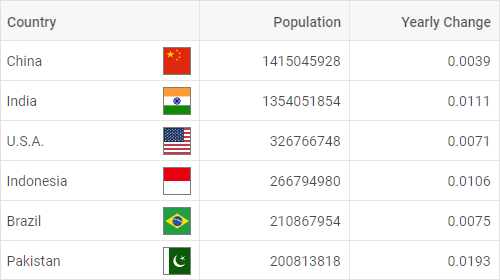

---
sidebar_label: Configuration
title: Configuration
---          

dhtmlxGrid possesses flexible configuration that let you get desired look and feel via a collection of versatile properties.

Columns
-----------

It is possible to adjust the configuration of grid columns via the corresponding option [columns](grid/api/grid_columns_config.md). As a value it takes an array with objects each of which contains config of a column.
The full list of properties you can set for a column is given in the API reference.

~~~js
var grid = new dhx.Grid("grid_container", {
    columns: [
        { width: 100, id: "a", header: [{ text: "#" }] },
        { width: 100, id: "b", header: [{ text: "Title" }] },
        { width: 200, id: "c", header: [{ text: "Name" }] },
        { width: 200, id: "d", header: [{ text: "Address" }] }
    ],
    data: dataset
});
~~~

Each column object may contain a set of properties. You will find the full list of the configuration properties of a Grid column [here](grid/api/api_gridcolumn_properties.md).

Alignment
---------------

Starting from v6.5, there is the ability to align data in a column as well as to align data in the column's header via the **align** option:

~~~js
var grid = new dhx.Grid("grid_container", {
    columns: [
        { id: "name", header:  [{ title: "Name", align: "center" }], align: "right"} /*!*/
        // more options
    ],
    data: dataset
});
~~~

[Grid. Content Align](https://snippet.dhtmlx.com/eyreddku)

The available values of the option are "left", "center" and "right".

Automatic adding of empty row into Grid
-----------------------------

There is a possibility to automatically add an empty row after the last filled row in the grid. Use the  property in the Grid configuration object to enable this feature:

~~~js
var grid = new dhx.Grid("grid_container", {
    columns: [// columns config],
    autoEmptyRow:true,   /*!*/
    data: dataset
});
~~~

{{editor	https://snippet.dhtmlx.com/rkytig73	Grid. Auto Empty Row}}

Autosize for columns
----------------------

You can configure columns' settings so that their width would automatically adjust to their content. Use the  property for this purpose. The property can take one of four values:

<table class="webixdoc_links">
	<tbody>
        <tr>
			<td class="webixdoc_links0"><b>"header"</b></td>
			<td>adjusts the columns to the width of their header</td>
		</tr>
        <tr>
			<td class="webixdoc_links0"><b>"footer"</b></td>
			<td>adjusts the columns to the width of their footer</td>
		</tr>
        <tr>
			<td class="webixdoc_links0"><b>"data"</b></td>
			<td>adjusts the columns to the width of their content</td>
		</tr>
        <tr>
			<td class="webixdoc_links0"><b>true</b></td>
			<td>combines the above mentioned modes and adjusts the column to the bigger value</td>
		</tr>
    </tbody>
</table>
 

~~~js
var grid = new dhx.Grid("grid_container", {
    columns: [// columns config],
    adjust: "header", /*!*/
    data: dataset
});
~~~

{{editor	https://snippet.dhtmlx.com/zfrpe22d	Grid. Adjust Columns}}

It is also possible to set the  property to *true* in the configuration of a separate column to make its width adjust automatically to the content:

~~~js
var grid = new dhx.Grid("grid_container", { 
    columns: [
        { id: "country", header: [{ text: "Country" }], adjust: "header" }, /*!*/
        { id: "population", header: [{ text: "Population" }] }
    ],
    adjust: false, /*!*/
    data: dataset
});
~~~

{{note  In case complex HTML content is added into a column, the column width may be calculated incorrectly.}}

Autowidth for columns
--------------------

It is possible to adjust the size of Grid columns to the size of Grid with the help of the  configuration option, like this:

~~~js
var grid = new dhx.Grid("grid_container", {
    columns: [// columns config],
    autoWidth: true, /*!*/
    data: dataset
});
~~~

[Grid. Auto Width](https://snippet.dhtmlx.com/4as4y3l4)

You can disable this functionality for a specified column via setting the  property to *false* in the configuration of the column:

~~~js
var grid = new dhx.Grid("grid", {
	columns: [
		{ width: 200, id: "country", header: [{ text: "Country" }], autoWidth: false }, /*!*/
		{ width: 150, id: "population", header: [{ text: "Population" }] },
	],
	autoWidth: true, /*!*/
	data: dataset
});
~~~

Data
---------

You can specify data for your grid before initialization via the [data](grid/api/grid_data_config.md) configuration property. There are also API methods for loading data into grid on the fly. Check the details in the article
grid/data_loading.md.

~~~js
var grid = new dhx.Grid("grid_container", {
    columns: [// columns config],
    data: dataset /*!*/
});
~~~

Drag-n-drop of Grid columns
----------------------------

{{pronote This functionality requires PRO version of the dhtmlxGrid (or DHTMLX suite) package.}}

Starting from v6.5, you can add the ability to reorder columns of Grid by drag and drop via using the  configuration property and setting its value to *"column"*.

~~~js
var grid = new dhx.Grid("grid_container", {
    columns: [// columns config],
    dragItem:"column",    /*!*/
    data: dataset
});
~~~

You can disable this functionality for a separate column via the **draggable** configuration option of the column:

~~~js
var grid = new dhx.Grid("grid_container", {
    columns: [
        { width: 200, id: "country", header: [{ text: "Country" }], draggable: false }, /*!*/
        { width: 150, id: "land", header: [{ text: "Land" }] },
        { width: 150, id: "density", header: [{ text: "Density" }], draggable: false } /*!*/
    ],
    data: dataset,
    dragItem: "column", /*!*/   
});
~~~

{{editor    https://snippet.dhtmlx.com/dfdlzpqb	Setup drag column (Pro)}}

To make the process of reordering columns by drag and drop more flexible, apply the related events: 

todotw скорее всего можно просто сослаться на API
- grid/api/grid_aftercolumndrag_event.md 
- grid/api/grid_aftercolumndrop_event.md 
- grid/api/grid_beforecolumndrag_event.md 
- grid/api/grid_beforecolumndrop_event.md 
- grid/api/grid_cancolumndrop_event.md 
- grid/api/grid_cancelcolumndrop_event.md 
- grid/api/grid_dragcolumnin_event.md 
- grid/api/grid_dragcolumnout_event.md 
- grid/api/grid_dragcolumnstart_event.md

Drag-n-drop of Grid rows
-------------------------

dhtmlxGrid supports drag-n-drop of rows between grids in several modes. To begin with, you should specify the [dragMode](grid/api/grid_dragmode_config.md) property in the configuration object of Grid. Then define which mode you need:

- "target" - a grid takes rows from other grids, while its row can't be dragged out of it
- "source" - a grid allows dragging its rows out and can't take rows from other grids
- "both" - a grid both takes rows from other grids and allows dragging its rows out as well

~~~js
var grid = new dhx.Grid("grid_container", { 
    columns: [
        { id: "country", header: [{ text: "Country" }] },
        { id: "population", header: [{ text: "Population" }] }
    ],
    data: dataset,
    dragMode: "source" /*!*/
});
~~~

{{editor    https://snippet.dhtmlx.com/qx9a86ax	Grid. Setup Drag Mode}}

Here is a list of drag-n-drop events that you can use while drag-n-drop of rows is enabled:

- grid/api/grid_afterrowdrag_event.md
- grid/api/grid_afterrowdrop_event.md
- grid/api/grid_beforerowdrag_event.md
- grid/api/grid_beforerowdrop_event.md
- grid/api/grid_canrowdrop_event.md
- grid/api/grid_cancelrowdrop_event.md
- grid/api/grid_dragrowin_event.md
- grid/api/grid_dragrowout_event.md
- grid/api/grid_dragrowstart_event.md

Editing Grid and separate columns
--------------------

dhtmlxGrid provides the editing feature that includes two options:

- editing of the whole Grid, i.e. of all its columns

To make all columns of the Grid editable, specify the  option in the configuration of Grid:

~~~js
var grid = new dhx.Grid("grid_container", {
	columns: [// columns config],
	data: data,
	editable: true /*!*/
});
~~~

{{editor    https://snippet.dhtmlx.com/w2cdossn	Grid. Editable Data}}

- editing of the specified columns only

This option implies that you can enable/disable editing of particular columns by setting the [editable: true](grid/api/grid_editable_config.md) property in the configuration of a column:

In the example below all columns will be editable, except for the first one:

~~~js
var grid = new dhx.Grid("grid", {
	columns: [
		{ 
        	width:150,id:"project",
            editable:false, /*!*/
            header: [
        	  {text:"Project"}, {content:"selectFilter"}
            ]
        },
		{ width:150, id:"owner", header: [{text:"Owner"},{content:"inputFilter"}]},
		{ width:150, id:"hours", header: [{text:"Hours"}, {content:"inputFilter"}]},
		// more columns
	],
	data: data,
	editable: true
});
~~~

And the following example demonstrates an opposite situation when only the first column is editable:

~~~js
var grid = new dhx.Grid("grid", {
	columns: [
		{ 
           width:150,id:"project",
           editable:true, /*!*/
           header: [
        	{text:"Project"}, {content:"selectFilter"}
           ]
        },
		{ width:150, id:"owner", header: [{text:"Owner"},{content:"inputFilter"}]},
		{ width:150, id: "hours", header: [{text:"Hours"}, {content:"inputFilter"}]},
		// more columns
	],
	data: data
});
~~~

### Setting type of column editor

You can specify the way of editing the cells of a Grid column depending on its content as simple input, select control, date picker, checkbox or combobox. The type of the used editor is defined by the **editorType** property of a [column](grid/api/grid_columns_config.md).
There are five types of column editors:

- **input** - an editor for cells with a simple text (the default one, unless a column has **type:"date"**)

~~~js
// cells of the "project" column will be edited as inputs
var grid = new dhx.Grid("grid", {
	columns: [
		{
			width: 150,
			id: "project",
			header: [{ text: "Project" }, { content: "selectFilter" }]
		}
    // more columns
	],
	data: data,
	editable: true
});
~~~

{{editor    https://snippet.dhtmlx.com/w2cdossn	Grid. Editable Data}}

- **datePicker** - an editor for cells with dates (default for a column with **type:"date"**)

To use this editor, you should specify the **type:"date"** property for a column. It is also possible to set the necessary [format of date](calendar/api/calendar_dateformat_config.md) while editing a cell content 
with the help of the **dateFormat** option.

~~~js
{ 
	// if the type:"date" config is set in the column config, 
    // there's no need to specify the type of the editor
	width: 150, id: "start_date", 
    header: [{ text: "Calendar", colspan: 2 }, { text: "Start date" }], 
    type: "date", dateFormat: "%d/%m/%Y"  /*!*/
}
~~~

{{editor    https://snippet.dhtmlx.com/w2cdossn	Grid. Editable Data}}

- **select** - an editor for cells that should contain several options to choose from

To set this editor type you need to provide the **options** property with an array of options to be displayed in the editor, e.g.:

~~~js
{
	width: 150, id: "status", header: [{text: "Status"}, {content: "selectFilter"}],
	editorType: "select", options: ["Done", "In Progress", "Not Started"] /*!*/
} 
~~~

{{editor    https://snippet.dhtmlx.com/w2cdossn	Grid. Editable Data}}

- **checkbox** - an editor for cells with a two-state check box

To use this editor, you need to specify the **type: "boolean"** property for a column.

~~~js
{ 
	// if the type:"boolean" config is set in the column config, 
    // there's no need to specify the type of the editor
	width: 160, id: "test", 
    header: [{ text: "Test" }], 
    type: "boolean" /*!*/
}
~~~

{{editor    https://snippet.dhtmlx.com/w2cdossn	Grid. Editable Data}}

{{note If you specify the editing option in the configuration of Grid, then editing of a column with checkbox will always be enabled.}}

- **combobox** - an editor for cells that should contain several options to choose from. There is a possibility to find an option by entering text in the edit control

To use this editor you need to specify the **editorType: "combobox"** property for a column and provide the **options** property with an array of options to be displayed in the editor, e.g.:

~~~js
{
    width: 160, id: "test", header: [{ text: "Test" }], type: "string", 
    editorType: "combobox", options: ["1 time", "1-2 times", "more than 5 times"]  /*!*/
}
~~~

{{editor    https://snippet.dhtmlx.com/w2cdossn	Grid. Editable Data}}

Frozen columns
---------------

You can fix (or "freeze") a column or several columns, so that they will become static, while the rest of columns remain scrollable. 
There is the [leftSplit](grid/api/grid_leftsplit_config.md) property that splits grid columns into the frozen and movable parts. Just set the number of columns (from the left side of the grid) you want to freeze 
as a value of the property in the Grid configuration.

~~~js
var grid = new dhx.Grid("grid_container", {
    columns: [// columns config],
    leftSplit:1,   /*!*/
    data: dataset
});
~~~

{{editor    https://snippet.dhtmlx.com/hcgl9nth	Grid. Frozen Columns}}

Header/footer content
----------------------------

There are three types of filters that you can specify in the header/footer content of a [Grid column](grid/api/grid_columns_config.md):

- **inputFilter** - provides a way of filtering data of a Grid column by using a text field

~~~js
{ 
    width: 160, id: "budget", 
    header: [{ text: "Budget" }, { content: "inputFilter" }] /*!*/
}
~~~

{{editor    https://snippet.dhtmlx.com/4qz8ng3c	Grid. Header Filter}}

- **selectFilter** - allows end users to filter data of a column by choosing an option from a presented dropdown list

~~~js
{ 
    width: 160, id: "status", 
    header: [{ text: "Status" }, { content: "selectFilter" }], /*!*/
    editorType: "select", 
    options: ["Done", "In Progress", "Not Started"] 
}
~~~

{{editor    https://snippet.dhtmlx.com/4qz8ng3c	Grid. Header Filter}}

- **comboFilter** - provides a way to filter data of a column by choosing an option from a presented dropdown list. To find an option quickly you can enter text into the edit control.

~~~js
{
    width: 160, id: "renewals", 
    header: [{ text: "Number of renewals" }, { content: "comboFilter" }], /*!*/
    type: "string", editorType: "combobox", 
    options: ["1 time", "1-2 times", "more than 5 times"] 
}
~~~

{{editor    https://snippet.dhtmlx.com/4qz8ng3c	Grid. Header Filter}}

If you specify **comboFilter** as the header or footer content of a column, you can set an additional config with properties for it.

~~~js
var grid = new dhx.Grid("grid_container", {
    columns: [
        {
            width: 150, 
            id: "migrants", 
            header: [
                { text: "Migrants (net)" }, 
                { content: "comboFilter", filterConfig: {readonly: true }} /*!*/
            ] 
        }   
    ],
    data: dataset
}
~~~

### The list of configuration properties for comboFilter

<table class="webixdoc_links">
	<tbody>
        <tr>
			<td class="webixdoc_links0"><b>filter</b></td>
			<td>(<i>function</i>) sets a custom function for filtering Combo Box options</td>
		</tr>
        <tr>
			<td class="webixdoc_links0"><b>readonly</b></td>
			<td>(<i>boolean</i>) makes ComboBox readonly (it is only possible to select options from the list, without entering words in the input)</td>
		</tr>
        <tr>
			<td class="webixdoc_links0"><b>template</b></td>
			<td>(<i>function</i>) sets a template of displaying options in the popup list</td>
		</tr>
        <tr>
			<td class="webixdoc_links0"><b>placeholder</b></td>
			<td>(<i>string</i>) sets a placeholder in the input of ComboBox</td>
		</tr>
        <tr>
			<td class="webixdoc_links0"><b>virtual</b></td>
			<td>(<i>boolean</i>) enables dynamic loading of data on scrolling the list of options</td>
		</tr>
    </tbody>
</table>
 

Header/footer height
------------------------

The height of the header/footer of Grid is calculated as a sum of rows which are included into it. To set the height of a row inside the header/footer, use the [headerRowHeight](grid/api/grid_headerrowheight_config.md)/[footerRowHeight](grid/api/grid_footerrowheight_config.md)
properties, correspondingly.

~~~js
var grid = new dhx.Grid("grid_container", {
    columns: [// columns config],
    // footerRowHeight:50   /*!*/
    headerRowHeight: 50    /*!*/
});
~~~

{{editor    https://snippet.dhtmlx.com/wjcjl80i	Grid. Rows Height}}

The default value of the mentioned properties is 40.

Hidden columns
----------------

You can set the **hidden:true** property in the [config of a column](grid/configuration.md#columns) so that it doesn't appear on a page.

~~~js				
{ 
	width: 150, id: "population", header: [{ text: "Population" }] 
},
{ 
	hidden: true, width: 150, id: "yearlyChange", header: [{ text: "Yearly Change" }] /*!*/
}
~~~

{{editor    https://snippet.dhtmlx.com/lh7ma639	Grid. Hidden Columns}}

HTML content of Grid columns
---------------------------------

dhtmlxGrid allows adding an image or an icon into Grid cells in two ways:

- by specifying the HTML content of all Grid columns

This way presupposes making each cell of Grid capable of displaying the HTML content via using the [htmlEnable](grid/api/grid_htmlenable_config.md) property in the configuration object of Grid.

~~~js
var dataset = [
	{
		"country": "China",
        "flag": "",
	    "id": "1"
	}
];

var grid = new dhx.Grid("grid", {
	columns: [// columns config],
	data: dataset,
    htmlEnable: true /*!*/
});
~~~

- by specifying the HTML content of a separate column

If you want to add custom elements into cells of the specified column, you need to set the **htmlEnable:true** property in the configuration of a column:

~~~js
var dataset = [
	{
		"country": "China",
	    "id": "1"
	}
];

var grid = new dhx.Grid("grid", {
	columns: [
		{
            width: 200, id: "country", header: [{ text: "Country" }],
            htmlEnable: true /*!*/
        }, 
		{ 
            width: 150, id: "urban", header: [{ text: "Urban Pop" }] 
        }, 
		// more columns	
	],
	data: dataset
});
~~~

{{editor    https://snippet.dhtmlx.com/chitkvkc	Grid. Html In Data}}

Event handlers for HTML content
-----------------------------------

Starting from v7.0, you can add event handlers to the HTML elements defined in a data set of Grid with the help of the  configuration property, for instance:

~~~js
const data = [
	{
		"country": "
China /*!*/
            
", /*!*/
		"population": "1415045928", "yearlyChange": "0.0039",
		"netChange": "5528531", "destiny": "151",
		"urban": "0.5800", "id": "1"
	},
    // more options
];

const grid = new dhx.Grid("grid", {
	columns: [
        { width: 200, id: "country", header: [{ text: "Country" }], htmlEnable: true }, /*!*/
        // more options
    ],
	data: data,
    eventHandlers: { /*!*/
		onclick: { /*!*/
			cell__html: function(event, data) { /*!*/
				display(JSON.stringify(data.col, null, 2)); /*!*/
			}, /*!*/
		}, /*!*/
		onmouseover: { /*!*/
			cell__html: function(event) { /*!*/
				display("You are over " + event.target.tagName); /*!*/
			}, /*!*/
		} /*!*/
	} /*!*/
});
~~~

[Grid. Handling events in template](https://snippet.dhtmlx.com/zcv5drxc)

The **eventHandlers** object includes a set of *key:value* pairs, where:

<table>
	<tbody>
        <tr>
			<td><i>key</i></td>
			<td> the name of the event. Note, that at the beginning of the event name the <b>'on'</b> prefix is used (onclick, onmouseover).</td>
		</tr>
        <tr>
			<td><i>value</i></td>
			<td>an object that contains a <i>key:value</i> pair, where <i>key</i> is the css class name that the handler will be applied to and <i>value</i> is a function that takes two parameters:
            <ul>
                <li><b>event</b> - an event object</li>
                <li><b>object</b> - an object with two attributes:
                <ol>- <b>row</b> - an object with a row configuration</ol>
                <ol>- <b>column</b> - an object with a column configuration</ol></li>
            </ul></td>
		</tr>
    </tbody>
</table>
 

Keyboard Navigation
--------------------

dhtmlxGrid provides the keyboard navigation that will help you manipulate your grid faster. 

### Default shortcut keys

There are four navigation keys that Grid enables by default:

<table class="webixdoc_links">
	<tbody>
        <tr>
			<td class="webixdoc_links0"><b>PageUp</b></td>
			<td>scroll Grid up to the height of the visible content (without change of the selected cell)</td>
		</tr>
        <tr>
			<td class="webixdoc_links0"><b>PageDown</b></td>
			<td>scroll Grid down to the height of the visible content (without change of the selected cell)</td>
		</tr>
        <tr>
			<td class="webixdoc_links0"><b>Home</b></td>
			<td>navigate to the beginning of the Grid content (without change of the selected cell)</td>
		</tr>
        <tr>
			<td class="webixdoc_links0"><b>End</b></td>
			<td>navigate to the end of the Grid content (without change of the selected cell)</td>
		</tr>
    </tbody>
</table>

If you need to disable this functionality, set the [keyNavigation](grid/api/grid_keynavigation_config.md) property to false. 

~~~js
var grid = new dhx.Grid("grid", {
	columns: [// columns config],
	data: dataset,
	keyNavigation: false /*!*/
});
~~~

{{editor    https://snippet.dhtmlx.com/y9kdk0md	Grid. Key Navigation}}

### Arrow shortcut keys
In case you want to enable the arrow keys that allow moving the selection between cells, you need to specify the [selection](grid/api/grid_selection_config.md) property for Grid.

~~~js
var grid = new dhx.Grid("grid", {
	columns: [// columns config],
	data: dataset,
	selection: "complex", /*!*/
	keyNavigation: true // true - by default
});
~~~

{{editor    https://snippet.dhtmlx.com/y9kdk0md	Grid. Key Navigation}}

The list of the arrow shortcut keys:

<table class="webixdoc_links">
	<tbody>
        <tr>
			<td class="webixdoc_links0"><b>ArrowUp</b></td>
			<td>move selection to the previous vertical cell</td>
		</tr>
        <tr>
			<td class="webixdoc_links0"><b>ArrowDown</b></td>
			<td>move selection to the next vertical cell</td>
		</tr>
        <tr>
			<td class="webixdoc_links0"><b>ArrowLeft</b></td>
			<td>move selection to the previous horizontal cell</td>
		</tr>
        <tr>
			<td class="webixdoc_links0"><b>ArrowRight</b></td>
			<td>move selection to the next horizontal cell</td>
		</tr>
        <tr>
			<td class="webixdoc_links0"><b>Ctrl+ArrowUp</b></td>
			<td>move selection to the first vertical cell</td>
		</tr>
        <tr>
			<td class="webixdoc_links0"><b>Ctrl+ArrowDown</b></td>
			<td>move selection to the last vertical cell</td>
		</tr>
        <tr>
			<td class="webixdoc_links0"><b>Ctrl+ArrowLeft</b></td>
			<td> move selection to the first horizontal cell</td>
		</tr>
        <tr>
			<td class="webixdoc_links0"><b>Ctrl+ArrowRight</b></td>
			<td> move selection to the last horizontal cell</td>
		</tr>
        <tr>
			<td class="webixdoc_links0"><b>Tab</b></td>
			<td> move selection to the next horizontal cell or the first cell of the next row</td>
		</tr>
        <tr>
			<td class="webixdoc_links0"><b>Shit+Tab</b></td>
			<td> move selection to the previous horizontal cell or to the first cell of the previous row</td>
		</tr>
    </tbody>
</table>

The arrow shortcut keys listed below do not work when the **selection** property is set to *"complex"*. Use another mode (*"cell" or "row"*) in case you you want to activate these navigation keys:

<table class="webixdoc_links">
	<tbody>
        <tr>
			<td class="webixdoc_links0"><b>Shift+ArrowUp</b></td>
			<td>move selection to the previous vertical cell with the change of the selected cells</td>
		</tr>
        <tr>
			<td class="webixdoc_links0"><b>Shift+ArrowDown</b></td>
			<td>move selection to the next vertical cell with the change of the selected cells</td>
		</tr>
        <tr>
			<td class="webixdoc_links0"><b>Shift+ArrowLeft</b></td>
			<td>move selection to the previous horizontal cell with the change of the selected cells</td>
		</tr>
        <tr>
			<td class="webixdoc_links0"><b>Shift+ArrowRight</b></td>
			<td>move selection to the next horizontal cell with the change of the selected cells</td>
		</tr>
        <tr>
			<td class="webixdoc_links0"><b>Ctrl+Shift+ArrowUp</b></td>
			<td>move selection to the first vertical cell with the change of the selected cells</td>
		</tr>
        <tr>
			<td class="webixdoc_links0"><b>Ctrl+Shift+ArrowDown</b></td>
			<td>move selection to the last vertical cell with the change of the selected cells</td>
		</tr>
        <tr>
			<td class="webixdoc_links0"><b>Ctrl+Shift+ArrowLeft</b></td>
			<td>move selection to the first horizontal cell with the change of the selected cells</td>
		</tr>
        <tr>
			<td class="webixdoc_links0"><b>Ctrl+Shift+ArrowRight</b></td>
			<td>move selection to the last horizontal cell with the change of the selected cells</td>
		</tr>
    </tbody>
</table>

### Shortcut keys for editing

It is also possible to use shortcut keys for editing a cell in Grid by setting [editable:true](grid/api/grid_editable_config.md) property in the configuration object of Grid.

~~~js
var grid = new dhx.Grid("grid", {
	columns: [// columns config],
	data: dataset,
	selection: "complex", /*!*/
    editable: true, /*!*/
	keyNavigation: true // true - by default
});
~~~

{{editor    https://snippet.dhtmlx.com/y9kdk0md	Grid. Key Navigation}}

The list of the shortcut keys for editing:

<table class="webixdoc_links">
	<tbody>
        <tr>
			<td class="webixdoc_links0"><b>Enter</b></td>
			<td>open the editor in the selected cell. If the editor is currently opened - close the editor and save changes</td>
		</tr>
        <tr>
			<td class="webixdoc_links0"><b>Escape</b></td>
			<td>close the editor of the selected cell without saving</td>
		</tr>
    </tbody>
</table>

Multiple selection of Grid cells
------------------------------------

While setting the [selection](grid/configuration.md#selection) property either to *"row"* or to *"cell"* value, you can enable the  property to allow a user to select multiple Grid elements:

~~~js
var grid = new dhx.Grid("grid_container", {
    columns: [// columns config],
    multiselection:true, /*!*/
    selection:"row",
    data: dataset
});
~~~

{{editor    https://snippet.dhtmlx.com/4nj0e9ye	Grid. Multiselection}}

Since the **multiselection** configuration option is set to *true*, using the "Ctrl + Click" combination allows selecting the desired cells or rows.
A range of Grid cells/rows can be selected by clicking the first element to select and then, while holding down the Shift key, clicking the last element to select. 

Resizing
--------------

Columns of Grid have fixed width with no possibility to change them from UI. You can switch on the corresponding configuration option to make all columns of Grid resizable.

~~~js
var grid = new dhx.Grid("grid_container", {
    columns: [// columns config],
    data: dataset,
    resizable: true /*!*/
}
~~~

Then you will be able to change the width of columns using the mouse. With the cursor grab the right border and drag to the desired width.

{{note If you also set the **autoWidth** configuration option, you will be able to change the width of columns only inside the container of Grid. }}

You can disable the resizing of any column by setting the [resizable:false](grid/api/grid_resizable_config.md) property in the config of a column.

~~~js
var grid = new dhx.Grid("grid_container", {
    columns: [
        { width: 150, id: "test1", header: [{ text: "Test1" }] },
        { width: 150, id: "test2", header: [{ text: "Test2" }], resizable: false } /*!*/
    ],
    data: dataset,
    resizable: true /*!*/
}
~~~

{{editor    https://snippet.dhtmlx.com/aeqzuks0	Grid. Resizable Columns}}

{{note To define the resizing limits, set necessary values to the **minWidth**/**maxWidth** properties in the config of a column.
}}

Row height
----------

The default height of a grid row is 40. You can change it and set any other height via the [rowHeight](grid/api/grid_rowheight_config.md) property, e.g.:

~~~js
var grid = new dhx.Grid("grid_container", {
    columns: [// columns config],
    rowHeight: 30, 	/*!*/
    data: dataset
});
~~~

{{editor    https://snippet.dhtmlx.com/wjcjl80i	Grid. Rows Height}}

Row style
------------

There is a possibility to apply some styling to a row via the [rowCss](grid/api/grid_rowcss_config.md) property. It is a function that takes the id of a row as a parameter and returns a string with the name of a CSS class.

~~~js

 
 
var grid = new dhx.Grid("grid_container", {
    columns: [// columns config],
    rowCss: function (row) { return row.custom ? "my_custom_row" : "" }, /*!*/
    data: dataset
});
~~~

{{editor    https://snippet.dhtmlx.com/2dxtwf9n	Grid. Custom Row Style}}

Selection
------------

dhtmlxGrid includes the selection feature that allows highlighting Grid elements depending on the chosen mode. The [selection](grid/api/grid_selection_config.md) property enables selection in a grid. It can take three values:

<table class="webixdoc_links">
	<tbody>
        <tr>
			<td class="webixdoc_links0"><b>row</b></td>
			<td>to move selection between Grid rows</td>
		</tr>
        <tr>
			<td class="webixdoc_links0"><b>cell</b></td>
			<td>to move selection between Grid cells</td>
		</tr>
        <tr>
			<td class="webixdoc_links0"><b>complex</b></td>
			<td>to highlight both a selected cell and the row it belongs to</td>
		</tr>
    </tbody>
</table>
 

~~~js
var grid = new dhx.Grid("grid_container", {
    columns: [// columns config],
    selection:"complex",    /*!*/
    data: dataset
});
~~~

{{editor    https://snippet.dhtmlx.com/ad6roqsx	Grid. Selection}}

Sorting columns
--------------------

By default, dhtmlxGrid allows sorting content of any Grid column by clicking on its header. 

To disable this option, set the  property in the Grid configuration to *false*:

~~~js
var grid = new dhx.Grid("grid_container", {
    columns: [// columns config],
    sortable:false, /*!*/  
    data: dataset
});
~~~

{{editor    https://snippet.dhtmlx.com/r3prvlmo	Grid. Sortable Columns}}

### Sorting separate columns

You can make separate columns sortable by specifying the [sortable:true](grid/api/grid_sortable_config.md) property in the configuration of a column:

In the example below all columns will be sortable, except for the second one:

~~~js
var grid = new dhx.Grid("grid_container", {
    columns: [
        { width: 200, id: "country", header: [{ text: "Country" }], sortable: true }, /*!*/
        { width: 150, id: "land", header: [{ text: "Land" }] },
        { width: 150, id: "density", header: [{ text: "Density" }], sortable: true } /*!*/
    ],
    data: dataset,
    sortable: false, /*!*/   
});
~~~

The following sample demonstrates the same situation:

~~~js
var grid = new dhx.Grid("grid_container", {
    columns: [
        { width: 200, id: "country", header: [{ text: "Country" }] },
        { width: 150, id: "land", header: [{ text: "Land" }], sortable: false }, /*!*/
        { width: 150, id: "density", header: [{ text: "Density" }] }
    ],
    data: dataset
});
~~~

Spans
-------------

The component has the [spans](grid/api/grid_spans_config.md) property that allows you to specify all necessary columns and rows spans right through the initial configuration. It represents an array with spans objects.
Each span object contains the following properties:

<table class="webixdoc_links">
	<tbody>
        <tr>
			<td class="webixdoc_links0"><b>row</b></td>
			<td>(<i>string|number</i>) obligatory, the id of a row</td>
		</tr>
        <tr>
			<td class="webixdoc_links0"><b>column</b></td>
			<td>(<i>string|number</i>) obligatory, the id of a column</td>
		</tr>
        <tr>
			<td class="webixdoc_links0"><b>rowspan</b></td>
			<td>(<i>number</i>) optional, the number of rows in a span</td>
		</tr>
        <tr>
			<td class="webixdoc_links0"><b>colspan</b></td>
			<td>(<i>number</i>) optional, the number of columns in a span</td>
		</tr>
        <tr>
			<td class="webixdoc_links0"><b>text</b></td>
			<td>(<i>string|number</i>) optional, the content of a span</td>
		</tr>
        <tr>
			<td class="webixdoc_links0"><b>css</b></td>
			<td>(<i>string</i>) optional, the name of a CSS class applied to a span</td>
		</tr>
        <tr>
			<td class="webixdoc_links0"><a href="https://docs.dhtmlx.com/suite/grid__configuration.html#tooltip"><b>tooltip</b></a></td>
			<td>(<i>boolean</i>) enables a tooltip on hovering over the content of a span, <i>true</i> by default</td>
		</tr>
    </tbody>
</table>
 

~~~js
var grid = new dhx.Grid("grid_container", {
	columns: [// columns config],
	spans: [
		{row:"0", column:"a", rowspan:5 },
		{row:"0", column:"b", rowspan:9, text:"<h2>Some content here</h2>"},
		{row:"0", column:"c", colspan:2, text:"Some content"},
		{row:"10", column:"a", colspan:4, text:"Some header", css:"myCustomColspan"}
	],
	data: dataset
});
~~~

{{editor    https://snippet.dhtmlx.com/1775dwbl	Grid. Spans Cells}}

**Note**, that if both the **spans** and [leftSplit](grid/configuration.md#frozencolumns) properties are set in the Grid config, the following rules will be applied:

- All necessary columns or rows will be in a span if the **spans** property is set for the columns located within the frozen area.
- If the **spans** property is set for a number of columns or rows placed as in the frozen part as in the movable one, then the columns remained in the movable part only will be in a span.

Tooltip
-----------

The default configuration of Grid provides tooltips that are rendered when a user hovers over the content of a column. Starting from v6.5, you can hide the tooltips via setting the  configuration property of Grid to *false*:

~~~js
var grid = new dhx.Grid("grid", {
    columns: [//columns config],
    data: dataset,
    tooltip: false 
});
~~~

[Grid. Hiding Tooltips](https://snippet.dhtmlx.com/mq4t3t3w)

There is also the possibility to enable/disable tooltips for separate columns or spans by using the **tooltip** option in the configuration object of the [columns](grid/configuration.md#columns) or [spans](grid/configuration.md#spans) accordingly:

~~~js
var grid = new dhx.Grid("grid", {
	columns: [
		{ width: 200, id: "country", header: [{ text: "Country" }], tooltip: true }, /*!*/
		{ width: 150, id: "population", header: [{ text: "Population" }] },
	],
	spans: [
		{ row: "1", column: "country", rowspan: 5, tooltip: true }, /*!*/
	],
	data: dataset,
	tooltip: false /*!*/
});
~~~

Width/height
--------------

You can specify necessary size of your Grid via the configuration properties [width](grid/api/grid_width_config.md) and [height](grid/api/grid_height_config.md):

~~~js
var grid = new dhx.Grid("grid_container", {
    columns: [// columns config],
    width: 400,   /*!*/
    height: 400,  /*!*/
    data: dataset
});
~~~

{{editor    https://snippet.dhtmlx.com/ffxj6se0	Grid. Custom Sizes}}

In case these options aren't set in the Grid configuration, the component will take the size of the container.