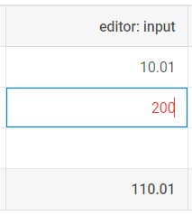
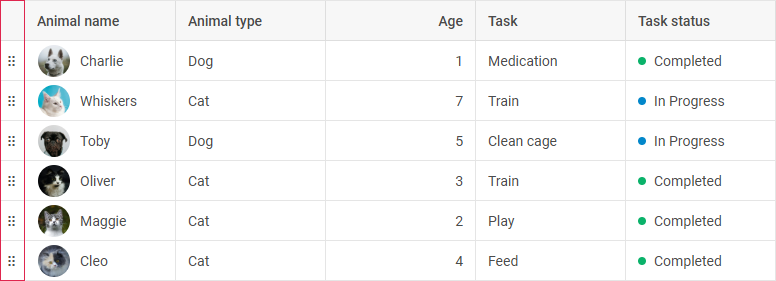

# Configuration

DHTMLX Grid possesses flexible configuration that let you get desired look and feel via a collection of versatile properties.

## Setting the TreeGrid mode 

**If you use the PRO version of DHTMLX Grid**, you can initialize Grid in the [TreeGrid mode](grid/treegrid_mode.md) which allows showing the nested tabular data. To create Grid in the TreeGrid mode, use the [`type: "tree"`](grid/api/grid_type_config.md) configuration option.

~~~jsx {2} title="index.js"
const Grid = new dhx.Grid("grid_container", {
    type: "tree",
    columns: [
        { id: "name", header: [{ text: "Name" }], gravity: 1.5 },
        { id: "native", type: "string", header: [{ text: "Native name" }], gravity: 1.5 },
        { id: "capital", type: "string", header: [{ text: "Capital" }] },
        { id: "currency", type: "string", header: [{ text: "Currency" }] }
    ],
    data: dataset,
    autoWidth: true
});
~~~

Check the details on the TreeGrid mode in the [related article](grid/treegrid_mode.md).

## Width/height

You can specify the necessary size of your Grid via the [`width`](grid/api/grid_width_config.md) and [`height`](grid/api/grid_height_config.md) configuration properties:

~~~jsx
const grid = new dhx.Grid("grid_container", {
    columns: [
        // columns config
    ],
    width: 400,
    height: 400,
    data: dataset
});
~~~

**Related sample**: [Grid. Custom sizes](https://snippet.dhtmlx.com/ffxj6se0)

:::info
If the `width` and `height` options aren't set in the Grid configuration, the Grid will take the size of its container. If you don't specify the height for the container, it will be equal to "0px" and Grid won't be visible on the page.
:::

### Autoheight for Grid

**If you use the PRO version of DHTMLX Grid**, you may enable the auto height mode of Grid. For this, set the value of the [height](grid/api/grid_height_config.md) property to "auto". In this mode, Grid will expand on adding new rows, and will shrink on removing rows not to occupy external place.

~~~jsx
const grid = new dhx.Grid("grid_container", {
    columns: [
        // columns config
    ],
    height: "auto",
    data: dataset
});
~~~

This functionality is available from v8.1.

**Related sample**: [Grid. Set automatic height (PRO)](https://snippet.dhtmlx.com/srbu56ob)

If needed, you may set the minimal and maximal height for the container via the `min-height` and `max-height` CSS properties:

~~~html

~~~

## Columns

It is possible to adjust the configuration of grid columns via the corresponding option [`columns`](grid/api/grid_columns_config.md). As a value it takes an array with objects each of which contains config of a column.
The full list of properties you can set for a column is given in the API reference.

~~~jsx
const grid = new dhx.Grid("grid_container", {
    columns: [
        { width: 100, id: "a", header: [{ text: "#" }] },
        { width: 100, id: "b", header: [{ text: "Title" }] },
        { width: 200, id: "c", header: [{ text: "Name" }] },
        { width: 200, id: "d", header: [{ text: "Address" }] }
    ],
    data: dataset
});
~~~

Each column object may contain a set of properties.

:::note 
You will find the full list of the configuration properties of a Grid column [here](grid/api/api_gridcolumn_properties.md).
:::

### Alignment

Starting from v6.5, there is the ability to align data in a column as well as to align data in the column's header/footer via the `align` option:

~~~jsx
const grid = new dhx.Grid("grid_container", {
    columns: [
        { id: "name", header:  [{ text: "Name", align: "center" }], align: "right"}
        // more options
    ],
    data: dataset
});
~~~

**Related sample**: [Grid. Content align](https://snippet.dhtmlx.com/eyreddku)

The available values of the option are *"left"*, *"center"* and *"right"*.

### Autosize for columns

You can configure columns' settings so that their width would automatically adjust to their content. Use the  property for this purpose. The property can take one of four values:

<table>
    <tbody>
        <tr>
            <td><b>"header"</b></td>
            <td>adjusts the columns to the width of their header</td>
        </tr>
        <tr>
            <td><b>"footer"</b></td>
            <td>adjusts the columns to the width of their footer</td>
        </tr>
        <tr>
            <td><b>"data"</b></td>
            <td>adjusts the columns to the width of their content</td>
        </tr>
        <tr>
            <td><b>true</b></td>
            <td>combines the above mentioned modes and adjusts the column to the bigger value</td>
        </tr>
    </tbody>
</table>
 

~~~jsx
const grid = new dhx.Grid("grid_container", {
    columns: [
        // columns config
    ],
    adjust: "header",
    data: dataset
});
~~~

**Related sample**: [Grid. Adjust columns by header, data, all](https://snippet.dhtmlx.com/zfrpe22d)

It is also possible to use the  property in the configuration of a separate column:

~~~jsx {3,6}
const grid = new dhx.Grid("grid_container", { 
    columns: [
        { id: "country", header: [{ text: "Country" }], adjust: "header" },
        { id: "population", header: [{ text: "Population" }] }
    ],
    adjust: false,
    data: dataset
});
~~~

:::note  
In case complex HTML content is added into a column, the column width may be calculated incorrectly.
:::

### Autowidth for columns

It is possible to automatically adjust the size of Grid columns to the size of Grid with the help of the  configuration option, like this:

~~~jsx
const grid = new dhx.Grid("grid_container", {
    columns: [
        // columns config
    ],
    autoWidth: true,
    data: dataset
});
~~~

**Related sample**: [Grid. Columns auto width](https://snippet.dhtmlx.com/4as4y3l4)

You can disable this functionality for a specified column via setting the  property to *false* in the configuration of the column:

~~~jsx {3,6}
const grid = new dhx.Grid("grid_container", {
    columns: [
        { id: "country", header: [{ text: "Country" }], autoWidth: false },
        { id: "population", header: [{ text: "Population" }] },
    ],
    autoWidth: true,
    data: dataset
});
~~~

Also note:

- If `autoWidth` is set for a column, the width of the column is calculated on the base of the sizes of the container of the grid and the values of the `minWidth/maxWidth` properties if they are set for the column.
- The property is ignored if the [`adjust`](#autosize-for-columns) property is used.
- If the `width` property is specified in the configuration object of a column, the `autoWidth` property won't work for this column.

### Formatting columns

You can display the values of the cells of a Grid column in the desired format with the help of the `numberMask` and `patternMask` properties. There is also the [`dateFormat`](#setting-the-format-for-dates) option that allows specifying the format of dates.

#### numberMask

The `numberMask` property sets an input mask for entering number values. This property is applied both to the displayed data and to the data which is being edited. 

:::info
If the type of a column hasn't been set and the `numberMask` property is specified, the column type will be set as `type:number`.
:::

The `numberMask` property can be specified in two ways:

- as an *object* with the following properties:
    - ***prefix*** - renders a text before the resulting value
    - ***suffix*** - renders a text after the resulting value
    - ***groupSeparator*** - sets a separator for thousands
    - ***decSeparator*** - sets a separator for decimals
    - ***allowNegative*** - allows using negative numbers
    - ***maxIntLength*** - allows setting the maximal length of the integer value
    - ***maxDecLength*** - allows setting the maximal length of the decimal value
    - ***minDecLength*** - allows setting the minimal rendered length of the decimal value

For example, the `numberMask` config can be set as the following object:

~~~jsx {5-12}
{
    width: 130,
    id: "cost",
    header: [{ text: "Cost" }, { content: "inputFilter" }],
    numberMask: {
        prefix: "$",
        groupSeparator: ",",
        decSeparator: ".",
        maxIntLength: 7,
        maxDecLength: 2,
        minDecLength: 0
    }
}
~~~

The value *100000.01* is converted into *$100,000.01* by the pattern given above.

#### Default `numberMask` configs depending on the column type

When the `type:"number"` is specified for a column, the resulting number is converted into the *number* type. The default config for this column type is the following:

~~~jsx
{
    groupSeparator: ",",
    decSeparator: ".",
    allowNegative: true,
    maxIntLength: 16,
    maxDecLength: 2,
    minDecLength: 0
}
~~~

The default config for the `type:"string"` is the following: 

~~~jsx
{
    groupSeparator: ",",
    decSeparator: ".",
    minDecLength: 0
}
~~~

When the `type:"string"` type is specified for a column, the resulting number is converted into the *string* type without a mask, as if it were a number. For example, if the input value is *"$ 1,000,000"*, the value returned by the [`getValue()`](form/api/form_getvalue_method.md) method is *"1000000"*.

- as a *boolean* value the `numberMask` property converts the number value displayed in the column into one of the predefined templates (depending on the specified column type):

~~~jsx
{
    width: 130,
    id: "cost",
    header: [{ text: "Cost" }, { content: "inputFilter" }],
    numberMask: true 
}
~~~

For the above example, the value *100000.01* is converted into *100,000.01* by the predefined template of the column `type:"number"`, since the `numberMask:true` property is specified.

**Related sample**: [Grid. Pattern and number masks](https://snippet.dhtmlx.com/45gjhciv)

#### patternMask

The `patternMask` property sets an input mask for entering number and string values. Allows setting a necessary pattern for entering data. It can be set in two ways: 

- as an *object* with the following properties:
    - ***pattern*** - (*function* | *string*) allows specifying the necessary mask and change it dynamically, depending on the entered values. Can be set as:
        - a *function* that takes as a parameter an entered value specified as a string or as a number and returns a string with a pattern mask
        - a *string* with a pattern mask
    - ***charFormat*** - (*object*) optional, allows specifying a regular expression for an optional symbol. It is set as an object with *key:value* pairs, where the *key* is a symbol and the *value* is a regular expression. This property has a predetermined configuration provided below:

~~~jsx
{
    "0": /\d/,
    "a": /[A-Za-z]/,
    "#": /[A-Za-z0-9]/,
    "*": /./,
}
~~~

|  Symbol| Description            |
| -------|----------------------- |
| "0"    | any number from **0** to **9** |
| "a"    | a single letter of the Roman alphabet, including all capital letters from **A** to **Z** and all lowercase letters from **a** to **z** |
| "#"    | a single letter of the Roman alphabet (either an uppercase or a lowercase one) or a single number from **0** to **9** |
| "*"    | any symbol |

:::note
The `inputMask` property supports static masks. These are the symbols not specified in the ***charFormat*** and rendered without the possibility of being changed.
:::

Here's an example of the `patternMask` property that specifies an input mask pattern for entering a ZIP code:

~~~jsx {4-10}
{
    id: "zip_code", header: [{ text: "ZIP Code" }], width: 120,
    patternMask: {
        pattern: value => {
            const [outcode, incode] = value.split(" ");
            if (outcode?.length && incode?.length) {
                return `a${"".padStart(outcode.length - 1, "#")} #aa`
            }
            return "a## #aa";
        }
    }
},
~~~

An example of a ZIP code according to the pattern mask is *WC2N 5DU*.

- as a *string* value the `patternMask` property allows setting a mask as a string using a predefined set of symbols. Here's an example of the `patternMask` property that specifies an input mask pattern for entering an ID:

~~~jsx {5}
{  
    id: "employee_id", 
    header: [{ text: "Employee ID" }], 
    width: 110, 
    patternMask: "ID.000" 
}
~~~

An example of an ID according to the pattern mask is *ID.001*.

**Related sample**: [Grid. Pattern and number masks](https://snippet.dhtmlx.com/45gjhciv)

#### Selecting the suitable data format

Depending on the type of the data entered into an input, you can specify different patterns for input masks. Check examples below to learn how to provide a suitable data format:

- phone number format

The phone number format may include a set of numbers, symbols and spaces. You can specify this data format as a string value of the [`patternMask`](#patternmask) property:

~~~jsx
{
    id: "phone_number",
    header: [{ text: "Phone number" }],
    patternMask: "+0 (000) 000-0000",
};
~~~

Example: *+9 (123) 123-1234*

- license plate format

The format for license plate usually contains a combination of letters, numbers and symbols. You can specify this data format as a string value of the [`patternMask`](#patternmask) property:

~~~jsx
{
    id: "license_plate",
    header: [{ text: "License plate" }],
    patternMask: "0-aaa-000",
}
~~~

Example: *9-AAA-999*

- price format

The format for price can be set via the [`numberMask`](#numbermask) property. For example, you can specify a number mask as the following object for a "salary" column:

~~~jsx
{ 
    id: "salary", 
    header: [{ text: "Salary" }],
    numberMask: { prefix: "£", maxDecLength: 0 } 
}
~~~

Example: *£10,000*

In the above example the `prefix` property sets the currency sign and the `maxDecLength` property defines that decimal values aren't used in the number.

- date and time format

For a date and time input you can specify the [`patternMask`](#patternmask) property as an object of the following type:

~~~jsx
patternMask: {
    pattern: "00/00/0000 H0:M0", 
    charFormat: { 
        "H": /[0-2]/,
        "M": /[0-5]/,
    }
}
~~~

Example: *01/01/2001 12:59*

In the above example:

- the `pattern` property sets a common mask pattern for date and time
- the `charFormat` property specifies regular expressions for setting hours and minutes:
    -  `"H": /[0-2]/` - a number from 0 to 2 for setting an hour as `H0`
    -  `"M": /[0-5]/` - a number from 0 to 5 for setting minutes as `M0`

**Related sample**: [Grid. Pattern and number masks](https://snippet.dhtmlx.com/45gjhciv)

#### Setting the format for dates

To specify the necessary format for dates, set the `type: "date"` property for a column and define the [format of dates](calendar/api/calendar_dateformat_config.md) with the help of the `dateFormat` option:

~~~jsx {3}
{ 
    width: 150, id: "date", header: [{ text: "Date" }], 
    type: "date", dateFormat: "%M %d %Y"
}
~~~

:::info
The date format must include delimiters (spaces or symbols), otherwise an error will be thrown.
:::

**Related sample**: [Grid. Data formats](https://snippet.dhtmlx.com/ox37nvdm)

### Frozen columns

You can fix (or "freeze") a column or several columns, so that they will become static when you scroll the grid, while the rest of columns remain movable. 

- To fix columns to the left side of the grid, use the [leftSplit](grid/api/grid_leftsplit_config.md) property. 
- To fix columns to the right side of the grid, use the [rightSplit](grid/api/grid_rightsplit_config.md) property. 

Just set the number of columns you want to freeze as a value of the related property in the Grid configuration.

~~~jsx
const grid = new dhx.Grid("grid_container", {
    columns: [
        // columns config
    ],
    leftSplit: 1,
    rightSplit: 2,
    data: dataset
});
~~~

**Related sample**: [Grid. Frozen columns and rows](https://snippet.dhtmlx.com/hcgl9nth)

### Hidden columns

You can set the `hidden:true` property in the [config of a column](grid/configuration.md#columns) so that it doesn't appear on a page.

~~~jsx {5}
{ 
    width: 150, id: "population", header: [{ text: "Population" }] 
},
{ 
    hidden: true, width: 150, id: "yearlyChange", header: [{ text: "Yearly Change" }]
}
~~~

**Related sample**: [Grid. Hidden columns](https://snippet.dhtmlx.com/lh7ma639)

### Sortable columns

By default, DHTMLX Grid allows sorting content of any Grid column by clicking on its header. 

To disable this option, set the  property in the Grid configuration to *false*:

~~~jsx
const grid = new dhx.Grid("grid_container", {
    columns: [
        // columns config
    ],
    sortable: false,  
    data: dataset
});
~~~

**Related sample**: [Grid. Sortable columns](https://snippet.dhtmlx.com/r3prvlmo)

#### Making separate columns sortable

You can make separate columns sortable by specifying the [`sortable:true`](grid/api/grid_sortable_config.md) property in the configuration of a column:

In the example below all columns will be sortable, except for the second one:

~~~jsx {3,5,8}
const grid = new dhx.Grid("grid_container", {
    columns: [
        { width: 200, id: "country", header: [{ text: "Country" }], sortable: true },
        { width: 150, id: "land", header: [{ text: "Land" }] },
        { width: 150, id: "density", header: [{ text: "Density" }], sortable: true }
    ],
    data: dataset,
    sortable: false,  
});
~~~

The following sample demonstrates the same result:

~~~jsx {4}
const grid = new dhx.Grid("grid_container", {
    columns: [
        { width: 200, id: "country", header: [{ text: "Country" }] },
        { width: 150, id: "land", header: [{ text: "Land" }], sortable: false },
        { width: 150, id: "density", header: [{ text: "Density" }] }
    ],
    data: dataset
});
~~~

### Resizable columns

The columns of Grid have a fixed width with no possibility to change it from UI. You can switch on the corresponding configuration option to make all columns of Grid resizable.

~~~jsx {6}
const grid = new dhx.Grid("grid_container", {
    columns: [
        // columns config
    ],
    data: dataset,
    resizable: true
});
~~~

Then you will be able to change the width of columns using the mouse. With the cursor grab the right border and drag to the desired width.

:::note 
If you also set the `autoWidth` configuration option, you will be able to change the width of columns only inside the container of Grid. 
:::

You can disable the resizing of any column by setting the [`resizable:false`](grid/api/grid_resizable_config.md) property in the config of a column.

~~~jsx {4,7}
const grid = new dhx.Grid("grid_container", {
    columns: [
        { width: 150, id: "test1", header: [{ text: "Test1" }] },
        { width: 150, id: "test2", header: [{ text: "Test2" }], resizable: false }
    ],
    data: dataset,
    resizable: true 
})
~~~

**Related sample**: [Grid. Resizable columns](https://snippet.dhtmlx.com/aeqzuks0)

:::note 
To define the resizing limits, set necessary values to the `minWidth`/`maxWidth` properties in the config of a column.
:::

### HTML content of Grid columns

DHTMLX Grid allows adding HTML content into Grid cells (such as images, icons, text styles, etc.). You can enable the possibility to add HTML content both for the whole Grid and for a particular column, or even for a certain column header/footer. Below you'll find all the available options: 

- setting HTML content for all Grid columns

This way presupposes making each cell of Grid capable of displaying the HTML content via using the [htmlEnable](grid/api/grid_htmlenable_config.md) property in the configuration object of Grid.

~~~jsx {14}
const dataset = [
    {
        "country": "China",
        "flag": "",
        "id": "1"
    }
];

const grid = new dhx.Grid("grid_container", {
    columns: [
        // columns config
    ],
    data: dataset,
    htmlEnable: true
});
~~~

- setting HTML content for a particular column

If you want to add custom elements into cells of the specified column, you need to set the `htmlEnable:true` property in the [configuration of a column](grid/api/api_gridcolumn_properties.md):

~~~jsx {12}
const dataset = [
    {
        "country": "China",
        "id": "1"
    }
];

const grid = new dhx.Grid("grid_container", {
    columns: [
        {
            width: 200, id: "country", header: [{ text: "Country" }],
            htmlEnable: true
        }, 
        { 
            width: 150, id: "urban", header: [{ text: "Urban Pop" }] 
        }, 
        // more columns
    ],
    data: dataset
});
~~~

**Related sample**: [Grid. Html in data](https://snippet.dhtmlx.com/chitkvkc)

- setting HTML content for the header/footer of a column

You can set HTML content in the header or the footer of a column independently. The `htmlEnable` property enabled for the header/footer redefines the value of the same config specified for the parent column and for the whole Grid:

~~~jsx {6}
const grid = new dhx.Grid("grid", {
    columns: [
        { width: 200, id: "country", header: [
            {
                text: "Country",
                htmlEnable: true,
            }
        ]},
        // other columns' configs
    ],
    data: dataset,
    htmlEnable: false
});
~~~

**Related sample**: [Grid. Styling header cells (custom CSS)](https://snippet.dhtmlx.com/7o4elf48?tag=grid)

### Event handlers for HTML content

#### HTML elements defined in the data set

Starting from v7.0, you can add event handlers to the HTML elements defined in a data set of Grid with the help of the  configuration property, for instance:

~~~jsx {3,17-28}
const data = [
    {
        "country": "
China
",
        "population": "1415045928", "yearlyChange": "0.0039",
        "netChange": "5528531", "density": "151",
        "urban": "0.5800", "id": "1"
    },
    // more options
];

const grid = new dhx.Grid("grid_container", {
    columns: [
        { width: 200, id: "country", header: [{ text: "Country" }], htmlEnable: true },
        // more options
    ],
    data: data,
    eventHandlers: {
        onclick: {
            cell__html: function(event, data) {
                console.log(JSON.stringify(data.col, null, 2));
            },
        },
        onmouseover: {
            cell__html: function(event) {
                console.log("You are over " + event.target.tagName);
            },
        }
    }
});
~~~

**Related sample**: [Grid. Handling events in template](https://snippet.dhtmlx.com/zcv5drxc)

#### HTML elements in the header/footer cell

The Suite version 8.3 brought the possibility to add events handlers for the header/footer cell's content. Use the  configuration property for this purpose:

~~~jsx
const grid = new dhx.Grid("grid", {
    columns: [
        {
            width: 60,
            id: "paid",
            header: [
                {
                   text: `
                       <label class="dhx_checkbox dhx_cell-editor__checkbox ">
                          <input type="checkbox" class="dhx_checkbox__input dhx_checkbox--check-all">
                          
                       </label>
                   `,
                   rowspan: 2,
                   htmlEnable: true,
                }
            ],
            type: "boolean",
            sortable: false,
        },
         // more columns
    ],
    data,
    eventHandlers: { 
        onclick: { 
            "dhx_checkbox--check-all": function(event, data) {
                grid.data.forEach(row => {
                    grid.data.update(row.id, {
                        [data.col.id]: event.target.checked,
                    });
                });
            }
        },
    },
});
~~~

**Related sample**: [Grid. Rich example with templates and different editors](https://snippet.dhtmlx.com/1mxmshax?tag=grid)

## Editing Grid and separate columns

DHTMLX Grid provides the editing feature that includes two options:

- editing of the whole Grid, i.e. of all its columns

To make all columns of the Grid editable, specify the  option in the configuration of Grid:

~~~jsx
const grid = new dhx.Grid("grid_container", {
    columns: [
        // columns config
    ],
    data: data,
    editable: true
});
~~~

**Related sample**: [Grid. Editing with different editors (combobox, select, multiselect, boolean, date)](https://snippet.dhtmlx.com/w2cdossn)

- editing of the specified columns only

This option implies that you can enable/disable editing of particular columns by setting the [`editable: true`](grid/api/grid_editable_config.md) property in the configuration of a column:

In the example below all columns will be editable, except for the first one:

~~~jsx {5,15}
const grid = new dhx.Grid("grid_container", {
    columns: [
        { 
            width: 150, id:"project",
            editable: false,
            header: [
              {text: "Project"}, {content: "selectFilter"}
            ]
        },
        { width:150, id: "owner", header: [{text: "Owner"},{content: "inputFilter"}]},
        { width:150, id: "hours", header: [{text: "Hours"}, {content: "inputFilter"}]},
        // more columns
    ],
    data: data,
    editable: true
});
~~~

And the following example demonstrates an opposite situation when only the first column is editable:

~~~jsx {5}
const grid = new dhx.Grid("grid_container", {
    columns: [
        { 
           width: 150, id: "project",
           editable: true,
           header: [
            {text:"Project"}, {content:"selectFilter"}
           ]
        },
        { width: 150, id: "owner", header: [{text: "Owner"},{content: "inputFilter"}]},
        { width: 150, id: "hours", header: [{text: "Hours"}, {content: "inputFilter"}]},
        // more columns
    ],
    data: data
});
~~~

### Types of column editor

You can specify the way of editing the cells of a Grid column depending on its content as a simple input, a date picker, a textarea control, a checkbox, a select, a multiselect or a combobox. The type of the used editor can be defined either by the `editorType` property of a [column](grid/api/grid_columns_config.md) or via the `type` one.

There are several types of column editors:

- #### input

An editor for cells with a simple text (the default one, unless a column has `type:"date"`).

~~~jsx
// cells of the "project" column will be edited as inputs
const grid = new dhx.Grid("grid_container", {
    columns: [
        {
            width: 150,
            id: "project",
            header: [{ text: "Project" }, { content: "selectFilter" }]
        }
    // more columns
    ],
    data: data,
    editable: true
});
~~~

**Related sample**: [Grid. Editing with different editors (combobox, select, multiselect, boolean, date)](https://snippet.dhtmlx.com/w2cdossn)

- #### datePicker

An editor for cells with dates (default for a column with `type:"date"`).

To use this editor, you should specify the `type:"date"` property for a column. It is also possible to set the necessary [format of date](calendar/api/calendar_dateformat_config.md) while editing a cell content with the help of the `dateFormat` option.

By default, after editing dates are transformed and displayed as string values. 
You can also save a date as a string representation of the Date object by setting the `asDateObject` property to *true* in the `editorConfig` object:

~~~jsx
{ 
    // if the type:"date" config is set in the column config, 
    // there's no need to specify the type of the editor
    width: 150, id: "start_date", 
    header: [{ text: "Calendar", colspan: 2 }, { text: "Start date" }], 
    type: "date", dateFormat: "%d/%m/%Y", 
    editorConfig: { 
        asDateObject: true // sets the datePicker mode when dates are saved as string representations of the Date object 
    }
}
~~~

**Related sample**: [Grid. Editing with different editors (combobox, select, multiselect, boolean, date)](https://snippet.dhtmlx.com/w2cdossn)

:::info
You can configure the date picker by passing the [properties of Calendar](category/calendar-properties.md) (**except for** the `value` and `range` ones) to the `editorConfig` object, as in:

~~~jsx
{ 
    id: "start_date", 
    header: [{ text: "Start date" }], 
    type: "date", 
    dateFormat: "%d/%m/%Y %H:%i",
    editorConfig: { 
        timePicker: true, 
        weekStart: "sunday",  
        thisMonthOnly: true, 
        weekNumbers: true
    } 
}
~~~
:::

- #### textarea

An editor for cells that contain text.

To use this editor, you should specify the `editorType:"textarea"` property for a column.

:::note 
The **textarea** editor allows editing multiple lines of text when the [autoHeight:true](grid/api/grid_autoheight_config.md) configuration option of Grid is enabled. The functionality is available only in PRO version of the DHTMLX Grid (or DHTMLX Suite) package.
:::

~~~jsx
const grid = new dhx.Grid("grid_container", {
    columns: [
        {
            width: 150, id: "project", 
            header: [{ text: "Project" }, { content: "selectFilter" }], 
            editorType: "textarea"
        }
    // more columns
    ],
    data: data,
    editable: true,
    autoHeight: true
});
~~~

**Related sample**: [Grid. Editing with different editors (combobox, select, multiselect, boolean, date)](https://snippet.dhtmlx.com/w2cdossn)

- #### checkbox

An editor for cells with a two-state check box.

To use this editor, you need to specify the `type: "boolean"` property for a column.

~~~jsx
{ 
    // if the type:"boolean" config is set in the column config, 
    // there's no need to specify the type of the editor
    width: 160, id: "test", 
    header: [{ text: "Test" }], 
    type: "boolean"
}
~~~

**Related sample**: [Grid. Editing with different editors (combobox, select, multiselect, boolean, date)](https://snippet.dhtmlx.com/w2cdossn)

:::note 
If you specify the editing option in the configuration of Grid, then editing of a column with checkbox will always be enabled.
:::

- #### select

An editor for cells that should contain several options to choose from.

To set this editor type you need to specify the `editorType:"select"` property for a column and define a list of options via the `options` property.

You may either specify the same list of editor options for all cells of the column. For that, use either an array of string values or an array of options' objects as a value of the property as in:

~~~jsx
{
    width: 150, id: "status", header: [{text: "Status"}, {content: "selectFilter"}],
    editorType: "select", options: ["Done", "In Progress", "Not Started"]
} 

// or
{
    width: 150, id: "status", header: [{text: "Status"}, {content: "selectFilter"}],
    editorType: "select", 
    options: [
        { id: "done", value: "Done" }, 
        { id: "in progress", value: "In Progress" }, 
        { id: "not started", value: "Not Started" },
    ],
} 
~~~

**Related sample**: [Grid. Editing with different editors (combobox, select, multiselect, boolean, date)](https://snippet.dhtmlx.com/w2cdossn)

Or define unique lists of options for different column cells. For that, use a function as a value of the property:

~~~jsx
{
    id: "select_example",
    header: [{ text: "Select example" }],
    editorType: "select",
    options: (column, row) => getCurrentOptions(row),
},
~~~

**Related sample**: [Grid. Individual option lists for select, multiselect and combobox editors](https://snippet.dhtmlx.com/i22fg83z)

- #### multiselect

An editor for cells that enables selection of multiple options. You can select one option, several options, all options, or no options.

To set this editor type you need to specify the `editorType:"multiselect"` property for a column and define a list of options via the `options` property.

You may either specify the same list of editor options for all cells of the column. For that, use either an array of string values or an array of options' objects as a value of the property as in:

~~~jsx
{
    id: "renewals", type: "string",
    header: [{ text: "Number of renewals" }],
    editorType: "multiselect",
    options: ["1 time", "1-2 times", "more than 5 times"],
}, 

// or
{
    id: "renewals", type: "string",
    header: [{ text: "Number of renewals" }],
    editorType: "multiselect",
    options: [
        { id: "1", value: "1 time" }, 
        { id: "1-2", value: "1-2 times" }, 
        { id: "5+", value: "more than 5 times" },
    ],
}
~~~

**Related sample**: [Grid. Editing with different editors (combobox, select, multiselect, boolean, date)](https://snippet.dhtmlx.com/w2cdossn)

Or define unique lists of options for different column cells. For that, use a function as a value of the property:

~~~jsx
{
    id: "multiselect_example",
    header: [{ text: "Multiselect example" }],
    type: "string",
    editorType: "multiselect",
    options: (column, row) => getCurrentOptions(row), 
    minWidth: 360
},
~~~

**Related sample**: [Grid. Individual option lists for select, multiselect and combobox editors](https://snippet.dhtmlx.com/i22fg83z)

If you use the **multiselect** editor, you can predefine several options to be shown in a cell. You should separate the options in the dataset using the `,` separator.

~~~jsx
const data = [
    {
        renewals: "1 time", //one option is shown in a cell
        ...
    },
    {
        renewals: "more than 5 times, 1 time" //two options are shown in a cell
        ...
    }
];
~~~

:::info note
Note that the *ids* of the **multiselect** editor options specified as *objects* and the options specified as *strings* shouldn't contain the `,` separator.
:::

#### Configuring the multiselect editor

There is a list of [configuration settings](grid/api/api_gridcolumn_properties.md) you may provide for the **multiselect** editor type. Use the `editorConfig` property to specify the desired settings:

~~~jsx
{
    id: "renewals", type: "string",
    header: [{ text: "Number of renewals" }],
    editorType: "multiselect",
    options: ["1 time", "1-2 times", "more than 5 times"],
    editorConfig: {selectAllButton:true}
}
~~~

- #### combobox

An editor for cells that should contain several options to choose from. There is a possibility to find an option by entering text in the edit control.

To use this editor you need to specify the `editorType: "combobox"` property for a column and define a list of options via the `options` property.

You may either specify the same list of editor options for all cells of the column. For that, use either an array of string values or an array of options' objects as a value of the property as in:

~~~jsx
{
    width: 160, id: "test", header: [{ text: "Test" }], type: "string", 
    editorType: "combobox", options: ["1 time", "1-2 times", "more than 5 times"]
}

//or
{
    width: 160, id: "test", header: [{ text: "Test" }], type: "string", 
    editorType: "combobox",
    options: [
        { id: "1", value: "1 time" }, 
        { id: "1-2", value: "1-2 times" }, 
        { id: "5+", value: "more than 5 times" },
    ],
}
~~~

**Related sample**: [Grid. Editing with different editors (combobox, select, multiselect, boolean, date)](https://snippet.dhtmlx.com/w2cdossn)

Or define unique lists of options for different column cells. For that, use a function as a value of the property:

~~~jsx
{
    id: "combobox_example",
    header: [{ text: "Combobox example" }],
    editorType: "combobox",
    options: (column, row) => getCurrentOptions(row),
    minWidth: 160
},
~~~

**Related sample**: [Grid. Individual option lists for select, multiselect and combobox editors](https://snippet.dhtmlx.com/i22fg83z)

#### Configuring the combobox editor

There is a list of [configuration settings](grid/api/api_gridcolumn_properties.md) you may provide for the **combobox** editor type. Use the `editorConfig` property to specify the desired settings:

~~~jsx
{
    width: 160, id: "test", header: [{ text: "Test" }], type: "string", 
    editorType: "combobox", options: ["1 time", "1-2 times", "more than 5 times"],
    editorConfig: {readonly:true}
}
~~~

### Editing columns with the "number" type

For columns with the `type:"number"` setting the `editorConfig` object may contain the following properties. They are:

- `min` - (optional) the minimum allowed value
- `max` - (optional) the maximum allowed value

~~~jsx
const grid = new dhx.Grid("grid", {
  columns: [
    {
      id: "col1",
      width: 180,
      type: "number",
      editorConfig: { min: 5, max: 100 },
    },
    // more columns
  ]
});
~~~

In case a user enters a value that goes beyond the limits specified by the above settings, the entered value is highlighted in red:

If the user ignores the warning and still tries to enter an unallowable value, it will be replaced with the minimum/maximum value defined in the `editorConfig` object by the `min/max` values. Thus, in the above example the entered value `200` will be replaced with `100`, since it is the upper limit set in the editor configuration.

**Related sample:** [Grid. Editing with different editors](https://snippet.dhtmlx.com/w2cdossn?tag=grid)

#### Styling the warning

There is a possibility to redefine the style of the warning on entering an invalid number value. You need to change the `dhx_cell-editor__input--not-valid` class for this purpose. Here is what it looks like:

~~~css
.dhx_cell-editor__input--not-valid {
    color: var(--dhx-color-primary);
    font-weight: var(--dhx-font-weight-medium);
}
~~~

### Editable combobox

From v7.3, you may allow end users to add new options into the combobox editor ([editorType: "combobox"](#types-of-column-editor)) from UI. To activate the functionality, specify the **newOptions: true** attribute of the **editorConfig** property in the configuration of the [column](grid/api/api_gridcolumn_properties.md):

~~~jsx {7}
{
    width: 150,
    id: "status",
    header: [{text: "Status"}, {content: "selectFilter"}],
    editorType: "combobox",
    // enables the ability to add new values into the combobox editor of the "Status" column
    editorConfig: { newOptions: true },
    options: ["Done", "In Progress", "Not Started"]
},
~~~

**Related sample:** [Grid. Rich example with templates and different editors](https://snippet.dhtmlx.com/1mxmshax)

The new option will be added into the combobox after the user types a new value into the input field and either presses "Enter" or clicks on the appeared *Create "newValue"* option in the drop-down list. 

At the same time, the created option will also appear in the drop-down list of the header/footer filters ([content: "selectFilter" | "comboFilter"](#headerfooter-filters)) of the column:

> To localize the *Create* option, translate the corresponding string and apply a ready locale to the Combobox component:

~~~jsx
const locale = {
    en: {
        createItem: "Create"
    },
    de: {
        createItem: "Schaffen"
    }
};

dhx.i18n.setLocale("combobox", locale["de"]);
~~~

### Opening editor with one click

By default, you can open the editor by double-clicking on a cell. 
But if you need the editor to open after a single click, apply the  event of the grid.

<iframe src="https://snippet.dhtmlx.com/r5crm57v?mode=result" frameborder="0" class="snippet_iframe" width="100%" height="450"></iframe>

:::note 
Note, that it does not work for the select editor (`editorType: "select"`) and you need to use the combobox editor (`editorType:"combobox"`) if you want a drop-down list to open on the mouse click.
:::

## Custom statistics in the column header/footer and spans

You can form the summary of calculated values based on the columns data for a [particular column](#column-summary) or for the [whole component](#grid-summary) and render custom statistics by using the column and Grid summary in:
    - the configuration objects of the [`text`](#headerfooter-text) and [`tooltipTemplate`](#column-headerfooter-tooltip) properties of the column header/footer 
    - the configuration objects of the `text` and `tooltipTemplate` properties of the Grid [`spans`](#spans) property 

It is also possible to [get the object with the calculated values](#getting-the-summary-object) using the `getSummary()` method.

**Related sample:** [Grid. Custom totals for footer and columns](https://snippet.dhtmlx.com/jhjxjv2l)

**Related sample:** [Grid. Custom totals for footer and columns with dynamic updates on edit](https://snippet.dhtmlx.com/59d6hqtm)

:::info
Use the [`dhx.methods`](helpers/data_calculation_functions.md) helper to define the default statistical functions and to create custom functions for data calculation while creating the summary list. 
::: 

### Column summary

To form a summary list that will be available at the column's level only, you should use the [`summary`](grid/api/api_gridcolumn_properties.md) configuration option of the column. The `summary` configuration option of a column can be initialized either as an *object* or as a *string*. As an object it contains calculated values set as *key:value* pairs, where the *keys* are the field names and *values* can be:

- a string with the name of the [applied functor](helpers/data_calculation_functions.md)

- a tuple `[string, string]` that specifies the field name and the name of the applied functor

- a `(rows: IRow[]) => string | number;` function for calculating the summary of the column

~~~jsx
{
    id: "quantity",
    type: "number",
    header: [{ text: "Quantity" }],
    footer: [{ text: ({ sum }) => sum }],
    summary: "sum",
    numberMask: { prefix: "$" },
},
~~~

:::info
When the column `summary` property is initialized as a string, the resulting value (excluding "count") is used with applied [`patternMask`](#patternmask)/[`numberMask`](#numbermask), if there are any.
:::

### Grid summary

To form a summary list at the Grid's level, you need to use the [`summary`](grid/api/grid_summary_config.md) configuration option of Grid. The defined list will be available both on the grid's level and on the column's level. The `summary` configuration option of Grid is an *object* with calculated values, where the *keys* are the field names and the *values* can be:

- a string with the name of the [applied functor](helpers/data_calculation_functions.md)

- a tuple `[string, string]` that specifies the field name and the name of the applied functor

- a `(rows: IRow[]) => string | number;` function for calculating the summary of the column

Here's an example of using the Grid and column `summary` configuration options:

~~~jsx {16-17,23-28,37-42}
// defining the method for calculating the density of population
dhx.methods.populationDensity = (rows) => {
    const totalPopulation = rows.reduce((sum, row) => sum + row.population, 0);
    const totalArea = rows.reduce((sum, row) => sum + row.area, 0);
    return totalArea ? (totalPopulation / totalArea).toFixed(2) : 0;
};

// adjusting a grid and using the method for calculating density
const grid = new dhx.Grid("grid_container", {
    columns: [
        { 
            width: 150, 
            id: "population", 
            header: [{ text: () => `<mark>Population</mark>`, htmlEnable: true }],
            footer: [{ text: ({ totalPopulation, count }) => `Total: ${totalPopulation}, Count: ${count}` }],
            // initializing column summary as a string
            summary: "count" 
        },
        {
            width: 150,
            id: "area",
            header: [{ text: ({ customSum }) => `Area: ${customSum}` }],
            // initializing column summary as an object
            summary: {
                customSum: rows => {        
                    return dhx.methods.sum(rows, "population") + dhx.methods.sum(rows, "area");     
                },
            }
        },
        {
            width: 150,
            id: "density",
            header: [{ text: "Density" }],
            footer: [{ text: ({ density }) => `Density: ${density}` }],
        }
    ],
    // initializing grid summary
    summary: {
        totalPopulation: ["population", "sum"],
        totalArea: ["area", "sum"],
        density: "populationDensity" // adding the summary value for density
    },
    data: dataset
});

// an example of getting the values of population density
const summary = grid.getSummary();
console.log(summary); // { totalPopulation: 1000000, totalArea: 50000, density: 20.00 }
~~~

In the above example the [`dhx.methods`](helpers/data_calculation_functions.md) helper is used to:

- create a custom function for calculating the density of population 
- redefine the default `sum` functor by using custom calculations for the summary of the "area" column

### Getting the summary object

To get the object with the calculated values, you should use the [`getSummary()`](grid/api/grid_getsummary_method.md) method. When called without parameters, the method returns an object with the calculated values defined in the configuration of the component.

You can also pass the `id` of a column to the method to get an object with the calculated values defined in the column's configuration together with the calculated values defined in the component's configuration. In the following example calculated values are used for rendering the summary for a column:

~~~jsx {17-19,21-23}
const grid = new dhx.Grid("grid_container", {
    columns: [
        { width: 150, id: "population", header: [{ text: "Population" }] },
        {
            width: 150,
            id: "age",
            header: [{ text: "Med. Age" }],
            summary: { avgAge: "avg" } 
        }
    ],
    summary: {
        totalPopulation: ["population", "sum"],
    },
    data: dataset
});

// getting summary data for the component
const totalSummary = grid.getSummary();
console.log(totalSummary); //{ totalPopulation: 1000000 } - sum of all the values in the "population" column

// getting summary data for the column
const columnSummary = grid.getSummary("age");
console.log(columnSummary); //{ totalPopulation: 1000000, avgAge: 28 } - the value of the "age" column only
~~~

## Column header/footer

### Header/footer text

You can specify the text of the header/footer column via the `text` property. It can be set either as a *string* or a *callback function* which is called with the following parameter: 

- `content` - an object with the content of the header/footer tooltip that contains the calculated values from the `summary` property as *key:value* pairs, where:
    - the *key* is either the key defined in the list or the functor name
    - the *value* can be a *string*, *number* or *null*

The calculated values are taken from the [`summary`](grid/api/grid_summary_config.md) config option of the component and the [`summary`](grid/api/api_gridcolumn_properties.md) config option of a column.

:::note
In case key names in the `summary` configs are the same, values are taken from the column's configuration option. 
:::

In the example below the text of the column's header is set as a string and the text of the footer is set as a callback function that takes calculated values both from the column `summary` config (*count*) and the Grid `summary` config (*totalPopulation*):

~~~jsx {6,7}
const grid = new dhx.Grid("grid_container", {
    columns: [
        { 
            width: 150, 
            id: "population", 
            header: [{ text: () => `<mark>Population</mark>`, htmlEnable: true }],
            footer: [{ text: ({ totalPopulation, count }) => `Total: ${totalPopulation}, Count: ${count}` }],
            summary: "count"
        }
    ],
    summary: { totalPopulation: ["population", "sum"] },
    data: dataset
});
~~~

### Header/footer filters

There are three types of filters that you can specify in the header/footer content of a [Grid column](grid/api/grid_columns_config.md):

- **inputFilter** - provides a way of filtering data of a Grid column by using a text field

~~~jsx
{ 
    width: 160, id: "budget", 
    header: [{ text: "Budget" }, { content: "inputFilter" }]
}
~~~

**Related sample**: [Grid. Header filters (comboFilter, inputFilter, selectFilter)](https://snippet.dhtmlx.com/4qz8ng3c)

- **selectFilter** - allows end users to filter data of a column by choosing an option from a presented dropdown list

~~~jsx
{ 
    width: 160, id: "status", 
    header: [{ text: "Status" }, { content: "selectFilter" }],
    editorType: "select", 
    options: ["Done", "In Progress", "Not Started"] 
}
~~~

**Related sample**: [Grid. Header filters (comboFilter, inputFilter, selectFilter)](https://snippet.dhtmlx.com/4qz8ng3c)

- **comboFilter** - provides a way to filter data of a column by choosing an option from a presented dropdown list. To find an option quickly you can enter text into the edit control

~~~jsx
{
    width: 160, id: "renewals", 
    header: [{ text: "Number of renewals" }, { content: "comboFilter" }],
    type: "string", editorType: "combobox", 
    options: ["1 time", "1-2 times", "more than 5 times"] 
}
~~~

**Related sample**: [Grid. Header filters (comboFilter, inputFilter, selectFilter)](https://snippet.dhtmlx.com/4qz8ng3c)

If you specify **comboFilter** as the header or footer content of a column, you can set an additional config with properties for it.

~~~jsx {8}
const grid = new dhx.Grid("grid_container", {
    columns: [
        {
            width: 150, 
            id: "migrants", 
            header: [
                { text: "Migrants (net)" }, 
                { content: "comboFilter", filterConfig: {readonly: true }}
            ] 
        }   
    ],
    data: dataset
});
~~~

#### The list of configuration properties for comboFilter

- **filter** - (*function*) sets a custom function for filtering Combo Box options
- **multiselection** - (*boolean*) enables selection of multiple options
- **readonly** - (*boolean*) makes ComboBox readonly (it is only possible to select options from the list, without entering words in the input). The default value of the **readonly** property depends on the following conditions:
    - the `readonly:true` is set as a default value, if `htmlEnable:true` is set for a column and there is no template specified for a column
    - in all other cases, `readonly:false` is set by default
- **placeholder** - (*string*) sets a placeholder in the input of ComboBox
- **virtual** - (*boolean*) enables dynamic loading of data on scrolling the list of options
- **template** - (*function*) a function which returns a template with content for the filter options. Takes an option item as a parameter

#### Customizing header/footer filters

To add a custom function with your you own logic for the filter of a Grid column, you need to set the `customFilter` attribute when configuring the header/footer content of the [column](grid/api/api_gridcolumn_properties.md).

:::note 
The `customFilter` attribute can be used when [*content: "inputFilter" | "selectFilter" | "comboFilter"*](#headerfooter-filters) is set.
:::

~~~jsx {8}
const grid = new dhx.Grid("grid_container", {
    columns: [
        { width: 150, id: "country", header: [
            { text: "Country" },
            { 
                content: "comboFilter",
                // filters values by the same length
                customFilter: (value, match) => value.length === match.length
            }
        ]},   
    ],
    data: dataset
});
~~~

**Related sample**: [Grid. Custom filters in the header](https://snippet.dhtmlx.com/gcidkxjg)

The `customFilter` attribute is a function which compares the value of each cell of the column with the value which is selected in the header/footer filter of the column. If the value of the cell matches the specified criteria, the function returns *true*, otherwise, it returns *false*.

### Header/footer height

You can change the height of the header/footer in one of the following ways:

1. Specify the necessary height of the rows in the header/footer via the related API options

The height of the header/footer of Grid is calculated as a sum of rows which are included into it. To set the height of a row inside the header/footer, use the [`headerRowHeight`](grid/api/grid_headerrowheight_config.md)/[`footerRowHeight`](grid/api/grid_footerrowheight_config.md)
properties, correspondingly. The default value of the mentioned properties is 40.

~~~jsx
const grid = new dhx.Grid("grid_container", {
    columns: [
        // columns config
    ],
    footerRowHeight:50
    headerRowHeight: 50
});
~~~

**Related sample**: [Grid. Header, footer and rows height](https://snippet.dhtmlx.com/wjcjl80i)

2. Provide the automatic adjustment of the header/footer height for the content to fit in

Use the  and  configuration options of Grid (**PRO version only**) to redefine the `autoHeight` config for the header and the footer, correspondingly:

~~~jsx
// enabling autoheight only in the content
const grid1 = new dhx.Grid("grid", {
    columns: [
        // columns config
    ],
    data: dataset,
    autoHeight: true, // enable autoHeight in the data (content)
    headerAutoHeight: false, // disable autoHeight in the header
    footerAutoHeight: false, // disable autoHeight in the footer
});

// enabling autoheight only in the header
const grid2 = new dhx.Grid("grid", {
    columns: [
        // columns config
    ],
    data: dataset,
    autoHeight: false, // disable autoHeight in the data, the header and the footer
    headerAutoHeight: true, // enable autoHeight in the header
});
~~~

**Related sample**: [Grid. Header/footer autoHeight mode](https://snippet.dhtmlx.com/jwz9k66d?tag=grid)

## Rows

### Row height

The default height of a grid row is 40. You can change it and set any other height via the [`rowHeight`](grid/api/grid_rowheight_config.md) property, e.g.:

~~~jsx
const grid = new dhx.Grid("grid_container", {
    columns: [
        // columns config
    ],
    rowHeight: 30,
    data: dataset
});
~~~

**Related sample**: [Grid. Header, footer and rows height](https://snippet.dhtmlx.com/wjcjl80i)

In this case, the height of each row is 30.

### Setting height for a separate row

Starting with v7.1, it is possible to specify the height for the necessary row of data in Grid via setting the number value to the `height` option when defining the [data set](grid/api/grid_data_config.md):

~~~jsx {5}
const dataset = [
    {
        "country": "China",
        "population": "1415045928",
        "height": 80,
        "id": "1"
    },
    {
        "country": "India",
        "population": "1354051854",
        "id": "2",
    }
];
~~~

**Related sample**: [Grid. Row height](https://snippet.dhtmlx.com/2jo5lcuj)

:::note 
The `height` option has a higher priority than the [`autoHeight:true`](grid/api/grid_autoheight_config.md) configuration property of Grid. 
:::

### Autoheight for rows

:::tip Pro version only 
This functionality requires PRO version of the DHTMLX Grid (or DHTMLX Suite) package.
:::

Starting from v7.1, you can set the [`autoHeight: true`](grid/api/grid_autoheight_config.md) option in the configuration of Grid to make a long text split into multiple lines automatically based on the width of the column:

~~~jsx
const grid = new dhx.Grid("grid_container", {
    columns: [
        // columns config
    ],
    autoHeight: true,
    data: dataset
});
~~~

**Related sample**: [Grid. Rows auto height](https://snippet.dhtmlx.com/zkcsyazg)

As a result, the height of the cells will automatically adjust to their content.

:::note
Please note that the `autoHeight` option does not adjust the height of the cells of the header/footer of Grid. 
:::

The option just makes their text split into multiple lines, but the height of the cells will remain the same. To set the height of the rows in the header/footer, you can:

- use the  and  configuration options of Grid to set specific values for the header/footer rows height
- use the  and  configuration options of Grid (**PRO version only**) to enable autoheight for the header/footer rows

### Automatic adding of empty row into Grid

There is a possibility to automatically add an empty row after the last filled row in the grid. Use the  property in the Grid configuration object to enable this feature:

~~~jsx
const grid = new dhx.Grid("grid_container", {
    columns: [
        // columns config
    ],
    autoEmptyRow: true,
    data: dataset
});
~~~

**Related sample**: [Grid. Auto empty row](https://snippet.dhtmlx.com/rkytig73)

### Frozen rows

You can fix (or "freeze") a row or several rows, so that they will become static when you scroll the grid, while the rest of rows remain movable. 

- To fix rows on the top of the grid, use the [`topSplit`](grid/api/grid_topsplit_config.md) property. 
- To fix rows on the bottom of the grid, use the [`bottomSplit`](grid/api/grid_bottomsplit_config.md) property. 

~~~jsx
const grid = new dhx.Grid("grid_container", {
    columns: [
        // columns config
    ],
    topSplit: 3,
    bottomSplit: 2,
    data: dataset
});
~~~

**Related sample**: [Grid. Frozen columns and rows](https://snippet.dhtmlx.com/hcgl9nth)

## Spans

The Grid component has the [`spans`](grid/api/grid_spans_config.md) property that allows you to specify all necessary columns and rows spans right through the initial configuration. It represents an array with spans objects.

~~~jsx
const grid = new dhx.Grid("grid_container", {
    columns: [ 
        // columns config
    ],
    spans: [
        {row:"0", column:"a", rowspan:5 },
        {row:"0", column:"b", rowspan:9, text:"<h2>Some content here</h2>"},
        {row:"0", column:"c", colspan:2, text:"Some content"},
        {row:"10", column:"a", colspan:4, text:"Some header", css:"myCustomColspan"}
    ],
    data: dataset
});
~~~

Each span object contains the following properties:

- `row` - (*string | number*) obligatory, the id of a row
- `column` - (*string|number*) obligatory, the id of a column
- `rowspan` - (*number*) optional, the number of rows in a span
- `colspan` - (*number*) optional, the number of columns in a span
- `text` - (*string|number*) optional, the content of a span. You can specify the text of the column span via the `text` property. It can be set either as a *string* or a *callback function* which is called with the following parameter: 
    - `content` - an object with the content of the span tooltip that contains the calculated values of the `summary` property, set as *key:value* pairs where:
        - the *key* is either the key defined in the list or the functor name
        - the *value* can be a *string*, *number* or *null*

The calculated values are taken from the [`summary`](grid/api/grid_summary_config.md) config option of the component and the [`summary`](grid/api/api_gridcolumn_properties.md) config option of a column.

:::note
In case key names in the `summary` configs are the same, values are taken from the column's configuration option. 
:::

:::info important
If the value of a spanned cell is initialized with the `text` property set as a *callback function*, the cell content can't be edited.
:::

~~~jsx {17}
const grid = new dhx.Grid("grid_container", {
    columns: [
        { width: 200, id: "country", header: [{ text: "Country" }] },
        { 
            width: 150, 
            id: "population", 
            header: [{ text: "Population" }],
            summary: "count"
        }
    ],
    summary: { totalPopulation: ["population", "sum"] },
    spans: [
        {
            row: "rowid",
            column: "population",
            rowspan: 9,
            text: ({ count }) => ("Count population:" + count)
        },
    ],
    data: dataset
});
~~~

- `css` - (*string*) optional, the name of a CSS class applied to a span
- [`tooltip`](#column-and-spans-tooltips) - (*boolean|object*) optional, enables a tooltip on hovering over the content of a span, or sets the configuration object with the tooltip settings; *true* by default. When set as an object, the `tooltip` config can have the following properties:
    - `force` - (optional) forces opening of a tooltip; if set to true, the `showDelay` and `hideDelay` settings are ignored, *false* by default
    - `showDelay` - (optional) the time period that should pass before showing a tooltip, in ms
    - `hideDelay` - (optional) the time period that should pass before hiding a tooltip, in ms
    - `margin` - (optional) the margin between the node and tooltip
    - `position` - (optional) the position of a tooltip: *"right"*, *"bottom"*, *"center"*, *"left"*, *"top"*; *"bottom"* by default
    - `css` - (optional) the style of a tooltip box

~~~jsx
const grid = new dhx.Grid("grid_container", {
    columns: [
        // columns config
    ],
    spans: [
        {row:"0", column:"a", rowspan:5 },
        {row:"0", column:"b", rowspan:9, text:"<h2>Some content here</h2>"},
        {row:"0", column:"c", colspan:2, text:"Some content"},
        {row:"10", column:"a", colspan:4, text:"Some header", css:"myCustomColspan"}
    ],
    data: dataset
});
~~~

- [`tooltipTemplate`](#adding-templates-for-column-and-spans-tooltip) - (*function*) sets a template for the span tooltip. The value of the `tooltipTemplate` property is a callback function which is called with the following parameters:
    - `content` - an object with the content of the span tooltip. Contains two properties which are available either from the component's or from the column's configuration:
        - `value` - the value rendered in a cell, including the applied templates
        - an object with the calculated values of the `summary` property, set as *key:value* pairs where:
            - the *key* is either the key defined in the list or the functor name
            - the *value* can be a *string*, *number* or *null*
    - `span` - the object of the column span

~~~jsx {17-18}
const grid = new dhx.Grid("grid_container", {
    columns: [
        { width: 200, id: "country", header: [{ text: "Country" }] },
        { 
            width: 150, 
            id: "population", 
            header: [{ text: "Population" }],
            summary: "count"
        }
    ],
    summary: { totalPopulation: ["population", "sum"] },
    spans: [
        {
            row: "rowid",
            column: "population",
            rowspan: 9,
            text: "Some text",
            tooltipTemplate: ({ value, count }) => (`value: ${value}; count: ${count}`),
        },
    ],
    data: dataset
});
~~~

**Related sample**: [Grid. Grouped cells (spans)](https://snippet.dhtmlx.com/1775dwbl)

**Note**, that if both the `spans` and [`leftSplit`](grid/api/grid_leftsplit_config.md) properties are set in the Grid config, the following rules will be applied:

- All necessary columns or rows will be in a span if the `spans` property is set for the columns located within the frozen area.
- If the `spans` property is set for a number of columns or rows placed as in the frozen part as in the movable one, then the columns remained in the movable part only will be in a span.

## Tooltip

### Grid tooltips

The default configuration of Grid provides tooltips that are rendered when a user hovers over the content of a column's cell. All the tooltips can be controlled via the  configuration property of Grid. By default, the tooltips are enabled. You can disable them, by setting the config to *false*:

~~~jsx
const grid = new dhx.Grid("grid_container", {
    columns: [
        //columns config
    ],
    data: dataset,
    tooltip: false 
});
~~~

**Related sample**: [Grid. Hiding tooltips](https://snippet.dhtmlx.com/mq4t3t3w)

The `tooltip` configuration option can be set as an object with the following properties:

- `force` - (optional) forces opening of a tooltip; if set to true, the `showDelay` and `hideDelay` settings are ignored, *false* by default
- `showDelay` - (optional) the time period that should pass before showing a tooltip, in ms
- `hideDelay` - (optional) the time period that should pass before hiding a tooltip, in ms
- `margin` - (optional) the margin between the node and tooltip
- `position` - (optional) the position of a tooltip: *"right"*, *"bottom"*, *"center"*, *"left"*, *"top"*; *"bottom"* by default 
- `css` - (optional) the style of a tooltip box

~~~jsx {6-8}
const grid = new dhx.Grid("grid_container", {
    columns: [
        // columns config
    ],
    data: dataset,
    tooltip: {
       force: true
    }
});
~~~

**Related sample**: [Grid. Tooltip config](https://snippet.dhtmlx.com/qpqnalyt)

It is also possible to control the header and footer tooltips, independently. There are the [`headerTooltip`](grid/api/grid_headertooltip_config.md) and [`footerTooltip`](grid/api/grid_footertooltip_config.md) Grid configuration properties, that you can use for this purpose:

~~~jsx {7-8}
const grid = new dhx.Grid("grid_container", {
    columns: [
        // columns config
    ],
    data: dataset,
    tooltip: false, // Disable all tooltips
    headerTooltip: true, // Enable all header tooltips
    footerTooltip: true, // Enable all footer tooltips
});
~~~

The `headerTooltip` and `footerTooltip` configs can be specified as objects the same as the main [`tooltip`](grid/configuration.md#grid-tooltips) config.

### Column and spans tooltips

There is a possibility to enable/disable tooltips for separate columns or spans by using the `tooltip` option in the configuration object of the [`columns`](grid/configuration.md#columns) or [`spans`](grid/configuration.md#spans) accordingly:

~~~jsx {3,7,10}
const grid = new dhx.Grid("grid_container", {
    columns: [
        { width: 200, id: "country", header: [{ text: "Country" }], tooltip: true }, 
        { width: 150, id: "population", header: [{ text: "Population" }] },
    ],
    spans: [
        { row: "1", column: "country", rowspan: 5, tooltip: true }, 
    ],
    data: dataset,
    tooltip: false 
});
~~~

The same as with the common Grid tooltips, column and span tooltips can be set as objects with the following properties:

- `force` - (optional) forces opening of a tooltip; if set to true, the `showDelay` and `hideDelay` settings are ignored, *false* by default
- `showDelay` - (optional) the time period that should pass before showing a tooltip, in ms
- `hideDelay` - (optional) the time period that should pass before hiding a tooltip, in ms
- `margin` - (optional) the margin between the node and tooltip; *8px* by default
- `position` - (optional) the position of a tooltip: *"right"*, *"bottom"*, *"center"*, *"left"*, *"top"*; *"bottom"* by default 
- `css` - (optional) the style of a tooltip box

~~~jsx {3,7,10}
const grid = new dhx.Grid("grid_container", {
    columns: [
        { width: 200, id: "country", header: [{ text: "Country" }], tooltip: { force: true } }, 
        { width: 150, id: "population", header: [{ text: "Population" }] },
    ],
    spans: [
        { row: "1", column: "country", rowspan: 5, tooltip: { force: true } }, 
    ],
    data: dataset,
    tooltip: false 
});
~~~

#### Adding templates for column and spans tooltip

You can add a template for a column or spans tooltip. 

- to set a template for a column tooltip use a function which takes 3 parameters:
    - `value` -  (required) the value of a cell
    - `row` -  (required) an object with all cells in a row
    - `column` -  (required) an object with the configuration of a column 

Returning *false* from the function will block showing of the tooltip.

~~~jsx {6-8}
const grid = new dhx.Grid("grid_container", {
    columns: [
        {
            width: 200, id: "country", header: [{ text: "Country" }], align: "left",
            htmlEnable: true, 
            tooltipTemplate: function (value, row, column) { 
                // the template logic
            } 
        },
        { width: 150, id: "population", header: [{ text: "Population" }] },
        { width: 150, id: "yearlyChange", header: [{ text: "Yearly Change" }] },
        // more options
    ],
    data: dataset
});
~~~

You can [check an example of applying a template for a column tooltip](grid/customization.md#adding-template-to-tooltip).

- to set a template for a spans tooltip use the `tooltipTemplate` configuration property. The value of the `tooltipTemplate` property is a callback function which is called with the following parameters:
    - `content` - an object with the content of the span tooltip. Contains two properties which are available either from the component's or from the column's configuration:
        - `value` - the value rendered in a cell, including the applied templates
        - an object with the calculated values of the `summary` property, set as *key:value* pairs where:
            - the *key* is either the key defined in the list or the functor name
            - the *value* can be a *string*, *number* or *null*
    - `span` - the object of the column span

~~~jsx {18}
const grid = new dhx.Grid("grid_container", {
    columns: [
        { width: 200, id: "country", header: [{ text: "Country" }] },
        { 
            width: 150, 
            id: "population", 
            header: [{ text: "Population" }],
            summary: "count"
        }
    ],
    summary: { totalPopulation: ["population", "sum"] },
    spans: [
        {
            row: "rowid",
            column: "population",
            rowspan: 9,
            text: "Some text",
            tooltipTemplate: ({ value, count }) => (`value: ${value}; count: ${count}`),
        },
    ],
    data: dataset
});
~~~

#### Column header/footer tooltip

The tooltip set for a column enables/disables all its tooltips. However, you can control the tooltips of the column header/footer separately, by specifying the `tooltip` property in the corresponding header/footer object inside the column:

~~~jsx {4}
const grid = new dhx.Grid("grid_container", {
    columns: [
        // Enables a tooltip for the country title
        { id: "country", header: [{ text: "Country", tooltip: true }] }, 
        { id: "population", header: [{ text: "Population" }] },
           // more columns
    ],
    data: dataset,
    tooltip: false,
});
~~~

What is more, you can specify a necessary template for the header/footer tooltip via the `tooltipTemplate` configuration property. The value of the `tooltipTemplate` property is a callback
function which is called with the following parameters:

- `content` - an object with the content of the header/footer tooltip. Contains two properties which are available either from the component's or from the column's configuration:
    - `value` - (*string*) the value rendered in a cell, including the applied templates
    - an object with the calculated values of the `summary` property, set as *key:value* pairs where:
        - the *key* is either the key defined in the list or the functor name
        - the *value* can be a *string*, *number* or *null*
- `header/footer` - (*object*) the object of the column header/footer
- `column` - (*object*) the object of a column

and returns a string with the tooltip template for the header/footer or *false* to disable a tooltip.

~~~jsx {9}
const grid = new dhx.Grid("grid_container", {
    columns: [
        { 
            width: 150, 
            id: "population", 
            header: [
                {
                    text: "Population",
                    tooltipTemplate: ({ totalPopulation, count }) => `Total: ${totalPopulation}, Count: ${ count }`
                }
            ],
            summary: "count"
        }
        // more columns
    ],
    summary: { totalPopulation: ["population", "sum"] },
    data: dataset
~~~

**Related sample**: [Grid. Header/footer tooltip](https://snippet.dhtmlx.com/fgstf2mq)

#### Tooltips for filters

You can provide a tooltip template for the header content of any type, which allows showing tooltips for filters.

Check the example below:

~~~jsx {14,26}
const balanceTemplate = value => {
    return value > 0
        ? `
⬆ $${value}
`
        : `
⬇ $${value}
`;
};

const grid = new dhx.Grid("grid_container", {
    columns: [
        {
            minWidth: 150,
            id: "project",
            header: [
                {text: "Project"},
                {content: "comboFilter", tooltipTemplate: () => "Select project"}
            ],
            footer: [{text: "Total"}],
            resizable: true,
            draggable: false
        },
        {
            width: 130,
            id: "balance",
            header: [{text: "Balance"}, {content: "inputFilter"}],
            footer: [
                {
                    tooltipTemplate: balanceTemplate
                },
            ],
            template: balanceTemplate,
            htmlEnable: true,
            numberMask: {
                prefix: "$"
            }
        },
    ],
});
~~~

## Row expander

The row expander functionality allows using nested content in Grid sub-rows. You can add a Grid or any other Suite widget, as well as some HTML content into a sub-row. 

:::tip Pro version only 
This functionality requires PRO version of the DHTMLX Grid (or DHTMLX Suite) package.
:::

### Adding sub-rows 

In order to enable the row expander feature, you should use the [`subRow`](grid/api/grid_subrow_config.md) configuration option. It defines the content of sub-rows for each row of the Grid. The `subRow` property is a callback function which is called with the row object as a parameter and should return an HTML string or the constructor of a Suite component (Grid, Chart, Form, DataView, etc.).

:::note
Note that when the `subRow` config is used, Grid doesn't support the [TreeGrid mode](grid/treegrid_mode.md) and the [data grouping](grid/usage.md#grouping-data) functionality.
:::

Check the example of using a sub-row with an HTML content:

~~~jsx {8-10}
const grid = new dhx.Grid("grid_container", {
    columns: [
        { id: "zone_name", header: [{ text: "Zone name" }] },
        { id: "temperature", header: [{ text: "Temperature" }] },
        { id: "status", header: [{ text: "Status" }] },
    ],
    data: dataset,
    subRow: ({ zone_name }) => {
        return `
Details for ${zone_name}
`;
    },
});
~~~

**Related sample:** [Grid. Row expander. Custom HTML and hiding toggle icon](https://snippet.dhtmlx.com/pvgyd3z9)

In the example below a sub-row contains a subgrid:

~~~jsx {7-16}
const grid = new dhx.Grid("grid_container", {
    columns: [
        { id: "zone_name", header: [{ text: "Zone name" }] },
        { id: "temperature", header: [{ text: "Temperature" }] },
    ],
    data: dataset,
    subRow: ({ data }) => {
        return new dhx.Grid(null, {
            columns: [
                { id: "animal_type", header: [{ text: "Animal type" }] },
                { id: "name", header: [{ text: "Name" }] },
            ],
            data,
            autoWidth: true,
        });
    },
});
~~~

**Related sample:** [Grid. Row expander. Full config](https://snippet.dhtmlx.com/xdw2037t)

### Adjusting configuration of sub-rows

You can define common configuration settings of all sub-rows or provide specific options for each sub-row via the [`subRowConfig`](grid/api/grid_subrowconfig_config.md) configuration property of Grid.

This property can be used either as a callback function or as an object:

- when set as an *object*, the specified parameters are applied to all the rows
- when set as a *callback function*, it is called with the row object as a parameter and returns an object, which allows providing specific configuration for each particular row 

The **subRowConfig** object may contain the following properties:

- `expanded` - (*boolean*) defines whether a sub-row is expanded by default, *false* by default
- `preserve` - (*boolean*) saves the state of sub-rows when they are expanded/collapsed, hidden from the visible area, the data is updated, *false* by default
- `toggleIcon` - (*boolean*) enables the icon for sub-rows expanding/collapsing, *true* by default
- `height` - (*number*) the height of a sub-row in pixels, *200* by default
- `padding` - (*string|number*) the inner padding of a sub-row, *8* by default
- `css` - (*string*) user-defined CSS classes for a sub-row
- `fullWidth` - (*boolean*) defines whether a sub-row will take all the width of Grid, *false* by default

:::info note
The `fullWidth` property works only if the `subRowConfig` property is initialized as an object.
:::

The following example shows how to provide global configuration options for sub-rows:

~~~jsx {7-11}
const grid = new dhx.Grid("grid_container", {
    columns: [
        { id: "zone_name", header: [{ text: "Zone name" }] },
        { id: "temperature", header: [{ text: "Temperature" }] },
    ],
    data: dataset,
    subRowConfig: {
        height: 200,
        padding: 8,
        fullWidth: true,
    },
    subRow: ({ zone_name }) => `
Details for ${zone_name}
`,
});
~~~

**Related sample:** [Grid. Row expander. Full config](https://snippet.dhtmlx.com/xdw2037t)

### Dynamic configuration of sub-rows

You can dynamically expand/collapse certain sub-rows or adjust their appearance (specify the size of a cell, provide particular styles for sub-rows, etc.) on initialization of Grid depending on some conditions, using the [`subRowConfig`](grid/api/grid_subrowconfig_config.md) configuration property of Grid set as a callback function. Check the example below:

~~~jsx {7-11}
const grid = new dhx.Grid("grid_container", {
    columns: [
        { id: "zone_name", header: [{ text: "Zone name" }] },
        { id: "temperature", header: [{ text: "Temperature" }] },
    ],
    data: dataset,
    subRowConfig: (row) => ({
        height: 200,
        expanded: row.temperature > 30,
        css: row.temperature > 30 ? "hot-zone" : "cool-zone",
    }),
    subRow: ({ zone_name }) => `
Details for ${zone_name}
`,
});
~~~

In the above example the sub-rows are dynamically configured depending on the value in the column with the "temperature" id. If the temperature value is more than 30, a sub-row will be expanded and gets the CSS "hot-zone" class (or "cool-zone", if the temperature value is less than 30). The height of an expanded sub-row cell will be 200px.

#### Adding sub-rows for specific rows

You can define which row a sub-row should be created for with the help of the `height` property of the [`subRowConfig`](grid/api/grid_subrowconfig_config.md) configuration option. If you don't want to create sub-rows for particular rows, specify the `height:0` setting in the `subRowConfig` property.

:::note
The described functionality works only if the `subRowConfig` property is initialized as a callback function.
:::

~~~jsx {7-10}
const grid = new dhx.Grid("grid_container", {
    columns: [
        // columns config
    ],
    data: dataset,
    autoWidth: true,
    subRowConfig: (row) => ({
        height: row.data.length ? 250 : 0, 
        expanded: true
    }),
    subRow: (row) => new dhx.Grid(null, {
        columns: [
            // columns config
        ],
        data: row.data
    }),
});
~~~

In the above example the [`subRowConfig`](grid/api/grid_subrowconfig_config.md) config set as a callback function defines that sub-rows with the height 250px will be created for rows that have some data. For rows without data the `height:0` setting is specified, so sub-rows won't be created for these rows.

**Related sample:** [Grid. Row expander. Subgrid only in specific rows](https://snippet.dhtmlx.com/03udbtmr)

### Saving state of nested components or data in sub-rows

You can save the state of the nested components or the data of sub-rows while updating data, scrolling or collapsing sub-rows by using the `preserve` property of the [`subRowConfig`](grid/api/grid_subrowconfig_config.md) configuration option of Grid. By default, sub-rows are destroyed when they are hidden (e.g. if a row leaves the visible area during scrolling) or collapsed, which leads to resetting of any changes made in the inner components.

When the `preserve: true` setting is specified, sub-rows aren't destroyed when hidden or collapsed and their content is saved. It means that any change (such as sorting, data input or state change) is saved and the sub-row is restored in the same state when displayed again.

:::info note
It's important to take into account that the `preserve: true` setting increases the size of the used memory, since the sub-rows data are kept in the memory even when they aren't displayed. 
:::

#### When using `preserve` is useful 

- When the data of sub-rows should be interactive. It means when a sub-row contains a form or any other component the content of which can be changed by a user and the changes shouldn't be reset
- For complex sub-rows with a state. For example, if a sub-row renders a component with a dynamic content and a complex user interface  

#### When `preserve` shouldn't be used

- When sub-rows are used just for rendering static information. If a sub-row presents a simple text or a static HTML, the use of `preserve` is not rational
- In case a large amount of data is used. If a grid has a lot of rows and sub-rows, using `preserve` may increase the size of the used memory, which will affect the performance 

In the example below the `preserve` config is used to save the context of the Form nested in a sub-row:

~~~jsx {7-9}
const grid = new dhx.Grid("grid_container", {
    columns: [
        { id: "name", header: [{ text: "Name" }] },
        { id: "age", header: [{ text: "Age" }] },
    ],
    data: dataset,
    subRowConfig: {
        preserve: true, // saves the state of sub-rows
    },
    subRow: (row) => {
        return new dhx.Form(null, {
            rows: [
                { type: "input", name: "details", label: "Details", value: row.details },
            ],
        });
    },
});
~~~

### Loading data into a sub-row

You can dynamically load data into a sub-row using the `load()` method of [DataCollection](/data_collection/) or [TreeCollection](/tree_collection/), depending on the nested component:

~~~jsx {16-18}
const grid = new dhx.Grid("grid_container", {
    columns: [
        { id: "country", header: [{ text: "Country" }] },
        { id: "population", header: [{ text: "Population" }] },
    ],
    data: dataset,
    subRowConfig: { height: 400 },
    subRow: () => {
        const subGrid = new dhx.Grid(null, {
            columns: [
                { id: "title", header: [{ text: "Title" }] },
                { id: "authors", header: [{ text: "Authors" }] },
            ],
        });

        subGrid.data.load("https://some/dataset.json").then(() => {
            subGrid.selection.setCell(subGrid.data.getId(0));
        });

        return subGrid;
    },
});
~~~

In the above example the `load()` method of [DataCollection](/data_collection/) is used for loading data into a nested Grid.

**Related sample:** [Grid. Row expander. Subgrid data loading](https://snippet.dhtmlx.com/03ndqrqt)

### Handling events

#### Grid event handlers

If a sub-row initializes a nested component (any Suite component), the sub-component's events can be set in the [`subRow`](grid/api/grid_subrow_config.md) callback function. It allows specifying event handlers directly for the nested component:

~~~jsx {16-18}
const grid = new dhx.Grid("grid_container", {
    columns: [
        { width: 200, id: "zone_name", header: [{ text: "Zone Name" }] },
        { width: 150, id: "temperature", header: [{ text: "Temperature" }] },
    ],
    data: dataset,
    subRow: ({ zone_name }) => {
        const subGrid = new dhx.Grid(null, {
            columns: [
                { id: "animal", header: [{ text: "Animal" }] },
                { id: "count", header: [{ text: "Count" }] },
            ],
            data: zooMap[zone_name],
        });

        subGrid.events.on("cellClick", (row, column) => {
            console.log(`${row} ${column}`);
        });

        return subGrid;
    },
});
~~~

**Related sample:** [Grid. Row expander. Subgrid events handling](https://snippet.dhtmlx.com/3364si14)

#### HTML template event handlers

To specify the event handlers for a sub-row with an HTML content, use the [`eventHandlers`](grid/api/grid_eventhandlers_config.md) configuration option of Grid:

~~~jsx {13-20}
const grid = new dhx.Grid("grid_container", {
    columns: [
        { width: 200, id: "name", header: [{ text: "Name" }] },
        { width: 150, id: "details", header: [{ text: "Details" }] },
    ],
    data: dataset,
    subRow: (row) => `
        

            
Details for ${row.name}

            <button class="subrow_button">Click Me</button>
        

    `,
    eventHandlers: {
        onclick: {
            // the button click event in a sub-row
            subrow_button: (event, data) => {
                console.log(`A button click in the row ${data.row.id}`); // subRow id
            }
        },
    }
});
~~~

### Multi-level Grid nesting

It is possible to create as many levels of nested subgrids, as necessary. 

To specify the structure of a multi-level Grid nesting, do the following:

- create a Grid with columns and data 
- in the Grid configuration specify the [`subRow`](grid/api/grid_subrow_config.md) option as a callback function, which:
    - returns a nested Grid that contains the `subRow` config set as a callback function that may return:
        - some Suite component
        - HTML as string 
        - a subgrid instance for another nesting level (that contains the `subRow` config set as a callback function to return another subgrid, a Suite component, or HTML content)

Check the example below:

~~~jsx {12,24,36}
const grid = new dhx.Grid("grid_container", {
    columns: [
        { id: "col_1", header: [{ text: "Grid. Level 1" }] },
        { id: "col_2", header: [{ text: "Second Column" }] },
    ],
    data: dataset,
    autoWidth: true,
    subRowConfig: (row) => ({
        height: 300,
        expanded: row.col_1 === "Row 1",
    }),
    subRow: ({ data }) => {
        return new dhx.Grid(null, {
            columns: [
                { id: "col_1", header: [{ text: "Grid. Level 2" }] },
                { id: "col_2", header: [{ text: "Second Column" }] },
            ],
            data,
            autoWidth: true,
            subRowConfig: (row) => ({
                height: 300,
                expanded: row.col_1 === "Row 1",
            }),
            subRow: ({ data }) => {
                return new dhx.Grid(null, {
                    columns: [
                        { id: "col_1", header: [{ text: "Grid. Level 3" }] },
                        { id: "col_2", header: [{ text: "Second Column" }] },
                    ],
                    data,
                    autoWidth: true,
                    subRowConfig: (row) => ({
                        height: 300,
                        expanded: row.col_1 === "Row 1",
                    }),
                    subRow: () => (`Subrow. <b>Level 4</b>`),
                })
            },
        })
    },
});
~~~

**Related sample:** [Grid. Row expander. Subgrid with rows expanded by criteria](https://snippet.dhtmlx.com/dih3z7cz)

### Adjusting sub-row width 

You can adjust the sub-row width depending on the width of its parent Grid via the `fullWidth` property of the [`subRowConfig`](grid/api/grid_subrowconfig_config.md) configuration object.

:::info note
The `fullWidth` property works only if the `subRowConfig` property is initialized as an object.
:::

If the `fullWidth: true` configuration option is specified, the sub-row width is the same as the full width of the Grid content, including the area outside the visible area borders (it means that the sub-row will be scrolled together with the horizontal scroll). By default, a sub-row takes just the width of the visible Grid area. 

Check the example below:

~~~jsx {12-14}
const grid = new dhx.Grid("grid_container", {
   width: 400,
    columns: [
        { id: "name", header: [{ text: "Name" }], width: 150 },
        { id: "value", header: [{ text: "Value" }], width: 150 },
        { id: "description", header: [{ text: "Description" }], width: 300 },
    ],
    data: dataset,
    subRow: (row) => {
        return `
Details for ${row.name}
`;
    },
    subRowConfig: {
        fullWidth: true, // makes the sub-row width equal to the Grid content width
    },
});
~~~

In the above example:

- the width of the Grid container is set as 400px
- if the `fullWidth` config isn't enabled, the sub-row width will be equal to the Grid width (400px)
- the common width of all the columns is 600px, thus if the `fullWidth: true` setting is specified, the sub-row width will be equal to 600px

### Getting sub-row config and content

You can get the configuration settings applied to a sub-row and the content inside it using the [`getSubRow()`](grid/api/grid_getsubrow_method.md) method. 

:::info
Note that the method works if a sub-row is in the visible area or if the `preserve:true` property is specified in the `subRowConfig` object of the sub-row.
:::

The method takes as a parameter the id of a row and returns an object that includes the following properties:

<table>
    <tbody>
         <tr>
            <td><b>css</b></td>
            <td>(<i>string</i>) user-defined CSS classes for a sub-row</td>
        </tr>
        <tr>
            <td><b>element</b></td>
            <td>(<i>HTMLElement | null</i>) the parent container of the current sub-row</td>
        </tr>
        <tr>
            <td><b>expanded</b></td>
            <td>(<i>boolean</i>) defines whether a sub-row is expanded by default, <i>false</i> by default</td>
        </tr>
        <tr>
            <td><b>fullWidth</b></td>
            <td>(<i>boolean</i>) defines whether a sub-row will take all the width of Grid, <i>false</i> by default</td>
        </tr>
        <tr>
            <td><b>height</b></td>
            <td>(<i>number</i>) the height of a sub-row in pixels, <i>200</i> by default</td>
        </tr>
        <tr>
            <td><b>padding</b></td>
            <td>(<i>string | number</i>) the inner padding of a sub-row, <i>8</i> by default</td>
        </tr>
        <tr>
            <td><b>preserve</b></td>
            <td>(<i>boolean</i>) saves the state of sub-rows while expanding/collapsing, disappearing from the visible area, data updating, <i>false</i> by default</td>
        </tr>
        <tr>
            <td><b>toggleIcon</b></td>
            <td>(<i>boolean</i>) enables the icon for expanding/collapsing, <i>true</i> by default</td>
        </tr>
        <tr>
            <td><b>view</b></td>
            <td>(<i>string | object | null</i>) that can be presented by:<ul><li>a <i>string</i>, if the sub-row is set by the HTML content</li><li>an <i>object</i> instance to interact with, if a sub-row is an instance of a nested component (for example, Grid)</li><li><i>null</i>, if the sub-row is unavailable (for example, it is hidden or placed outside the visible area and the `preserve` config is not specified)</li></ul></td>
        </tr>
    </tbody>
</table>

## Drag-n-drop

The drag-n-drop functionality allows you to reorder one or several rows or columns inside the grid or between several grids. 

:::tip Pro version only 
If you use the GPL version of DHTMLX Grid (or DHTMLX Suite), you will be able to reorder only rows and only one by one.

**Note**, to be able to drag-n-drop a column and (or) multiple rows, you need to use PRO version of the DHTMLX Grid (or DHTMLX Suite) package.
:::

**Related sample**: [Grid. Drag-and-Drop in TreeGrid mode](https://snippet.dhtmlx.com/0tuk0y5f)

### Drag-n-drop inside the grid

It is possible to reorder a row or column of Grid by drag and drop. To enable the functionality, define the [`dragItem: "both"`](grid/api/grid_dragitem_config.md) property in the configuration object of Grid:

~~~jsx {5}
const grid = new dhx.Grid("grid_container", {
    columns: [
        // columns config
    ],
    dragItem: "both",
    data: dataset
});
~~~

**Related sample**: [Grid. Drag-n-drop](https://snippet.dhtmlx.com/zwc91d50)

:::note
To activate the functionality for columns or rows separately, use `dragItem: "column"` or  `dragItem: "row"` respectively.
:::

If needed, you can disable the drag-n-drop functionality for a separate column via the `draggable` configuration option of the column:

~~~jsx {5,8}
const grid = new dhx.Grid("grid_container", {
    columns: [
        { width: 200, id: "country", header: [{ text: "Country" }]},
        { width: 150, id: "land", header: [{ text: "Land" }] },
        { width: 150, id: "density", header: [{ text: "Density" }], draggable: false }
    ],
    data: dataset,
    dragItem: "column", 
});
~~~

:::tip
To make the process of work with drag and drop more flexible, you can apply the related drag-n-drop events of Grid for [columns](grid/api/api_overview.md#column-drag-and-drop) and [rows](grid/api/api_overview.md/#row-drag-and-drop).
:::

### Drag-n-drop between grids

DHTMLX Grid supports drag-n-drop of rows/columns between grids in several modes. To begin with, you should specify the [dragMode](grid/api/grid_dragmode_config.md) property in the configuration object of Grid. Then define which mode you need:

- "target" - a grid takes a row/column from other grids, while its row/colmn can't be dragged out of it
- "source" - a grid allows dragging its row/column out and can't take a row/column from other grids
- "both" - a grid both takes a row/column from other grids and allows dragging its row/column out as well

~~~jsx {7}
const grid = new dhx.Grid("grid_container", { 
    columns: [
        { id: "country", header: [{ text: "Country" }] },
        { id: "population", header: [{ text: "Population" }] }
    ],
    data: dataset,
    dragMode: "source",
    // dragItem: "column" - allows reordering columns one by one
});
~~~

**Related sample**: [Grid. Drag-n-drop between grids](https://snippet.dhtmlx.com/qx9a86ax)

### Drag-n-drop of multiple rows

:::tip Pro version only 
This functionality requires PRO version of the DHTMLX Grid (or DHTMLX Suite) package.
:::

To allow a user to drag-n-drop multiple rows at once, you need to enable [multiselection](#multiple-selection-of-grid-cells) of rows when configuring drag-n-drop. For example:

~~~jsx
const grid = new dhx.Grid("grid", {
    columns: [
        // columns config
    ],
    data: data,
    selection: "row",
    //drag-n-drop rows inside the grid
    multiselection: true,
    dragItem: "both" // or dragItem: "row"
});
~~~

**Related sample**: [Grid. Drag-n-drop](https://snippet.dhtmlx.com/zwc91d50)

or

~~~jsx
const grid = new dhx.Grid("grid", {
    columns: [
        // columns config
    ],
    data: dataset,
    selection: "row",
    //drag-n-drop rows between grids
    multiselection: true,
    dragMode: "both" // or dragMode: "source"
});
~~~

### Adjusting DragPanel module

:::tip Pro version only 
This functionality requires PRO version of the DHTMLX Grid (or DHTMLX Suite) package.
:::

The [`DragPanel`](grid/usage_dragpanel.md) module allows configuring the drag-n-drop functionality in Grid. It provides settings for adjusting the look and feel of the drag panel that appears when the drag-n-drop functionality is activated. Check the details below.

To initialize the `DragPanel` module, you should enable the [`dragPanel`](grid/api/grid_dragpanel_config.md) property in the Grid configuration together with the [row Drag-and-Drop](#drag-n-drop) functionality (e.g. via the `dragItem: "row"` or `dragItem: "both"` properties). For example:

~~~jsx {10-11}
const grid = new dhx.Grid("grid_container", {
    columns: [
        { id: "a", header: [{ text: "A" }] },
        { id: "b", header: [{ text: "B" }] },
    ],
    data: [
        { id: "1", a: "A1", b: "B1" },
        { id: "2", a: "A2", b: "B2" },
    ],
    dragItem: "row", // enables row Drag-and-Drop
    dragPanel: true // enables the DragPanel module
});
~~~

**Related sample**: [Grid. DragPanel. Initialization](https://snippet.dhtmlx.com/oyk02cr6)

The module is also automatically enabled if the [row Drag-and-Drop](#drag-n-drop) functionality is activated 
(e.g. via the `dragItem: "row"` or `dragItem: "both"` properties) and either the [`BlockSelection`](grid/usage_blockselection.md) or [`Clipboard`](grid/usage_clipboard.md) modules are enabled.

The following example demonstrates enabling the `DragPanel` module with row Drag-and-Drop and the `BlockSelection` module:

~~~jsx {10-11}
const grid = new dhx.Grid("grid_container", {
    columns: [
        { id: "a", header: [{ text: "A" }] },
        { id: "b", header: [{ text: "B" }] },
    ],
    data: [
        { id: "1", a: "A1", b: "B1" },
        { id: "2", a: "A2", b: "B2" },
    ],
    dragItem: "row", // enables row Drag-and-Drop
    blockSelection: true // triggers DragPanel activation
});
~~~

You can specify additional configuration options for the `DragPanel` module while initializing the component. For this, you need to set the `dragPanel` property as an *object*. The following options are available:
    - `css` - (*string*) specifies a custom CSS class for styling the drag panel
    - `icon` - (*string*) defines a custom icon for the drag handle
    - `width` - (*number*) sets the width of the drag panel in pixels

The following example demonstrates configuring the `DragPanel` module with custom styling and width:

~~~html

~~~

## Selection

DHTMLX Grid includes the selection feature that allows highlighting Grid elements depending on the chosen mode. The [`selection`](grid/api/grid_selection_config.md) property enables selection in a grid. It can take three values:

<table>
    <tbody>
        <tr>
            <td><b>row</b></td>
            <td>to move selection between Grid rows</td>
        </tr>
        <tr>
            <td><b>cell</b></td>
            <td>to move selection between Grid cells</td>
        </tr>
        <tr>
            <td><b>complex</b></td>
            <td>to highlight both a selected cell and the row it belongs to</td>
        </tr>
    </tbody>
</table>
 

~~~jsx
const grid = new dhx.Grid("grid_container", {
    columns: [
        // columns config
    ],
    selection: "complex", 
    data: dataset
});
~~~

**Related sample**: [Grid. Selection](https://snippet.dhtmlx.com/ad6roqsx)

### Multiple selection of Grid cells

While setting the [`selection`](grid/configuration.md#selection) property to *"row"*, *"cell"*, or *"complex"* value, you can enable the  property to allow a user to select multiple Grid elements:

~~~jsx
const grid = new dhx.Grid("grid_container", {
    columns: [
        // columns config
    ],
    multiselection: true,
    selection: "row",
    data: dataset
});
~~~

**Related sample**: [Grid. Multiselection](https://snippet.dhtmlx.com/4nj0e9ye)

Since the `multiselection` configuration option is set to *true*, using the "Ctrl + Click" combination allows selecting the desired cells or rows.
A range of Grid cells/rows can be selected by clicking the first element to select and then, while holding down the Shift key, clicking the last element to select.

## Managing range selection in Grid

:::tip Pro version only 
This functionality requires PRO version of the DHTMLX Grid (or DHTMLX Suite) package.
:::

The Grid functionality provides the [range selection management](grid/usage_rangeselection.md) feature for setting/resetting a range of cells, retrieving information about the current range, and checking whether specific cells belong to the selected range.

To enable [range selection management](grid/usage_rangeselection.md) within a grid, you should use the `RangeSelection` module. To initialize the module, enable the [`rangeSelection`](grid/api/grid_rangeselection_config.md) property in the Grid configuration: 

~~~jsx
const grid = new dhx.Grid("grid_container", {
    columns: [
        { id: "a", header: [{ text: "A" }] },
        { id: "b", header: [{ text: "B" }] },
    ],
    data: [
        { id: "1", a: "A1", b: "B1" },
        { id: "2", a: "A2", b: "B2" },
    ],
    rangeSelection: true // enables the RangeSelection module
});
~~~

The `rangeSelection` property can be set in two ways:

- as a *boolean* value it enables or disables the range selection module upon the component initialization
- as an *object* it enables the module and allows setting additional configuration options during the component initialization. The following options are available:
    - `disabled` - (*boolean*) makes the module inactive upon initialization of the component 

The example below demonstrates interaction with the RangeSelection module's API when range selection is configured to be inactive on the component initialization.

~~~jsx {11,15}
const grid = new dhx.Grid("grid_container", {
    // other configuration
    columns: [
        { id: "a", header: [{ text: "A" }] },
        { id: "b", header: [{ text: "B" }] },
    ],
    data: [
        { id: "1", a: "A1", b: "B1" },
        { id: "2", a: "A2", b: "B2" },
    ],
    rangeSelection: { disabled: true }
});

console.log(grid.range.isDisabled()); // `true` - module is inactive
grid.range.setRange({ xStart: "a", yStart: "1" }); // the range will not be set
~~~

For information on using the Range Selection API, read the [Work with RangeSelection module](grid/usage_rangeselection.md) guide.

## Managing block selection in Grid

:::tip Pro version only 
This functionality requires PRO version of the DHTMLX Grid (or DHTMLX Suite) package.
:::

The Grid functionality provides the [block selection management](grid/usage_blockselection.md) feature for selecting cells' ranges via the mouse pointer, touch input, and keyboard navigation, as well as adjusting the appearance of the selection and managing the behavior of the module, depending on the applied mode.

To enable managing of the block selection within a grid, you should use the `BlockSelection` module. To initialize the module, enable the [`blockSelection`](grid/api/grid_blockselection_config.md) property in the Grid configuration: 

~~~jsx
const grid = new dhx.Grid("grid_container", {
    columns: [
        { id: "a", header: [{ text: "A" }] },
        { id: "b", header: [{ text: "B" }] },
    ],
    data: [
        { id: "1", a: "A1", b: "B1" },
        { id: "2", a: "A2", b: "B2" },
    ],
    blockSelection: true // enables the BlockSelection module
});
~~~

The `blockSelection` property can be set in two ways:

- as a *boolean* value it enables or disables the block selection module upon the component initialization
- as an *object* it enables the module and allows setting additional configuration options during the component initialization. The following options are available:

<table>
    <tbody>
        <tr>
            <td><b>disabled</b></td>
            <td>(<i>boolean</i>) disables the module on startup, `false` by default</td>
        </tr>
        <tr>
            <td><b>mode</b></td>
            <td>(<i>string</i>) the operating mode of the module:<ul><li><i>"range"</i> - managed through the <a href="../../usage_rangeselection/">`RangeSelection` module</a></li><li><i>"manual"</i> - managed through the manual control</li></ul></td>
        </tr>
        <tr>
            <td><b>handle</b></td>
            <td>(<i>boolean | object</i>) enables the handle for resizing or provides additional configuration options, `true` by default. As an *object* can contain the following properties:<ul><li><b>allowAxis</b> - (<i>string</i>) restricts the handle movement: `"x"` (horizontal), `"y"` (vertical), `"xy"` (both directions). `"xy"` by default</li><li><b>handler</b> - (<i>function | boolean</i>) a *function* to process the handle actions or *boolean* to enable/disable. As a *function*, the property takes the following parameters:</li><ul><li><b>cell</b> - (<i>object</i>) the object of the current cell. Contains the following properties:</li><ul><li>*row* - the configuration object of a row</li><li>*column* - the configuration object of a column</li></ul></ul><ul><li><b>array</b> - (<i>array</i>) an array of all selected cells. Each cell object contains the following properties: </li><ul><li>*row* - the configuration object of a row</li><li>*column* - the configuration object of a column</li></ul></ul><ul><li><b>range</b> - (<i>array</i>) an array of pre-selected cells. Each cell object contains the following properties: </li><ul><li>*row* - the configuration object of a row</li><li>*column* - the configuration object of a column</li></ul></ul><ul><li><b>dir</b> - (<i>string</i>) the direction of cells selection: "up" | "down" | "right" | "left"</li></ul><ul><li><b>index</b> - (<i>number</i>) the index of the iterated cell</li></ul><ul><li><b>grid</b> - (<i>object</i>) the `dhx.Grid` component object</li></ul>The <b>handler</b> function may return an <i>object with the history of Grid actions</i>. The returned object contains the following properties:<ul><li><b>prev</b> - the previous cell value</li><li><b>current</b> - the new cell value</li></ul></ul></td>
        </tr>
        <tr>
            <td><b>area</b></td>
            <td>(<i>boolean</i>) enables the display of the selection area, `true` by default</td>
        </tr>
    </tbody>
</table>

:::note
By default, the `blockSelection` property is set to `false`. When `blockSelection` is set to `true` or the module is set to the "range" mode, the [`RangeSelection`](grid/usage_rangeselection.md) module is initialized.
:::

The example below demonstrates configuring the module with the handle disabled and the "range" mode enabled:

~~~jsx {10-13}
const grid = new dhx.Grid("grid_container", {
    columns: [
        { id: "a", header: [{ text: "A" }] },
        { id: "b", header: [{ text: "B" }] },
    ],
    data: [
        { id: "1", a: "A1", b: "B1" },
        { id: "2", a: "A2", b: "B2" },
    ],
    blockSelection: {
        mode: "range", // setting the "range" mode
        handle: false // the handle is disabled
    }
});
~~~

The following example demonstrates configuring the handle:

~~~jsx {10-13}
const grid = new dhx.Grid("grid_container", {
    columns: [
        { id: "a", header: [{ text: "A" }] },
        { id: "b", header: [{ text: "B" }] },
    ],
    data: [
        { id: "1", a: "A1", b: "B1" },
        { id: "2", a: "A2", b: "B2" },
    ],
    blockSelection: {
        mode: "range", // setting the "range" mode
        handle: { allowAxis: "y" } // restricts the handle movement to the vertical direction 
    }
});
~~~

**Related sample:** [Grid. BlockSelection in the "range" mode. Inventory selection with restricted columns](https://snippet.dhtmlx.com/42fp5qvt)

For information on using the Block Selection API, read the [Work with Block Selection module](grid/usage_blockselection.md) guide.

## Clipboard 

:::tip Pro version only 
This functionality requires PRO version of the DHTMLX Grid (or DHTMLX Suite) package.
:::

The Grid component provides the [functionality for interacting with the clipboard](grid/usage_clipboard.md), such as copying, cutting, and pasting data from a selected range of cells, as well as integrating with other grids or external applications like Google Spreadsheets. 

To enable the clipboard functionality within a grid, you should use the `Clipboard` module. To initialize the module, enable the [`clipboard`](grid/api/grid_clipboard_config.md) property in the Grid configuration. The `Clipboard` module requires the [`RangeSelection`](#managing-range-selection-in-grid) module to be enabled. For convenient range selection via the UI, it is recommended to use the [`BlockSelection`](#managing-block-selection-in-grid) module with the `mode: "range"` setting. It allows users to visually select areas before copying or pasting. 

:::note
The `blockSelection: { mode: "range" }` property is automatically initialized in the Grid configuration when the `Clipboard` module is enabled.
:::

~~~jsx
const grid = new dhx.Grid("grid_container", {
    columns: [
        { id: "a", header: [{ text: "A" }] },
        { id: "b", header: [{ text: "B" }] },
    ],
    data: [
        { id: "1", a: "A1", b: "B1" },
        { id: "2", a: "A2", b: "B2" },
    ],
    blockSelection: { mode: "range" }, // required for Clipboard to function (initializes automatically)
    clipboard: true // enables the Clipboard module
});
~~~ 

The `clipboard` property can be set in two ways:

- as a *boolean* value it enables or disables the `clipboard` module upon the component initialization
- as an *object* it enables the module and allows defining [modifier functions](grid/usage_clipboard.md/#using-formatter-functions) for data processing. The following properties are available:
    - `copyModifier` - (*function*) modifies data before copying to the clipboard. Accepts as parameters the cell value, the cell object, and the `cut` flag (set to `true`, if it's a cut operation)
    - `cutModifier` - (*function*) modifies the cell data before cutting (before clearing the cell). Accepts as parameters the cell value and the cell object
    - `pasteModifier` - (*function*) modifies data from the clipboard before pasting into a cell. Accepts as parameters the cell value and the cell object

The example below demonstrates the clipboard configuration with all the modifiers in use:

~~~jsx {10-15}
const grid = new dhx.Grid("grid_container", {
    columns: [
        { id: "a", header: [{ text: "A" }] },
        { id: "b", header: [{ text: "B" }] },
    ],
    data: [
        { id: "1", a: "A1", b: "B1" },
        { id: "2", a: "A2", b: "B2" },
    ],
    clipboard: {
        // adds a suffix based on the operation
        copyModifier: (value, cell, cut) => `${value}${cut ? "-cut" : "-copied"}`, 
        cutModifier: (value, cell) => `${value}-removed`, // before cutting a value
        pasteModifier: (value, cell) => value.replace("-copied", "") // removes the suffix on data pasting
    }
});
~~~

**Related sample**: [Grid. Clipboard. Financial data with formatted copy/paste](https://snippet.dhtmlx.com/1fnkhwm0)

For information on working with Clipboard, read the [Work with Clipboard module](grid/usage_clipboard.md) guide.

## History of Grid actions 

:::tip Pro version only 
This functionality requires PRO version of the DHTMLX Grid (or DHTMLX Suite) package.
:::

DHTMLX Grid provides the [functionality for managing the history of actions in the component](grid/usage_history.md). 

To enable the history functionality within a grid, you should use the `History` module. To initialize the module, enable the [`history`](grid/api/grid_history_config.md) property in the Grid configuration. 

~~~jsx
const grid = new dhx.Grid("grid_container", {
    columns: [
        { id: "a", header: [{ text: "A" }] },
        { id: "b", header: [{ text: "B" }] },
    ],
    data: [
        { id: "1", a: "A1", b: "B1" },
        { id: "2", a: "A2", b: "B2" },
    ],
    history: true // enables the History module
});
~~~

The `history` property can be set in two ways:
- as a *boolean* value it enables or disables the `History` module upon the component initialization
- as an *object* it enables the module and allows setting additional parameters:
    - `limit` - (*number*) the maximum number of actions stored in the history. When the limit is exceeded, the oldest actions are removed
    - `disabled` - (*boolean*) if `true`, the module is disabled on initialization, and no actions are recorded in the history

The example below demonstrates configuring the module with a history limit of 10 actions. The module is disabled on initialization:

~~~jsx {10-13}
const grid = new dhx.Grid("grid_container", {
    columns: [
        { id: "a", header: [{ text: "A" }] },
        { id: "b", header: [{ text: "B" }] },
    ],
    data: [
        { id: "1", a: "A1", b: "B1" },
        { id: "2", a: "A2", b: "B2" },
    ],
    history: {
        limit: 10, // limits history to 10 actions
        disabled: true // the module is disabled on start
    }
});

grid.history.enable(); // enabling the module
~~~

**Related sample:** [Grid. History. Configuration](https://snippet.dhtmlx.com/m88562wf)

For information on working with the History API, read the [Work with History module](grid/usage_history.md) guide.

## Keyboard navigation

DHTMLX Grid provides the keyboard navigation that will help you manipulate your grid faster. 

### Default shortcut keys

The navigation shortcut keys and keys combinations that Grid enables by default are provided below:

<table>
    <tbody>
        <tr>
            <td><b>PageUp</b></td>
            <td>scrolls Grid up to the height of the visible content (without change of the selected cell)</td>
        </tr>
        <tr>
            <td><b>PageDown</b></td>
            <td>scrolls Grid down to the height of the visible content (without change of the selected cell)</td>
        </tr>
        <tr>
            <td><b>Home</b></td>
            <td>navigates to the beginning of the Grid content (without change of the selected cell)</td>
        </tr>
        <tr>
            <td><b>End</b></td>
            <td>navigates to the end of the Grid content (without change of the selected cell)</td>
        </tr>
        <tr>
            <td><b>Ctrl+Enter</b></td>
            <td>expands/collapses the parent item in the TreeGrid mode</td>
        </tr>
    </tbody>
</table>

If you need to disable this functionality, set the [`keyNavigation`](grid/api/grid_keynavigation_config.md) property to *false*. 

~~~jsx
const grid = new dhx.Grid("grid_container", {
    columns: [
        // columns config
    ],
    data: dataset,
    keyNavigation: false
});
~~~

**Related sample**: [Grid. Key navigation](https://snippet.dhtmlx.com/y9kdk0md)

### Shortcut keys for moving selection between cells

In case you want to enable the shortcut keys that allow moving the selection between cells, you need to specify the [`selection`](grid/api/grid_selection_config.md) property for Grid.

~~~jsx {6}
const grid = new dhx.Grid("grid_container", {
    columns: [
        // columns config
    ],
    data: dataset,
    selection: "complex",
    keyNavigation: true // true - by default
});
~~~

**Related sample**: [Grid. Key navigation](https://snippet.dhtmlx.com/y9kdk0md)

The list of the shortcut keys and their combinations used for moving selection between cells is the following:

<table>
    <tbody>
        <tr>
            <td><b>ArrowUp</b></td>
            <td>moves selection to the previous vertical cell</td>
        </tr>
        <tr>
            <td><b>ArrowDown</b></td>
            <td>moves selection to the next vertical cell</td>
        </tr>
        <tr>
            <td><b>ArrowLeft</b></td>
            <td>moves selection to the previous horizontal cell</td>
        </tr>
        <tr>
            <td><b>ArrowRight</b></td>
            <td>moves selection to the next horizontal cell</td>
        </tr>
        <tr>
            <td><b>Ctrl+ArrowUp</b></td>
            <td>moves selection to the first vertical cell</td>
        </tr>
        <tr>
            <td><b>Ctrl+ArrowDown</b></td>
            <td>moves selection to the last vertical cell</td>
        </tr>
        <tr>
            <td><b>Ctrl+ArrowLeft</b></td>
            <td> moves selection to the first horizontal cell</td>
        </tr>
        <tr>
            <td><b>Ctrl+ArrowRight</b></td>
            <td> moves selection to the last horizontal cell</td>
        </tr>
        <tr>
            <td><b>Tab</b></td>
            <td> moves selection to the next horizontal cell or the first cell of the next row</td>
        </tr>
        <tr>
            <td><b>Shit+Tab</b></td>
            <td> moves selection to the previous horizontal cell or to the first cell of the previous row</td>
        </tr>
    </tbody>
</table>

The combinations of the shortcut keys listed below do not work when the `selection` property is set to *"complex"*. Use another mode (*"cell" or "row"*) in case you want to activate these navigation keys:

<table>
    <tbody>
        <tr>
            <td><b>Shift+ArrowUp</b></td>
            <td>moves selection to the previous vertical cell with the change of the selected cells</td>
        </tr>
        <tr>
            <td><b>Shift+ArrowDown</b></td>
            <td>moves selection to the next vertical cell with the change of the selected cells</td>
        </tr>
        <tr>
            <td><b>Shift+ArrowLeft</b></td>
            <td>moves selection to the previous horizontal cell with the change of the selected cells</td>
        </tr>
        <tr>
            <td><b>Shift+ArrowRight</b></td>
            <td>moves selection to the next horizontal cell with the change of the selected cells</td>
        </tr>
        <tr>
            <td><b>Ctrl+Shift+ArrowUp</b></td>
            <td>moves selection to the first vertical cell with the change of the selected cells</td>
        </tr>
        <tr>
            <td><b>Ctrl+Shift+ArrowDown</b></td>
            <td>moves selection to the last vertical cell with the change of the selected cells</td>
        </tr>
        <tr>
            <td><b>Ctrl+Shift+ArrowLeft</b></td>
            <td>moves selection to the first horizontal cell with the change of the selected cells</td>
        </tr>
        <tr>
            <td><b>Ctrl+Shift+ArrowRight</b></td>
            <td>moves selection to the last horizontal cell with the change of the selected cells</td>
        </tr>
    </tbody>
</table>

### Shortcut keys for editing

It is possible to use shortcut keys for editing a cell in Grid by setting the [`editable:true`](grid/api/grid_editable_config.md) property in the configuration object of Grid.

~~~jsx {7}
const grid = new dhx.Grid("grid_container", {
    columns: [
        // columns config
    ],
    data: dataset,
    selection: "complex",
    editable: true,
    keyNavigation: true // true - by default
});
~~~

**Related sample**: [Grid. Key navigation](https://snippet.dhtmlx.com/y9kdk0md)

The list of the shortcut keys for editing is given below:

<table>
    <tbody>
        <tr>
            <td><b>Enter</b></td>
            <td>opens the editor in the selected cell. If the editor is currently opened - closes the editor and saves changes</td>
        </tr>
        <tr>
            <td><b>Escape</b></td>
            <td>closes the editor of the selected cell without saving</td>
        </tr>
        <tr>
            <td><b>Delete</b></td>
            <td>clears data in the selected cells. Works only with the <a href="../usage_blockselection/#keyboard-navigation">`BlockSelection` module</a> in the "range" mode</td>
        </tr>
    </tbody>
</table>

### Shortcut keys for selecting ranges of cells

If you need to use the keyboard navigation for selecting ranges of cells via the user interface, you should enable the [`BlockSelection` module](grid/usage_blockselection.md) in the Grid configuration.

:::note
Keyboard navigation works in both the `"range"` and `"manual"` modes. In the `"manual"` mode, applying the selection (e.g., after `Enter`) requires handling via the events, such as [`beforeBlockSelectionApply`](grid/api/blockselection/beforeblockselectionapply_event.md) and [`afterBlockSelectionApply`](grid/api/blockselection/afterblockselectionapply_event.md).
:::

The module supports keyboard navigation for selecting and managing ranges, similar to keyboard navigation used in Google Spreadsheets. The following shortcut keys and their combinations are available: 

<table>
    <tbody>
        <tr>
            <td><b>ArrowUp</b></td>
            <td>resets the selected range and moves the focus to the previous vertical cell, setting the initially selected cell if no selection is active</td>
        </tr>
        <tr>
            <td><b>ArrowDown</b></td>
            <td>resets the selected range and moves the focus to the next vertical cell, setting the initially selected cell if no selection is active</td>
        </tr>
        <tr>
            <td><b>ArrowLeft</b></td>
            <td>resets the selected range and moves the focus to the previous horizontal cell, setting the initially selected cell if no selection is active</td>
        </tr>
        <tr>
            <td><b>ArrowRight</b></td>
            <td>resets the selected range and moves the focus to the next horizontal cell, setting the initially selected cell if no selection is active</td>
        </tr>
         <tr>
            <td><b>Shift+ArrowUp</b></td>
            <td>extends the selected range from the current initial cell to the previous vertical cell</td>
        </tr>
        <tr>
            <td><b>Shift+ArrowDown</b></td>
            <td>extends the selected range from the current initial cell to the next vertical cell </td>
        </tr>
        <tr>
            <td><b>Shift+ArrowLeft</b></td>
            <td>extends the selected range from the current initial cell to the previous horizontal cell </td>
        </tr>
        <tr>
            <td><b>Shift+ArrowRight</b></td>
            <td>extends the selected range from the current initial cell to the next horizontal cell </td>
        </tr>
        <tr>
            <td><b>Ctrl+ArrowUp</b></td>
            <td>resets the selected range and moves the focus to the first vertical cell</td>
        </tr>
        <tr>
            <td><b>Ctrl+ArrowDown</b></td>
            <td>resets the selected range and moves the focus to the last vertical cell</td>
        </tr>
        <tr>
            <td><b>Ctrl+ArrowLeft</b></td>
            <td>resets the selected range and moves the focus to the first horizontal cell</td>
        </tr>
        <tr>
            <td><b>Ctrl+ArrowRight</b></td>
            <td>resets the selected range and moves the focus to the last horizontal cell</td>
        </tr>
        <tr>
            <td><b>Ctrl+Shift+ArrowUp</b></td>
            <td>extends the selected range to the first vertical cell</td>
        </tr>
        <tr>
            <td><b>Ctrl+Shift+ArrowDown</b></td>
            <td>extends the selected range to the last vertical cell</td>
        </tr>
        <tr>
            <td><b>Ctrl+Shift+ArrowLeft</b></td>
            <td> extends the selected range to the first horizontal cell</td>
        </tr>
        <tr>
            <td><b>Ctrl+Shift+ArrowRight</b></td>
            <td> extends the selected range to the last horizontal cell</td>
        </tr>
    </tbody>
</table>

The following shortcut key and mouse combination is available:

<table>
    <tbody>
        <tr>
            <td><b>Shift + click</b></td>
            <td>sets the end cell of the range, extending the selection from the current initial cell</td>
        </tr>
    </tbody>
</table>

The following shortcut key is available when the [`editable` mode](grid/api/grid_editable_config.md) is set for the Grid component and the `BlockSelection` module is used in the `"range"` mode:

 <table>
    <tbody>
        <tr>
            <td><b>Delete</b></td>
            <td>allows clearing the selected cells</td>
        </tr>
    </tbody>
</table>